# 巨鲨语音助手项目概要设计书

## 文件状态

- [x] 草稿
- [ ] 正式发布
- [ ] 正在修改

| 项目     | 内容          |
| -------- | ------------- |
| 文件编号 | ASR-DD-001    |
| 当前版本 | V1.0.0        |
| 作者     | 产品研发团队  |
| 完成日期 | 2026 年 04 月 |

## 审批信息

| 角色 | 姓名 | 日期 |
| ---- | ---- | ---- |
| 编制 |      |      |
| 审核 |      |      |
| 批准 |      |      |

## 版本历史

| 版本/状态 | 作者         | 参与者 | 完成日期            | 备注                                 |
| --------- | ------------ | ------ | ------------------- | ------------------------------------ |
| V1.0.0    | 产品研发团队 |        | 2026 年 04 月 30 日 | 基于当前仓库现状重写 ASR 项目概要设计 |

## 目录

- [1 引言](#1-引言)
  - [1.1 编写目的](#11-编写目的)
  - [1.2 背景](#12-背景)
  - [1.3 术语定义](#13-术语定义)
  - [1.4 参考资料](#14-参考资料)
- [2 总体设计方案](#2-总体设计方案)
  - [2.1 系统环境描述](#21-系统环境描述)
    - [2.1.1 运行环境](#211-运行环境)
    - [2.1.2 开发环境](#212-开发环境)
  - [2.2 网络拓扑图](#22-网络拓扑图)
  - [2.3 系统架构设计](#23-系统架构设计)
  - [2.4 软件架构设计](#24-软件架构设计)
    - [2.4.1 架构的优缺点分析](#241-架构的优缺点分析)
  - [2.5 系统业务层次图](#25-系统业务层次图)
  - [2.6 关键技术与实现要点](#26-关键技术与实现要点)
- [3 子系统设计](#3-子系统设计)
  - [3.1 Web 前端子系统设计](#31-web-前端子系统设计)
    - [3.1.1 系统架构](#311-系统架构)
    - [3.1.2 技术栈](#312-技术栈)
    - [3.1.3 模块设计](#313-模块设计)
    - [3.1.4 路由设计](#314-路由设计)
    - [3.1.5 状态管理](#315-状态管理)
    - [3.1.6 布局与公共层](#316-布局与公共层)
  - [3.2 桌面端子系统设计](#32-桌面端子系统设计)
    - [3.2.1 系统架构](#321-系统架构)
    - [3.2.2 技术栈](#322-技术栈)
    - [3.2.3 模块设计](#323-模块设计)
    - [3.2.4 认证与配置设计](#324-认证与配置设计)
    - [3.2.5 场景模式与快捷键](#325-场景模式与快捷键)
  - [3.3 后端子系统设计](#33-后端子系统设计)
    - [3.3.1 API 网关模块](#331-api-网关模块)
    - [3.3.2 管理服务模块](#332-管理服务模块)
    - [3.3.3 转写服务模块](#333-转写服务模块)
    - [3.3.4 NLP 服务模块](#334-nlp-服务模块)
  - [3.4 开放平台与兼容接口设计](#34-开放平台与兼容接口设计)
    - [3.4.1 OpenAPI 应用与鉴权](#341-openapi-应用与鉴权)
    - [3.4.2 能力授权与回调](#342-能力授权与回调)
    - [3.4.3 Legacy 兼容接口](#343-legacy-兼容接口)
- [4 数据结构设计](#4-数据结构设计)
  - [4.1 数据库设计](#41-数据库设计)
    - [4.1.1 用户与设备身份](#411-用户与设备身份)
    - [4.1.2 转写任务与会议数据](#412-转写任务与会议数据)
    - [4.1.3 工作流数据](#413-工作流数据)
    - [4.1.4 词典与应用设置](#414-词典与应用设置)
    - [4.1.5 开放平台数据](#415-开放平台数据)
  - [4.2 实体关系说明](#42-实体关系说明)
- [5 运行设计](#5-运行设计)
  - [5.1 请求路由与服务通信运行设计](#51-请求路由与服务通信运行设计)
  - [5.2 实时语音识别运行设计](#52-实时语音识别运行设计)
  - [5.3 批量转写与会议纪要运行设计](#53-批量转写与会议纪要运行设计)
  - [5.4 工作流执行运行设计](#54-工作流执行运行设计)
  - [5.5 OpenAPI 与兼容接口运行设计](#55-openapi-与兼容接口运行设计)
- [6 系统出错处理设计](#6-系统出错处理设计)
  - [6.1 出错信息](#61-出错信息)
  - [6.2 补救措施](#62-补救措施)
  - [6.3 系统维护设计](#63-系统维护设计)
- [7 尚待解决的问题](#7-尚待解决的问题)

## 1 引言

### 1.1 编写目的

本说明书用于说明巨鲨语音助手 ASR 项目在当前版本下的总体结构、子系统边界、关键数据对象和运行关系，作为后续开发、测试、部署和维护的设计依据。

本说明书的预期读者包括：系统设计人员、开发人员、测试人员、实施人员和运维人员。

### 1.2 背景

- 待说明的软件系统名称：巨鲨语音助手（ASR 项目）
- 软件系统目标：提供实时语音识别、批量转写、会议纪要、工作流后处理、桌面速录和开放平台接入能力
- 软件系统形态：Web 管理端、桌面客户端、OpenAPI 接口、All-in-One 部署包
- 当前主要使用对象：平台管理员、内部转写与会议纪要使用人员、桌面端终端用户、第三方系统接入方

### 1.3 术语定义

| 术语       | 定义 |
| ---------- | ---- |
| ASR        | Automatic Speech Recognition，自动语音识别，将音频内容转换为文本 |
| VAD        | Voice Activity Detection，语音活动检测，用于判定音频中是否存在有效语音 |
| 工作流     | 由多个节点顺序组成的后处理链路，用于对识别结果进行纠错、过滤、摘要或控制指令识别 |
| 实时识别   | 客户端边录音边上传音频片段，服务端持续返回增量识别结果的模式 |
| 批量转写   | 以文件上传或音频 URL 为输入，异步提交识别任务并轮询同步结果的模式 |
| 会议纪要   | 针对会议场景的音频处理能力，包含逐字稿、说话人片段和摘要结果 |
| 声纹       | 用于识别特定说话人的特征数据，依赖外部说话人服务 |
| 语音控制   | 桌面端通过语音唤醒和语音意图工作流切换场景或触发控制动作的能力 |
| OpenAPI    | 对第三方系统开放的标准接口集合，支持能力授权、Token 鉴权、回调和调用审计 |
| 匿名登录   | 桌面端基于机器码向后台换取 JWT 的登录方式 |
| Legacy 接口 | 为兼容历史调用方保留的旧路径接口，可由网关统一开启或关闭 |
| 产品能力   | 由后端按产品版本返回的功能开关，用于控制会议纪要、声纹库、语音控制等能力是否可见 |

### 1.4 参考资料

- 巨鲨语音助手需求规格说明书
- 项目根目录 README
- docs/openapi/README.md
- backend/configs/config.example.yaml
- deploy/all-in-one/README.md

## 2 总体设计方案

巨鲨语音助手系统面向语音识别和语音后处理场景构建，当前采用前后端分离加多进程后端的总体方案。系统由 Web 管理端、桌面客户端、API 网关、管理服务、转写服务、NLP 服务及 MySQL 组成；其中转写能力依赖外部 ASR 服务，说话人相关能力可选依赖外部 3D-Speaker 服务。

系统当前不以知识库、向量检索或消息队列为核心架构，而是围绕“音频输入、识别、工作流后处理、结果输出”这一主链路组织功能。

### 2.1 系统环境描述

#### 2.1.1 运行环境

**客户端软件环境**

| 分类     | 名称/形态          | 说明 |
| -------- | ------------------ | ---- |
| Web 管理端 | 现代浏览器           | 通过 HTTPS 或 HTTP 访问前端页面；远程实时录音场景建议使用 HTTPS |
| 桌面客户端 | Tauri 桌面应用       | 当前发布流程重点覆盖 Windows 客户端，源码层支持跨平台构建 |
| 第三方接入 | HTTP/OpenAPI 调用方 | 通过网关暴露的 OpenAPI 路径完成认证、识别、会议和技能调用 |

**服务端软件环境**

| 分类         | 名称                     | 说明 |
| ------------ | ------------------------ | ---- |
| 操作系统     | Linux                    | All-in-One 发布和容器部署以 Linux 环境为主 |
| 反向代理     | Nginx                    | 负责静态页面、HTTPS、下载文件分发和 API 入口转发 |
| 容器与编排   | Docker / Docker Compose  | 用于一体化发布、部署和升级 |
| 核心数据库   | MySQL                    | 当前核心业务数据唯一持久化中心 |
| 后端服务     | gateway / admin-api / asr-api / nlp-api | 四个 Go 进程组成业务服务层 |
| 外部识别服务 | ASR 服务                 | 通过 HTTP 接入，负责批量或流式语音识别 |
| 可选外部服务 | 3D-Speaker 服务          | 用于说话人分离、声纹注册与识别 |

**运行目录与持久化目录**

| 目录 | 作用 |
| ---- | ---- |
| uploads | 存放上传后的音频文件 |
| downloads | 存放公开分发的桌面端安装包 |
| runtime/mysql | All-in-One 下 MySQL 数据目录 |
| runtime/certs | All-in-One 下 HTTPS 证书目录 |
| runtime/tmp | 运行期临时目录 |

说明：当前服务端硬件规格主要取决于外部 ASR 服务和可选说话人服务的部署方案。本仓库内的业务服务层以协调、编排和持久化为主，音频识别算力不在本仓库内部实现。

#### 2.1.2 开发环境

| 分类       | 名称                      | 版本/说明 |
| ---------- | ------------------------- | --------- |
| 后端语言   | Go                        | go.mod 当前版本为 1.25.4 |
| Web 前端   | Vue 3 + TypeScript + Vite | 当前前端为单页面应用 |
| 桌面端     | Tauri 2 + Vue 3           | 用于悬浮窗录音和本地文本注入 |
| 包管理工具 | pnpm                      | frontend 当前声明 pnpm 10.8.0 |
| 数据库     | MySQL                     | 开发、测试和发布均采用 MySQL |
| 容器工具   | Docker / Docker Compose   | 用于联调和发布包制作 |
| IDE        | VS Code                   | 当前仓库任务和开发流程已适配 |

### 2.2 网络拓扑图

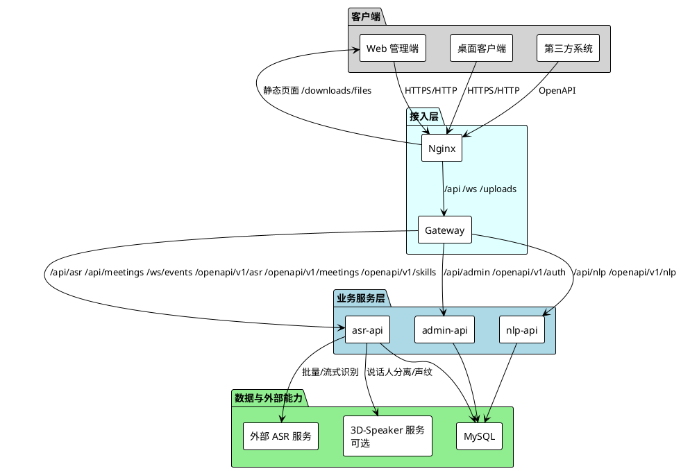

### 2.3 系统架构设计

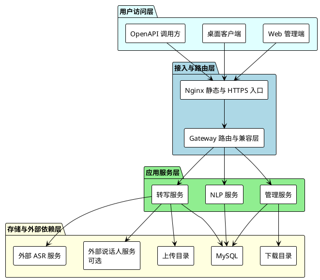

系统的核心关系如下：

1. Nginx 负责统一入口、静态页面、HTTPS 终止及下载目录对外分发。
2. Gateway 负责按路径将请求分发到 admin-api、asr-api 和 nlp-api，并兼容旧接口路径。
3. admin-api 负责管理类能力，asr-api 负责识别、会议和开放平台主要业务，nlp-api 负责文本纠错与摘要支撑。
4. MySQL 是当前业务数据的中心存储，上传音频和安装包以目录方式管理。
5. 识别与说话人能力通过外部服务接入，业务服务层不直接实现底层识别模型。

### 2.4 软件架构设计

当前后端目录结构采用分层组织方式，与仓库中的 internal 目录保持一致。

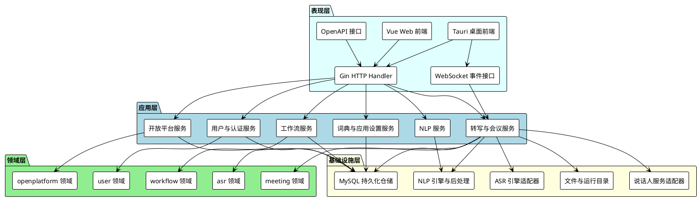

#### 2.4.1 架构的优缺点分析

**设计优势：**

1. 服务边界清晰。管理、转写、NLP、网关分工明确，便于分别演进与部署。
2. 工作流驱动明显。实时、批量、会议、语音控制都可复用同一套工作流编排与执行记录。
3. 多入口共享能力。Web、桌面端和 OpenAPI 共用核心业务服务，避免重复实现。
4. 交付方式完整。All-in-One 发布包内置数据库、服务进程、Nginx 和下载页，便于内网交付。
5. 版本能力可控。通过产品版本和 capability 控制会议纪要、声纹库、语音控制等能力开放。

**设计风险与约束：**

1. 外部依赖明显。转写结果质量与稳定性受外部 ASR 服务影响。
2. 说话人能力可选。未配置外部说话人服务时，会议相关高级能力会降级。
3. 兼容路径增加维护成本。Legacy 路径仍需由网关统一维护与审计。
4. 工作流配置直接影响业务结果。错误的节点顺序或参数会导致识别后处理输出异常。

### 2.5 系统业务层次图

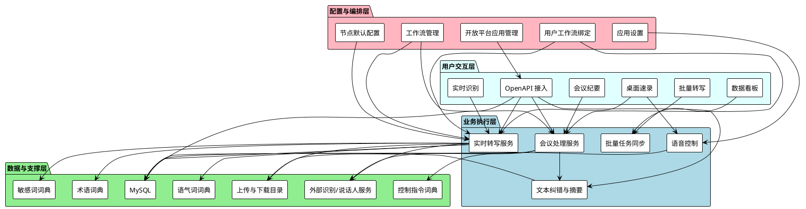

### 2.6 关键技术与实现要点

1. **双模式识别链路**：系统同时支持批量转写和流式识别，分别对应异步任务处理与持续推流处理。
2. **工作流后处理机制**：识别结果可进入术语纠错、敏感词过滤、语气词过滤、会议摘要、语音意图等节点组成的有序处理链路。
3. **统一权限与能力开关**：Web 和桌面端根据后端返回的产品能力控制页面展示和功能可用性。
4. **匿名设备登录**：桌面端通过机器码完成匿名登录，再使用 JWT 调用统一后端接口。
5. **开放平台 Token 与回调**：第三方系统通过 app_id 和 app_secret 获取 access_token，并支持异步回调和调用审计。
6. **Legacy 兼容策略**：网关按配置决定是否开放历史路径，并统一记录兼容接口访问日志。
7. **All-in-One 一体化交付**：发布包内置 MySQL、Nginx 和三类业务服务，同时保留对外部识别服务的连接能力。

## 3 子系统设计

### 3.1 Web 前端子系统设计

#### 3.1.1 系统架构

Web 前端采用 Vue 3 单页面应用，负责后台管理、任务查看、工作流配置和开放平台管理。前端通过路由、状态管理和 API 模块对各后端服务进行统一访问。

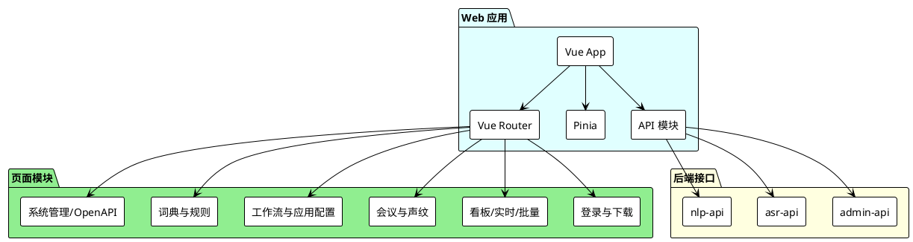

#### 3.1.2 技术栈

| 技术 | 说明 |
| ---- | ---- |
| Vue 3 | Web 前端框架 |
| TypeScript | 类型安全支持 |
| Vite | 开发与构建工具 |
| Vue Router | 路由管理 |
| Pinia | 状态管理 |
| Naive UI | 管理端组件库 |
| Axios | HTTP 请求封装 |
| UnoCSS | 原子化样式体系 |
| ESLint | 代码规范检查 |

#### 3.1.3 模块设计

**a. 数据看板模块**

- 统一展示批量转写、后处理重试和任务状态概览。
- 面向管理员或运营人员查看整体运行情况。

**b. 实时语音识别模块**

- 负责麦克风采集、实时音频上传、实时文本展示。
- 与用户默认实时工作流绑定，用于识别后的自动后处理。

**c. 批量转写模块**

- 支持上传本地音频文件或提交音频 URL。
- 展示异步任务状态、识别结果和工作流执行结果。
- 支持对失败的后处理链路进行手动恢复。

**d. 会议纪要模块**

- 支持会议音频上传、会议列表查看和详情查看。
- 当产品能力开放时显示声纹库入口。
- 会议详情页展示逐字稿、说话人片段和会议摘要，并支持重新生成摘要。

**e. 工作流与应用配置模块**

- 管理系统模板和个人工作流。
- 支持节点默认配置维护、单节点调试和整条工作流执行。
- 统一配置实时、批量、会议和语音控制等场景的默认工作流绑定。

**f. 词典与规则模块**

- 负责术语库、纠错规则、敏感词库、语气词库和控制指令库的配置。
- 为工作流节点提供基础运营数据。

**g. 系统管理与开放平台模块**

- 提供用户管理能力。
- 提供 OpenAPI 应用、能力授权、默认工作流和调用日志管理能力。
- 角色管理页面当前为预留入口，尚未形成完整角色矩阵配置界面。

**h. 登录与公开下载模块**

- 登录页通过管理服务完成 JWT 登录。
- 公开下载页用于分发桌面端安装包，读取挂载目录中的发布文件。

**前端子模块划分与关系**

| 子模块 | 当前职责 | 主要关系 |
| ------ | -------- | -------- |
| 识别业务子模块 | 由数据看板、实时识别、批量转写三类页面组成 | 数据看板读取任务健康度；实时识别依赖用户实时工作流绑定；批量转写与任务执行记录、失败恢复入口联动 |
| 会议业务子模块 | 由会议列表、新建会议、会议详情、声纹库组成 | 受产品能力控制；会议详情依赖会议列表结果；声纹库为会议说话人识别与管理提供支撑 |
| 工作流编排子模块 | 由工作流列表、编辑器、节点管理、应用配置组成 | 节点管理维护默认节点配置；编辑器编排节点顺序；应用配置将工作流绑定到实时、批量、会议和语音控制场景 |
| 词典运营子模块 | 由术语库、敏感词库、语气词库、控制指令库组成；纠错规则作为术语库附属配置 | 为工作流中的 term_correction、sensitive_filter、filler_filter、voice_intent 等节点提供运行数据 |
| 系统运营子模块 | 由登录、用户管理、角色占位、OpenAPI 管理、公开下载组成 | 登录为后台页面提供 JWT；OpenAPI 管理配置开放平台应用、能力和默认工作流；公开下载页与下载目录挂载内容联动 |

除页面域之外，Web 前端还存在三个共享支撑子模块：

1. 布局子模块，由 BlankLayout 和 DefaultLayout 组成，分别服务公开页面和受保护页面。
2. 状态子模块，由 user、app、transcription 三个 store 组成，分别承担登录态、能力开关与工作流绑定、批量转写界面状态共享。
3. 接口子模块，由 request、asr、meeting、workflow、user、openplatform、voiceprint、downloads 等 API 文件组成，负责把页面请求映射到 admin-api、asr-api 和 nlp-api。

**子模块关系图**

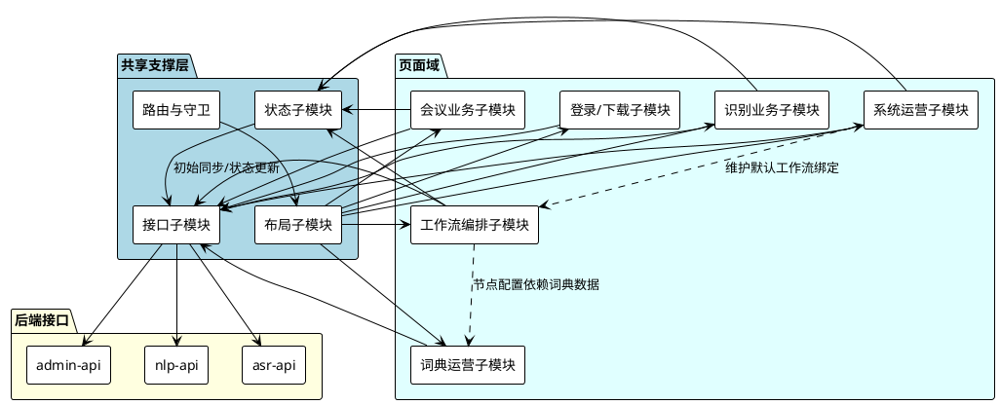

**子模块运行设计**

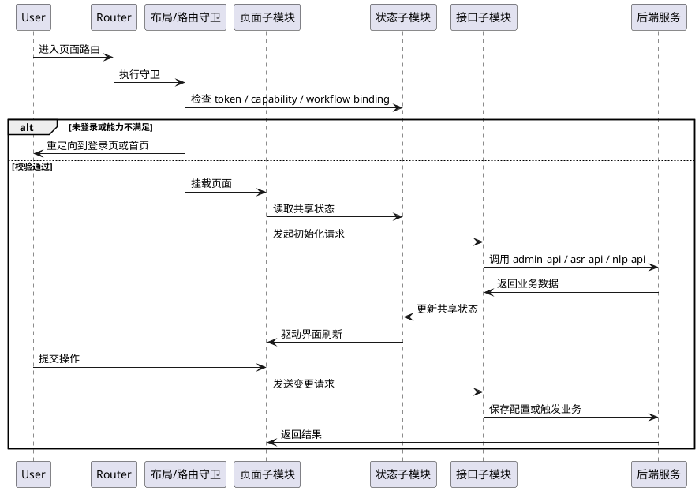

#### 3.1.4 路由设计

| 路由路径 | 功能说明 |
| -------- | -------- |
| /login | 用户登录 |
| /downloads | 桌面端公开下载页 |
| /dashboard | 数据看板 |
| /realtime | 实时语音识别 |
| /transcription | 批量转写历史与提交 |
| /workflows/application-settings | 应用配置与默认工作流绑定 |
| /workflows | 工作流列表 |
| /workflows/nodes | 节点默认配置与调试 |
| /workflows/:id | 工作流编辑器 |
| /meetings | 会议纪要列表 |
| /meetings/upload | 新建会议 |
| /meetings/voiceprints | 声纹库 |
| /meetings/:id | 会议详情 |
| /terminology | 术语库管理、词条和词库附属纠错规则 |
| /terminology/sensitive | 敏感词库 |
| /terminology/fillers | 语气词库 |
| /terminology/voice-commands | 控制指令库 |
| /system/users | 用户管理 |
| /system/roles | 角色管理预留页 |
| /system/openapi | OpenAPI 管理 |

路由守卫的核心策略如下：

1. 非公开页面必须已登录。
2. 页面显示受产品能力开关控制，例如会议纪要、声纹库、语音控制相关页面只在对应能力开放时可进入。
3. 公开下载页允许已登录和未登录用户访问。

#### 3.1.5 状态管理

| Store | 作用 |
| ----- | ---- |
| user store | 存储登录态、当前用户信息和鉴权结果 |
| app store | 存储产品版本、能力开关、默认工作流绑定、侧栏状态 |
| transcription store | 存储批量转写相关列表与界面状态 |

状态管理的设计重点如下：

1. 产品能力和默认工作流绑定由后端统一下发，前端只负责展示和提交修改。
2. 旧版本地缓存的工作流绑定会在首次同步时向后端迁移。
3. 页面不直接依赖静态角色配置，而是优先依赖当前用户和能力开关。

#### 3.1.6 布局与公共层

Web 前端当前采用两类布局：

1. BlankLayout：用于登录页和公开下载页。
2. DefaultLayout：用于管理端主业务页面。

公共层设计包括：

1. API 模块按领域拆分为 asr、meeting、workflow、user、openplatform、voiceprint、downloads 等文件。
2. 公共请求层统一封装鉴权、错误处理和响应解包逻辑。
3. 页面描述信息与能力开关联动，用于控制导航与入口可见性。

### 3.2 桌面端子系统设计

#### 3.2.1 系统架构

桌面端基于 Tauri 构建，核心目标是提供轻量悬浮录音、文本注入、历史查看和会议模式切换能力。桌面端没有复杂的页面路由，而是围绕主录音窗口与设置窗口组织功能。

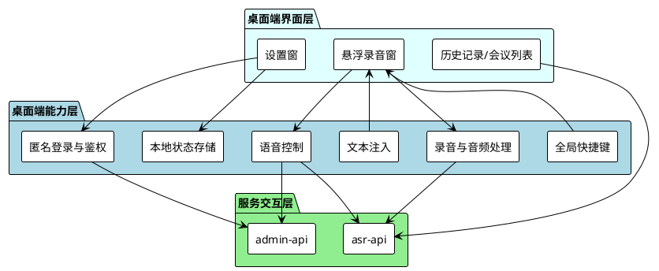

#### 3.2.2 技术栈

| 技术 | 说明 |
| ---- | ---- |
| Tauri 2 | 桌面容器与原生能力接入 |
| Vue 3 + TypeScript | 桌面前端 UI |
| Pinia | 本地状态与配置管理 |
| UnoCSS | 轻量样式体系 |
| @tauri-apps/plugin-global-shortcut | 全局快捷键 |
| @tauri-apps/plugin-store | 本地持久化 |
| Web Audio API | 麦克风采集 |
| html2pdf.js | 会议纪要导出支撑 |

#### 3.2.3 模块设计

**a. 悬浮录音窗**

- 以固定尺寸悬浮球形式存在。
- 负责录音开始、结束、状态展示和场景状态呈现。

**b. 设置窗口**

- 展示服务连接状态、构建版本、用户别名等信息。
- 提供连接设置、录音设置和历史/会议入口。

**c. 历史记录与会议列表**

- 历史记录页展示实时转写结果，并可查看对应工作流执行后的最终文本。
- 会议列表页在会议能力开启时显示，用于查看会议详情和摘要。

**d. 文本注入**

- 桌面端支持将识别文本注入当前光标位置。
- 注入能力由桌面端本地原生能力实现，服务端只返回文本内容。

**e. 语音控制**

- 高级版本可启用语音控制。
- 语音控制基于独立工作流执行，通过语音唤醒与语音意图节点完成场景切换。

**桌面端子模块划分与关系**

| 子模块 | 当前职责 | 主要关系 |
| ------ | -------- | -------- |
| 主录音交互子模块 | 由 RecorderWindow、MicButton、ExpandedPanel、TitleBar 组成 | 负责悬浮球展示、录音状态切换和视觉反馈；依赖 useAudioRecorder 与 useTranscribe 完成采集和提交 |
| 设置与确认子模块 | 由 SettingsWindow、SettingsPanel、AppConfirm 组成 | 负责服务地址、设备别名、自动注入、快捷键等设置；与 app store 双向同步 |
| 历史与会议子模块 | 由 HistoryList、MeetingsList、MeetingDetail、DictPickerDialog、TextDiffPreview 组成 | 历史记录可查看工作流最终文本并回填词典；会议列表与详情受会议能力开关控制 |
| 本地能力子模块 | 由 useInjector、useDesktopHotkeys、useHotkeyActions 组成 | 负责文本注入和全局快捷键，是桌面端相对 Web 管理端新增的本地能力层 |
| 语音控制子模块 | 由 useVoiceControl、voiceControl 工具、voiceCommandRegistry 组成 | 在段文本产生后优先执行唤醒词和意图识别，再决定切换场景、进入命令模式或继续保留识别结果 |

桌面端内部的主关系如下：

1. useTranscribe 是主业务链路枢纽，连接录音采集、后端提交、历史记录刷新和工作流结果读取。
2. app store 是所有桌面子模块共享的状态中心，统一保存服务地址、Token、场景模式、能力开关和快捷键绑定。
3. 语音控制子模块在逻辑上位于录音结果与最终保存之间，因此会影响后续是保存为实时任务还是会议任务。

**子模块关系图**

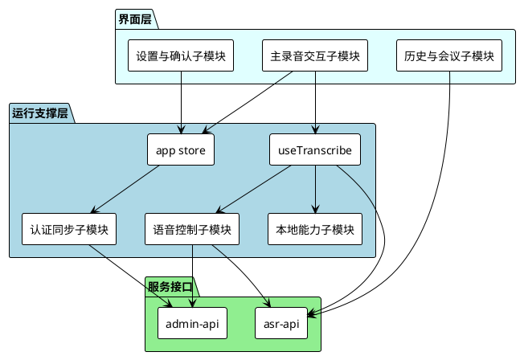

**子模块运行设计**

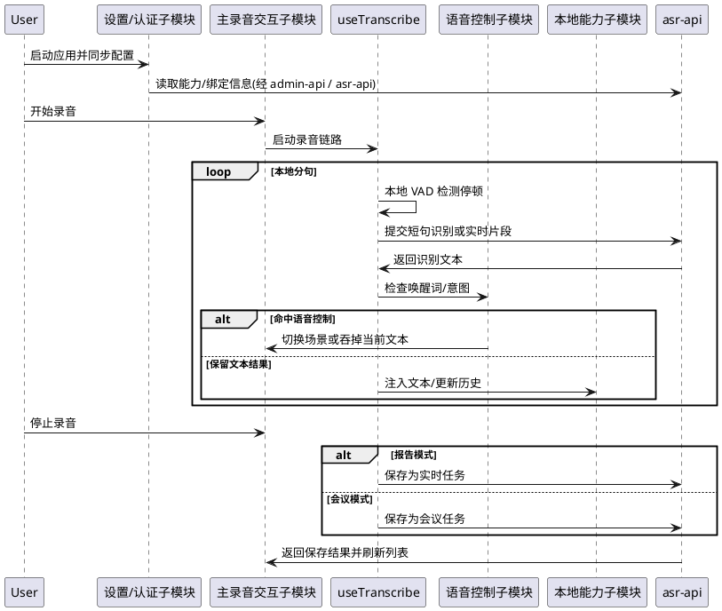

#### 3.2.4 认证与配置设计

桌面端采用匿名设备登录模型，主要关系如下：

1. 客户端收集机器码和设备基本信息。
2. 通过 `/api/admin/auth/anonymous-login` 向后台换取 JWT。
3. 登录成功后同步产品能力、用户默认工作流绑定和个人显示名称。
4. 本地持久化服务地址、Token、设备别名、机器码、录音参数、场景模式和快捷键设置。

本地配置的主要类别包括：

- 服务连接配置
- 当前设备身份信息
- 录音与识别参数
- 场景模式与语音控制状态
- 历史记录界面偏好和快捷键绑定

#### 3.2.5 场景模式与快捷键

桌面端当前支持以下场景逻辑：

1. **报告模式**：停止录音后按实时转写任务保存。
2. **会议模式**：停止录音后优先提交到会议上传接口，生成会议记录。
3. **命令模式**：在语音控制开启时，由语音唤醒进入，等待语音意图识别并触发场景切换。

快捷键设计重点：

1. 全局快捷键用于切换录音状态。
2. 快捷键配置在本地持久化，并由桌面端在主窗口启动后同步注册。
3. 场景切换后，桌面端会主动刷新工作流绑定，使后续识别任务使用新的默认工作流。

### 3.3 后端子系统设计

#### 3.3.1 API 网关模块

Gateway 是后端统一路由入口，主要负责按路径转发、WebSocket 代理和旧接口兼容控制。

**核心职责：**

1. 代理 `/api/asr`、`/api/meetings`、`/uploads`、`/ws/events` 到 asr-api。
2. 代理 `/api/admin` 和 `/openapi/v1/auth` 到 admin-api。
3. 代理 `/api/nlp` 到 nlp-api。
4. 代理 `/openapi/v1/asr`、`/openapi/v1/meetings`、`/openapi/v1/skills` 到 asr-api。
5. 代理 `/openapi/v1/nlp` 到 nlp-api。
6. 在 `legacy.enabled` 为真时开放历史路径，并将访问写入兼容日志。

**模块特点：**

- 支持 WebSocket 升级请求透传，保证流式事件可通过网关访问。
- 对上游 CORS 头进行裁剪，避免与网关自身策略重复。
- 对关闭的 Legacy 路径返回 410 Gone。

**子模块划分与关系**

| 子模块 | 当前职责 | 主要关系 |
| ------ | -------- | -------- |
| 路由注册子模块 | 负责 `/api`、`/openapi`、`/uploads`、`/ws` 等路径到具体服务的映射 | 连接 Nginx 入口与 admin-api、asr-api、nlp-api 三个业务服务 |
| WebSocket 代理子模块 | 识别升级请求并转发 WebSocket 帧 | 为 `/ws/events` 和 OpenAPI 流式事件提供透传能力 |
| Legacy 兼容子模块 | 统一开启、关闭和转发旧路径 | 与 asr-api、nlp-api 的 legacy handler 配合完成旧接口兼容 |
| 兼容日志子模块 | 对旧路径访问写入单独日志 | 为旧接口迁移和关闭决策提供依据 |

网关本身不承载业务状态，主要作为路由协调层存在；兼容路径和 WebSocket 能力均在这一层统一收口，避免业务服务分别暴露多套入口。

**子模块关系图**

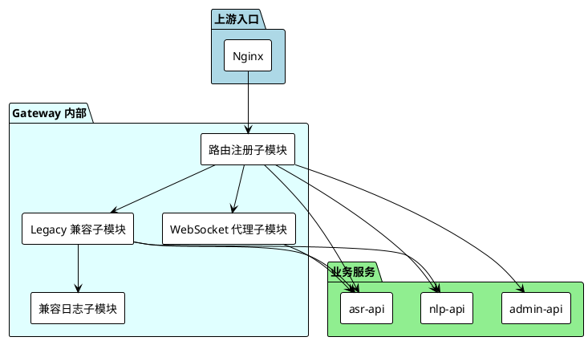

**子模块运行设计**

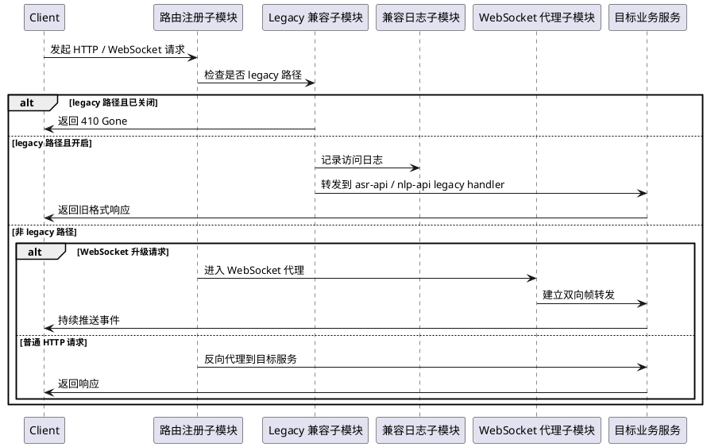

#### 3.3.2 管理服务模块

admin-api 负责平台管理面能力，是 Web 管理端的主接口来源。

**核心职责：**

1. 用户登录、匿名设备登录、当前用户信息查询与个人资料修改。
2. 用户默认工作流绑定的读取与更新。
3. 工作流管理、节点默认配置、节点测试、工作流克隆和执行查看。
4. 术语库、纠错规则、敏感词库、语气词库、控制指令库管理。
5. 应用设置管理，包括语音控制等全局配置。
6. 仪表板统计聚合接口。
7. 公开下载列表与下载文件对接。
8. OpenAPI 应用管理、能力授权、密钥轮换和调用日志查看。

**启动时初始化内容：**

1. 确保管理员账号存在。
2. 写入术语、敏感词、语气词、控制指令等种子数据。
3. 确保工作流模板存在。

**子模块划分与关系**

| 子模块 | 当前职责 | 主要关系 |
| ------ | -------- | -------- |
| 认证与用户子模块 | 提供登录、匿名设备登录、当前用户资料和用户管理 | 为 Web 前端和桌面端提供 JWT、用户信息和默认工作流绑定 |
| 工作流编排子模块 | 提供工作流列表、编辑、克隆、执行查询、节点测试和节点默认配置 | 与转写服务共享工作流定义，决定实时、批量、会议、语音控制的后处理链路 |
| 词典运营子模块 | 提供术语、纠错规则、敏感词、语气词、控制指令管理 | 为 NLP 处理和工作流节点提供基础数据 |
| 应用设置子模块 | 提供语音控制等全局配置读写 | 被桌面端配置同步和语音控制运行时消费 |
| 运营支撑子模块 | 提供数据看板、下载列表和公开下载能力 | 数据看板调用转写服务聚合统计；下载列表与发布目录挂载内容联动 |
| 开放平台管理子模块 | 提供 OpenAPI 应用、能力、密钥、调用日志管理 | 其配置结果由 asr-api 和 nlp-api 在运行期通过 OpenAuth 中间件读取 |

管理服务是“配置中心 + 管理入口”的角色：用户绑定、工作流模板、词典数据和开放平台应用均在此维护，而这些配置会在转写服务、NLP 服务、桌面端和第三方接入中被复用。

**子模块关系图**

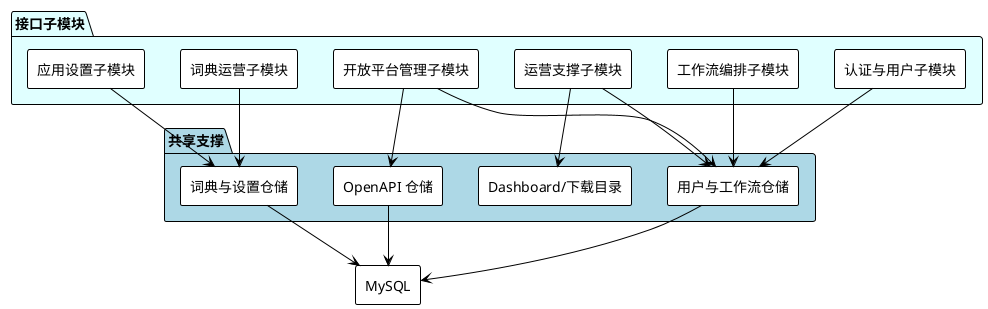

**子模块运行设计**

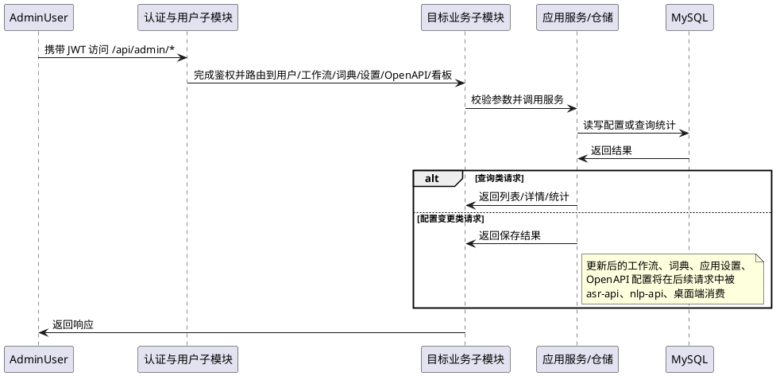

#### 3.3.3 转写服务模块

asr-api 是系统的核心业务执行服务，负责音频识别、会议处理和开放平台主要业务。

**核心职责：**

1. 批量转写任务创建、查询、删除、同步和后处理恢复。
2. 实时流式识别会话管理，包括开始、推送片段、提交分段和结束会话。
3. 实时任务和批量任务的识别结果落库。
4. 会议创建、音频上传、会议列表、会议详情、摘要重生和删除。
5. 声纹库接口对接。
6. 工作流执行结果与识别结果联动。
7. WebSocket 业务事件输出。
8. OpenAPI 的 ASR、会议和技能相关接口。

**运行特点：**

1. 通过批量同步循环持续查询外部 ASR 任务状态。
2. 通过会议同步循环补齐会议类异步任务状态。
3. 在上传目录中保存音频文件，再以 URL 或本地路径方式交给业务服务处理。
4. 在配置了说话人服务时，提供说话人分离和声纹能力；未配置时相关能力按现有后端逻辑降级。

**子模块划分与关系**

| 子模块 | 当前职责 | 主要关系 |
| ------ | -------- | -------- |
| 批量任务子模块 | 管理批量转写任务创建、查询、删除、同步和后处理恢复 | 与外部 ASR 服务的批量任务接口对应，并与工作流执行记录联动 |
| 流式识别子模块 | 管理 stream session、chunk 提交、commit 和 finish | 服务于 Web 实时识别、桌面端实时录音和 OpenAPI 流式识别能力 |
| 会议处理子模块 | 管理会议上传、会议列表、详情、摘要重生成 | 与批量转写链路共享音频处理基础能力，并依赖会议工作流和摘要逻辑 |
| 声纹与说话人子模块 | 管理声纹注册、查询、删除和说话人分离相关能力 | 依赖外部说话人服务，并为会议子模块提供增强能力 |
| 实时事件子模块 | 通过 WebSocket 向前端推送业务事件 | 与流式识别、任务状态变化和前端实时展示形成联动 |
| OpenAPI 执行子模块 | 对外暴露 ASR、会议和技能相关接口 | 与开放平台配置、调用审计、回调和工作流执行共享同一业务上下文 |
| 后台同步子模块 | 定时执行任务状态同步和会议状态同步 | 为数据看板、任务列表和会议列表提供最终一致的状态来源 |

转写服务内部的核心关系是“音频输入 -> 外部识别 -> 工作流处理 -> 结果落库 -> 事件输出”：批量任务、实时识别、会议处理和 OpenAPI 调用都复用这一主链路，只是在入口形式和后处理目标上存在差异。

**子模块关系图**

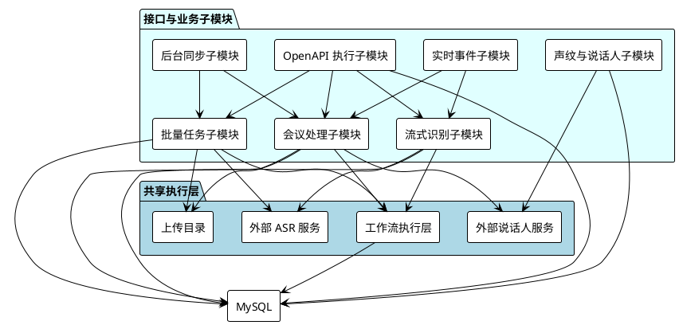

**子模块运行设计**

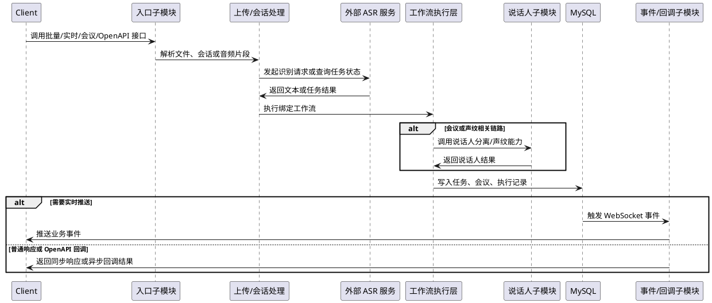

#### 3.3.4 NLP 服务模块

nlp-api 负责文本后处理能力的独立对外暴露。

**核心职责：**

1. 文本纠错与规范化处理。
2. 摘要生成能力支撑。
3. 对 Web 管理端提供受保护的 `/api/nlp` 接口。
4. 对第三方开放 `/openapi/v1/nlp` 接口。
5. 在 Legacy 开关打开时提供旧版 NLP 路径兼容。

**模块定位：**

- 该服务与术语库、规则库共享同一数据库。
- 该服务既可以被 asr-api 在业务链路中复用，也可以被 OpenAPI 单独调用。

**子模块划分与关系**

| 子模块 | 当前职责 | 主要关系 |
| ------ | -------- | -------- |
| 纠错子模块 | 基于术语和规则数据执行文本纠错与规范化 | 数据由 admin-api 维护，结果可被管理端页面和转写服务后处理链路复用 |
| 摘要子模块 | 基于配置模型生成摘要文本 | 既服务 nlp-api 独立调用，也服务会议摘要生成能力 |
| 管理端接口子模块 | 暴露受保护的 `/api/nlp` 接口 | 供 Web 管理端直接调用 |
| OpenAPI 接口子模块 | 暴露 `/openapi/v1/nlp` 接口 | 与开放平台 Token 鉴权和调用审计联动 |
| Legacy 兼容子模块 | 在兼容开关开启时提供旧版 NLP 路径 | 与网关的 legacy 路由控制保持一致 |

NLP 服务在系统中的定位是“可独立调用的文本处理能力层”：一方面被 asr-api 的后处理链复用，另一方面对 Web 管理端和第三方调用方直接暴露统一接口。

**子模块关系图**

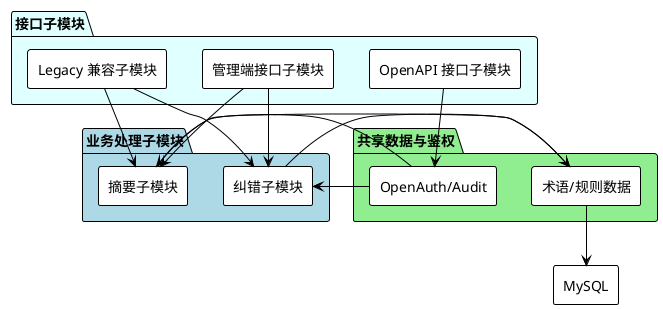

**子模块运行设计**

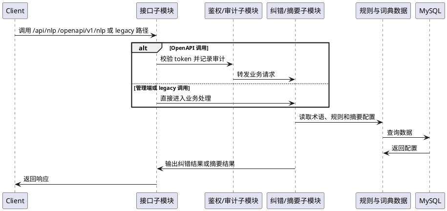

### 3.4 开放平台与兼容接口设计

#### 3.4.1 OpenAPI 应用与鉴权

当前开放平台采用“应用凭证 + access_token”的鉴权模式。

**管理侧能力：**

1. 创建 OpenAPI 应用。
2. 分配允许能力。
3. 设置回调白名单。
4. 配置各能力默认工作流。
5. 轮换密钥、停用、启用或撤销应用。
6. 查看调用日志。

**认证流程：**

1. 第三方系统使用 `app_id` 和 `app_secret` 调用 `/openapi/v1/auth/token`。
2. admin-api 返回 `access_token`。
3. 第三方系统在后续调用中通过 `Authorization: Bearer <token>` 或 query 参数携带 Token。

**子模块划分与关系**

| 子模块 | 当前职责 | 主要关系 |
| ------ | -------- | -------- |
| 应用管理子模块 | 管理应用基本信息、状态、密钥轮换和撤销 | 配置入口位于 admin-api，配置结果存入 open_apps 等表 |
| 能力授权子模块 | 维护应用允许调用的能力和默认工作流映射 | 影响 asr-api、nlp-api 运行期是否放行对应请求，以及是否绑定默认工作流 |
| Token 签发子模块 | 基于应用凭证签发 access_token | 由 admin-api 提供入口，是所有 OpenAPI 调用的前置条件 |
| OpenAuth 运行子模块 | 在 asr-api、nlp-api 中校验 token、装载应用上下文并做审计 | 与应用管理子模块共享同一份数据库配置，形成“管理面配置、运行面消费”的关系 |

OpenAPI 的管理面与运行面是分离的：admin-api 负责配置应用和签发 token，asr-api 与 nlp-api 在具体业务调用时消费这些配置并完成鉴权与审计。

**子模块关系图**

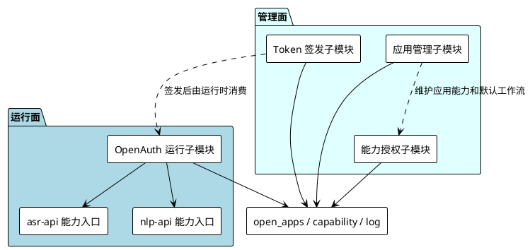

**子模块运行设计**

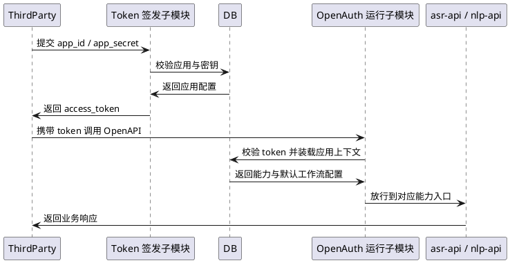

#### 3.4.2 能力授权与回调

当前开放平台已对外暴露的能力包括：

1. ASR 识别与流式会话。
2. 会议摘要与会议详情查询。
3. NLP 文本纠错。
4. 技能注册与技能管理。

能力设计特点如下：

1. 每个应用有独立的能力集合与默认工作流映射。
2. 调用链路会记录调用日志、路由、HTTP 状态和延迟。
3. 在提供 `callback_url` 时，异步任务完成后会发起签名回调。
4. 回调头中包含签名与请求标识，便于调用方验签与幂等处理。
5. Skill 回调连续失败达到阈值后会被自动停用，避免持续错误调用。

**能力子模块划分与关系**

| 子模块 | 当前职责 | 主要关系 |
| ------ | -------- | -------- |
| ASR 能力子模块 | 对外提供识别、流式会话、事件订阅等能力 | 与 asr-api 的流式识别和批量任务主链路共用识别和工作流能力 |
| 会议能力子模块 | 对外提供会议摘要、会议详情查询和重生成能力 | 与会议处理子模块共用会议数据和会议工作流 |
| NLP 能力子模块 | 对外提供文本纠错能力 | 直接落在 nlp-api 的纠错与摘要能力之上 |
| 技能管理与触发子模块 | 对外提供技能创建、查询、更新、删除和 dry-run，并支持运行期回调 | 配置存储在 open_skills，运行期又与 voice_intent 节点及 Skill callback 链路关联 |
| 审计与回调子模块 | 记录调用日志、保存请求标识并发送异步签名回调 | 横向挂接在 ASR、会议、NLP、技能等具体能力调用链上 |

开放平台能力并不是独立实现的一套业务，而是把 asr-api、nlp-api 现有能力按“鉴权、审计、回调、默认工作流”重新包装后对外暴露。

**子模块关系图**

```plantuml
@startuml OpenAPI能力与回调子模块关系图
!theme plain
skinparam componentStyle rectangle
skinparam backgroundColor white

package "能力包装层" as caps #lightcyan {
  component [ASR 能力子模块] as CapAsr
  component [会议能力子模块] as CapMeeting
  component [NLP 能力子模块] as CapNlp
  component [技能管理与触发子模块] as CapSkill
  component [审计与回调子模块] as CapAudit
}

package "底层业务能力" as svc #lightblue {
  component [asr-api 业务链路] as CapAsrSvc
  component [nlp-api 业务链路] as CapNlpSvc
  component [技能回调目标] as CapCallback
}

database [open_call_logs / open_skills] as CapDB

CapAsr --> CapAsrSvc
CapMeeting --> CapAsrSvc
CapNlp --> CapNlpSvc
CapSkill --> CapDB
CapSkill --> CapAsrSvc
CapAudit --> CapAsr
CapAudit --> CapMeeting
CapAudit --> CapNlp
CapAudit --> CapSkill
CapAudit --> CapDB
CapAudit --> CapCallback
@enduml
```

**子模块运行设计**

```plantuml
@startuml OpenAPI能力与回调子模块运行设计
participant ThirdParty as T
participant "能力子模块" as C
participant "审计与回调子模块" as A
participant "底层业务服务" as S
participant DB as DB
participant Callback as CB

T -> C: 调用 ASR / 会议 / NLP / 技能接口
C -> A: 建立请求上下文并准备审计
A -> S: 调用底层业务能力
S -> DB: 写入业务数据
DB -> S: 返回处理结果
S -> A: 返回业务结果
A -> DB: 写入 open_call_logs / skill_invocations
alt 异步任务或技能回调
  A -> CB: 发送签名回调
  CB -> A: 返回回调结果
end
A -> T: 返回最终响应
@enduml
```

#### 3.4.3 Legacy 兼容接口

系统保留了历史调用路径以兼容旧接入方，兼容策略由网关统一控制。

**兼容特征：**

1. 旧路径包括上传、识别、任务查询、会议摘要、文本纠错和模板查询等历史接口。
2. 兼容路径同时提供 `/api/*` 和 `/api/legacy/*` 两套入口。
3. 当兼容开关关闭时，这些路径统一返回 410 Gone。
4. 兼容接口访问会被单独写入兼容日志，便于后续迁移评估。

**兼容子模块划分与关系**

| 子模块 | 当前职责 | 主要关系 |
| ------ | -------- | -------- |
| 网关开关子模块 | 决定 Legacy 路径是否开放以及未开放时的统一返回码 | 位于 gateway，是所有旧路径的总入口控制点 |
| ASR 兼容处理子模块 | 处理上传、识别、任务、音频摘要等旧版 ASR 路径 | 由 asr-api 的 legacy handler 承接，并复用当前转写服务能力 |
| NLP 兼容处理子模块 | 处理文本纠错、模板查询等旧版 NLP 路径 | 由 nlp-api 的 legacy handler 承接，并复用当前 NLP 能力 |
| 健康检查与访问日志子模块 | 提供旧版 health 路径和访问审计 | 便于旧系统迁移阶段做监控兼容与调用统计 |

Legacy 兼容层本质上是“入口兼容而非业务分叉”：旧路径最终仍然复用当前 asr-api 和 nlp-api 的业务能力，由 gateway 统一控制其生命周期。

**子模块关系图**

```plantuml
@startuml Legacy兼容子模块关系图
!theme plain
skinparam componentStyle rectangle
skinparam backgroundColor white

package "入口控制层" as legacygw #lightcyan {
  component [网关开关子模块] as LegacySwitch
  component [健康检查与访问日志子模块] as LegacyOps
}

package "兼容处理层" as legacyhandler #lightblue {
  component [ASR 兼容处理子模块] as LegacyAsr
  component [NLP 兼容处理子模块] as LegacyNlp
}

package "当前业务能力" as legacysvc #lightgreen {
  component [当前转写服务能力] as LegacyAsrSvc
  component [当前 NLP 服务能力] as LegacyNlpSvc
}

LegacySwitch --> LegacyAsr
LegacySwitch --> LegacyNlp
LegacySwitch --> LegacyOps
LegacyAsr --> LegacyAsrSvc
LegacyNlp --> LegacyNlpSvc
LegacyOps --> LegacyAsr
LegacyOps --> LegacyNlp
@enduml
```

**子模块运行设计**

```plantuml
@startuml Legacy兼容子模块运行设计
participant OldClient as C
participant "网关开关子模块" as S
participant "访问日志子模块" as Log
participant "兼容处理子模块" as H
participant "当前业务服务" as Biz

C -> S: 调用 /api/* 或 /api/legacy/*
alt 兼容开关关闭
  S -> C: 返回 410 Gone
else 兼容开关开启
  S -> Log: 记录兼容访问
  S -> H: 转发到 ASR / NLP legacy handler
  H -> Biz: 复用当前业务能力
  Biz -> H: 返回处理结果
  H -> C: 返回旧格式响应
end
@enduml
```

## 4 数据结构设计

### 4.1 数据库设计

当前系统以 MySQL 作为核心持久化中心。数据库结构由两部分共同维护：

1. backend/migrations 下的历史 SQL 迁移。
2. 后端启动时执行的 GORM AutoMigrate。

因此，当前数据库对象不仅包含传统 SQL migration 中的表，也包含设备身份与开放平台等由模型自动维护的表。

#### 4.1.1 用户与设备身份

| 表/对象 | 作用 | 关键关系 |
| ------- | ---- | -------- |
| users | 用户账户、管理员和普通用户身份 | 与转写任务、会议、开放平台应用存在逻辑关联 |
| device_identities | 存储桌面端机器码、主机名、平台和网络信息 | 与匿名设备登录的用户一一对应 |
| user_workflow_bindings | 存储用户在实时、批量、会议、语音控制场景下的默认工作流 | 关联 workflows |

#### 4.1.2 转写任务与会议数据

| 表/对象 | 作用 | 关键关系 |
| ------- | ---- | -------- |
| transcription_tasks | 记录批量、实时等识别任务的状态、音频地址、结果文本和工作流绑定 | 关联 users，可选关联 meetings 和 workflows |
| meetings | 记录会议任务基本信息 | 关联 users，可选关联来源转写任务 |
| meeting_transcripts | 存储会议逐字稿和说话人片段 | 关联 meetings |
| meeting_summaries | 存储会议摘要内容和摘要模型版本 | 与 meetings 一对一 |

#### 4.1.3 工作流数据

| 表/对象 | 作用 | 关键关系 |
| ------- | ---- | -------- |
| workflows | 工作流主表，记录名称、归属、发布状态、类型与来源目标信息 | 关联用户绑定、任务和执行记录 |
| workflow_nodes | 工作流节点定义，记录节点类型、顺序、配置和启用状态 | 关联 workflows |
| workflow_node_defaults | 节点默认配置 | 按 node_type 唯一管理 |
| workflow_executions | 一次工作流执行的输入、输出、触发来源和状态 | 关联 workflows |
| workflow_node_results | 单节点执行结果与耗时 | 关联 workflow_executions |

#### 4.1.4 词典与应用设置

| 表/对象 | 作用 | 关键关系 |
| ------- | ---- | -------- |
| term_dicts / term_entries | 术语词库和词条 | 为术语纠错节点提供基础数据 |
| correction_rules | 纠错规则表 | 与术语词典关联 |
| sensitive_dicts / sensitive_entries | 敏感词库与词条 | 为敏感词过滤节点提供基础数据 |
| filler_dicts / filler_entries | 语气词库与词条 | 为语气词过滤节点提供基础数据 |
| voice_command_dicts / voice_command_entries | 控制指令分组与候选话术 | 为语音唤醒和语音意图识别提供基础数据 |
| app_settings | 应用级设置，例如语音控制配置 | 由管理服务统一读写 |
| admin_operation_states | 管理操作状态缓存 | 用于辅助后台管理操作状态记录 |

#### 4.1.5 开放平台数据

| 表/对象 | 作用 | 关键关系 |
| ------- | ---- | -------- |
| open_apps | OpenAPI 应用主表，存储 app_id、密钥摘要、状态、回调白名单、默认工作流等 | 关联 users |
| open_app_capabilities | 应用能力授权表 | 关联 open_apps |
| open_skills | 开放平台技能定义 | 关联 open_apps |
| open_call_logs | OpenAPI 调用日志 | 关联 open_apps |
| skill_invocations | 技能调用记录 | 关联 open_skills 和 open_apps |

### 4.2 实体关系说明

```plantuml
@startuml ASR实体关系图
!theme plain
hide circle
skinparam linetype ortho

entity users
entity device_identities
entity user_workflow_bindings
entity transcription_tasks
entity meetings
entity meeting_transcripts
entity meeting_summaries
entity workflows
entity workflow_nodes
entity workflow_executions
entity workflow_node_results
entity open_apps
entity open_skills
entity open_call_logs
entity skill_invocations

users ||--o| device_identities
users ||--o| user_workflow_bindings
users ||--o{ transcription_tasks
users ||--o{ meetings
users ||--o{ open_apps

workflows ||--o{ workflow_nodes
workflows ||--o{ workflow_executions
workflow_executions ||--o{ workflow_node_results

workflows o|--o{ transcription_tasks
workflows o|--o{ user_workflow_bindings

transcription_tasks o|--o| meetings
meetings ||--o{ meeting_transcripts
meetings ||--o| meeting_summaries

open_apps ||--o{ open_skills
open_apps ||--o{ open_call_logs
open_apps ||--o{ skill_invocations
open_skills ||--o{ skill_invocations

@enduml
```

关系说明如下：

1. 用户是转写任务、会议和开放平台应用的拥有者。
2. 设备身份与匿名桌面用户对应，用于机器码登录。
3. 工作流既可被用户默认绑定引用，也可被转写任务、会议摘要和开放平台能力执行时引用。
4. 会议可由独立上传产生，也可与转写任务形成来源关联。
5. 开放平台应用下可定义技能，并记录调用日志与技能调用记录。

## 5 运行设计

### 5.1 请求路由与服务通信运行设计

Nginx 和 Gateway 共同构成请求进入业务服务的主通道。

**入口职责分工：**

1. Nginx 负责静态前端页面、HTTPS、下载文件和证书文件分发。
2. `/api`、`/ws` 和 `/uploads` 请求先进入 Gateway，再由 Gateway 按路径分发。
3. `/downloads/files` 和 `/downloads/certs/tls.crt` 由 Nginx 直接从挂载目录对外分发。

```plantuml
@startuml 请求路由与服务通信时序图
participant Client as C
participant Nginx as N
participant Gateway as G
participant AdminAPI as A
participant ASRAPI as S
participant NLPAPI as P
participant MySQL as DB

== 静态页面 ==
C -> N: GET / 或 /downloads
N -> C: 返回前端页面或下载列表入口

== API 请求 ==
C -> N: /api/* 或 /openapi/*
N -> G: 代理 API 请求

alt 管理接口
  G -> A: /api/admin/* 或 /openapi/v1/auth/*
  A -> DB: 读写管理数据
  A -> G: 返回响应
else 转写/会议接口
  G -> S: /api/asr/* /api/meetings/* /openapi/v1/asr/* /openapi/v1/meetings/* /openapi/v1/skills/*
  S -> DB: 读写任务、会议、执行记录
  S -> G: 返回响应
else NLP 接口
  G -> P: /api/nlp/* /openapi/v1/nlp/*
  P -> DB: 读写词典/规则数据
  P -> G: 返回响应
end

G -> N: 汇总响应
N -> C: 返回最终响应
@enduml
```

### 5.2 实时语音识别运行设计

实时语音识别支持 Web 管理端和桌面端两种入口。桌面端额外叠加了本地文本注入和语音控制逻辑。

```plantuml
@startuml 实时语音识别流程
participant Client as C
participant ASRAPI as S
participant "外部 ASR 服务" as U
participant "Workflow Service" as W
participant MySQL as DB

C -> S: 创建流式会话或提交实时片段
loop 音频分段上传
  C -> S: 推送音频 chunk / realtime segment
  S -> U: 调用上游流式/实时识别
  U -> S: 返回增量文本
  S -> C: 返回 text_delta / partial text
end

alt 需要形成完整任务结果
  C -> S: commit / finish / realtime-tasks/upload
  S -> W: 执行绑定的实时工作流
  W -> DB: 写入执行记录和节点结果
  S -> DB: 写入实时任务与最终文本
  S -> C: 返回最终结果
end

@enduml
```

运行要点如下：

1. Web 管理端主要用于浏览器实时识别和结果展示。
2. 桌面端在停止录音后可根据场景模式决定保存为实时任务或会议任务。
3. 当语音控制能力开启时，桌面端会优先将段文本送入语音控制工作流，再决定是否切换场景或继续保留文本结果。

### 5.3 批量转写与会议纪要运行设计

批量转写与会议纪要都基于音频上传和异步结果同步，但会议链路会额外生成逐字稿和摘要结果。

```plantuml
@startuml 批量转写与会议纪要流程
participant Client as C
participant ASRAPI as S
participant "外部 ASR 服务" as U
participant "Speaker 服务 可选" as SP
participant "Workflow / NLP" as W
participant MySQL as DB

== 提交阶段 ==
C -> S: 上传音频 / 提交音频 URL
S -> DB: 创建转写任务或会议记录
S -> U: 提交批量识别任务
U -> S: 返回 external_task_id
S -> C: 返回受理结果

== 同步阶段 ==
loop 后台同步循环
  S -> U: 查询任务状态
  U -> S: 返回识别结果或处理中状态
end

alt 批量转写
  S -> W: 执行批量后处理工作流
  W -> DB: 写入 workflow_executions / workflow_node_results
  S -> DB: 更新 transcription_tasks
else 会议纪要
  opt 配置了说话人服务
    S -> SP: 执行说话人分离/识别
    SP -> S: 返回说话人片段
  end
  S -> W: 生成会议摘要或重新执行会议工作流
  W -> DB: 写入会议摘要和执行记录
  S -> DB: 更新 meetings / meeting_transcripts / meeting_summaries
end

S -> C: 前端随后通过列表与详情接口读取结果
@enduml
```

### 5.4 工作流执行运行设计

工作流是系统当前后处理链路的中心机制，既服务于管理端，也服务于桌面端和开放平台。

**当前触发来源包括：**

1. 实时转写任务。
2. 批量转写任务。
3. 会议摘要生成。
4. 管理端手动测试或执行。
5. 桌面端语音控制。
6. OpenAPI 能力调用。

```plantuml
@startuml 工作流执行流程
participant Trigger as T
participant "Workflow Service" as W
participant "Node Defaults" as D
participant "Node Handlers" as H
participant MySQL as DB

T -> W: 触发工作流执行
W -> DB: 读取 workflow 和 workflow_nodes
W -> D: 读取节点默认配置

loop 按节点顺序执行
  W -> H: 执行当前节点
  H -> W: 返回输出文本/结构化结果
  W -> DB: 写入 workflow_node_results
end

W -> DB: 写入 workflow_executions.final_text
W -> T: 返回最终结果
@enduml
```

当前工作流节点主要覆盖以下类别：

1. 术语纠错。
2. 语气词过滤。
3. 敏感词过滤。
4. LLM 纠错。
5. 自定义正则处理。
6. 会议摘要。
7. 语音唤醒与语音意图。
8. 说话人分离。

### 5.5 OpenAPI 与兼容接口运行设计

```plantuml
@startuml OpenAPI与兼容接口流程
participant ThirdParty as TS
participant Gateway as G
participant AdminAPI as A
participant ASRAPI as S
participant NLPAPI as P
participant MySQL as DB
participant Callback as CB

== Token 获取 ==
TS -> G: POST /openapi/v1/auth/token
G -> A: 转发认证请求
A -> DB: 校验应用与密钥
A -> TS: 返回 access_token

== OpenAPI 调用 ==
TS -> G: 调用 /openapi/v1/asr/* /meetings/* /nlp/* /skills/*
G -> S: ASR/会议/技能类请求
G -> P: NLP 类请求
S -> DB: 记录业务数据
P -> DB: 记录调用数据

opt 异步回调
  S -> CB: 发送签名回调
end

== Legacy 兼容 ==
TS -> G: 调用 /api/* 或 /api/legacy/* 旧路径
alt 兼容开关开启
  G -> S: 转发到新服务能力
else 兼容开关关闭
  G -> TS: 返回 410 Gone
end

@enduml
```

OpenAPI 运行要点如下：

1. 流式识别会话会同时返回 `commit_url`、`events_url` 和 `ws_url`，便于浏览器或第三方客户端直接建立流式连接。
2. WebSocket 事件通过网关代理后仍可正常透传。
3. OpenAPI 调用日志用于后续追踪应用能力使用情况。
4. Legacy 路径仅用于历史迁移过渡，不作为新接入首选路径。

## 6 系统出错处理设计

### 6.1 出错信息

| 错误类型 | 典型状态 | 说明 | 处理方式 |
| -------- | -------- | ---- | -------- |
| 请求参数错误 | 400 | 请求体、路径参数、文件大小或格式不满足要求 | 立即返回错误信息，提示调用方修正输入 |
| 认证失败 | 401 | JWT 或 OpenAPI Token 无效、过期或密钥错误 | 重新登录或重新获取 Token |
| 权限不足或能力未开放 | 403 | 非管理员执行管理操作，或产品版本未开放对应能力 | 拒绝请求并提示权限/能力约束 |
| 资源不存在 | 404 | 任务、会议、工作流、流式会话或用户不存在 | 返回未找到信息 |
| 兼容接口已关闭 | 410 | Legacy 接口已由网关禁用 | 提示调用方切换到新接口 |
| 内部处理失败 | 500 | 服务内部逻辑、数据库操作或工作流执行异常 | 记录日志并返回内部错误 |
| 上游服务不可用 | 502 或业务失败 | 网关 WebSocket 上游不可达，或外部识别服务不可用 | 返回上游不可用信息并等待重试 |

### 6.2 补救措施

1. **批量任务重试**：asr-api 通过后台同步循环持续拉取未完成任务状态，并记录失败次数与下次同步时间。
2. **后处理恢复**：转写任务支持手动触发后处理恢复，避免一次工作流失败导致最终结果长期不可用。
3. **会议摘要重生成**：会议详情支持重新生成摘要，以便在工作流或模型配置变更后补算结果。
4. **说话人能力降级**：当外部说话人服务未配置或不可用时，系统保留会议主流程，相关高级能力按现有逻辑降级处理。
5. **兼容接口集中开关**：Legacy 能力由网关统一控制，便于按阶段切断旧路径。
6. **发布回滚机制**：All-in-One 安装脚本在升级后会结合健康检查决定是否回滚到上一版本镜像。

### 6.3 系统维护设计

**监控与日志：**

1. 业务服务标准输出日志由容器统一采集。
2. Legacy 路径访问会写入 `runtime/legacy-access.log`。
3. OpenAPI 调用日志存储在数据库中，必要时配合请求体日志目录进行问题追踪。
4. Dashboard 页面提供任务健康度的聚合视图，但不替代专门的 APM 系统。

**运行维护要点：**

1. MySQL、上传目录、下载目录、临时目录和证书目录均需要持久化。
2. All-in-One 中服务启动顺序为 MySQL、业务服务、Gateway、Nginx。
3. Nginx 对外提供证书下载地址，便于自签证书环境下客户端导入。
4. 管理员账号由启动阶段自动确保存在，但不会强制覆盖已有同名账号密码。

## 7 尚待解决的问题

| 问题类型 | 当前状态 | 影响 | 处理方向 |
| -------- | -------- | ---- | -------- |
| 角色管理 | Web 页面已保留入口，但当前未形成完整角色矩阵配置界面 | 前端不能独立完成细粒度角色编排 | 后续与权限模型一起完善 |
| OpenAPI VAD 时间戳 | `recognize/vad` 目前按文本长度近似分配片段时间 | 精细时间轴能力受限 | 依赖上游 ASR 暴露更细粒度时间戳 |
| 外部依赖 | All-in-One 发布包不内置外部 ASR 和可选说话人服务 | 部署时需要额外准备外部服务 | 继续通过环境变量和发布文档约束部署流程 |
| Legacy 兼容 | 历史路径仍需兼容部分旧调用方 | 增加路由与测试面 | 待调用方迁移完成后逐步收敛 |
| 桌面端发布 | 当前正式打包链路重点覆盖 Windows 客户端 | 其他平台更多依赖源码构建与开发验证 | 后续按交付需求继续补齐多平台发布验证 |
