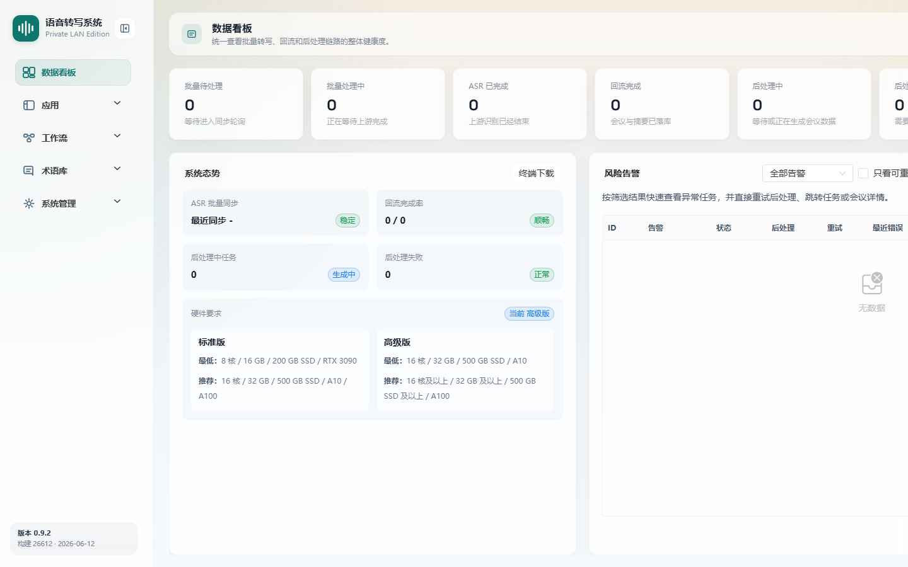

# 数据看板

> 菜单位置：左侧导航 **数据看板**（路径 `/dashboard`）
> 适用版本：标准版 / 高级版　|　可见角色：**仅管理员**

数据看板是管理员登录后的默认首页，集中展示批量任务统计、系统运行态势与风险告警，帮助管理员快速掌握系统整体健康状况。

---

## 功能特性

数据看板由三个区域组成：

1. **核心统计区**：以卡片形式展示批量任务各状态数量，包括：
   - 批量待处理、批量处理中、ASR 已完成、回流完成、后处理中、后处理失败、重试告警。
2. **系统态势区**：展示系统关键运行指标：
   - ASR 批量同步状态（稳定 / 阻塞）及最近同步时间；
   - 回流完成率（完成数 / 总数）；
   - 后处理中任务数与后处理失败数；
   - 硬件要求参考（标准版 / 高级版的最低与推荐配置）。
3. **风险告警区**：展示异常任务告警列表，支持筛选、批量重试与历史管理。

---

## 如何使用

- **场景一**：每日巡检。管理员进入看板，查看任务积压与失败数量，判断系统是否正常。
- **场景二**：异常处置。当“后处理失败”或“重试告警”数量异常时，进入风险告警区批量重试。
- **场景三**：同步监控。通过系统态势区观察 ASR 批量同步是否“阻塞”，及时排查上游识别服务。

---

## 操作步骤

### 查看统计数据

1. 使用管理员账号登录 Web 后台，自动进入数据看板。
2. 查看顶部统计卡片，了解各状态任务数量。
3. 如需刷新，触发页面刷新或执行相关操作，数据会按概览接口返回的最新快照更新。

### 处理风险告警

1. 在风险告警区，按**告警类型**筛选，或勾选**“只看可重试”**缩小范围。
2. 选择需要重试的异常任务，点击**批量重试后处理**。
3. 重试完成后，可在**最近重试批次**中按结果筛选、展开查看明细，或删除单条历史记录。
4. 对单个异常任务可触发同步，并跳转到对应的**批量任务**或**会议详情**进一步处理。
5. 如需清理历史，使用**清空历史告警**。

---

## 注意事项

- 本页**仅管理员可见**，普通用户无此菜单。
- 风险告警列表分页显示，默认每页 5 条。
- 统计数据为接口返回的快照，并非毫秒级实时；以页面刷新或操作后的更新为准。
- 重试为“重新执行后处理”，不会重复进行 ASR 识别本身。

---

## 异常恢复

| 异常现象 | 处理办法 |
| --- | --- |
| 统计数据获取失败 | 卡片显示默认值 0，按提示刷新页面重试 |
| ASR 同步超时 | 系统态势区显示“阻塞”状态，需检查上游 ASR 引擎服务连通性 |
| 批量重试失败 | 提示重试失败并保留告警记录，可稍后再次重试或进入任务详情排查 |
