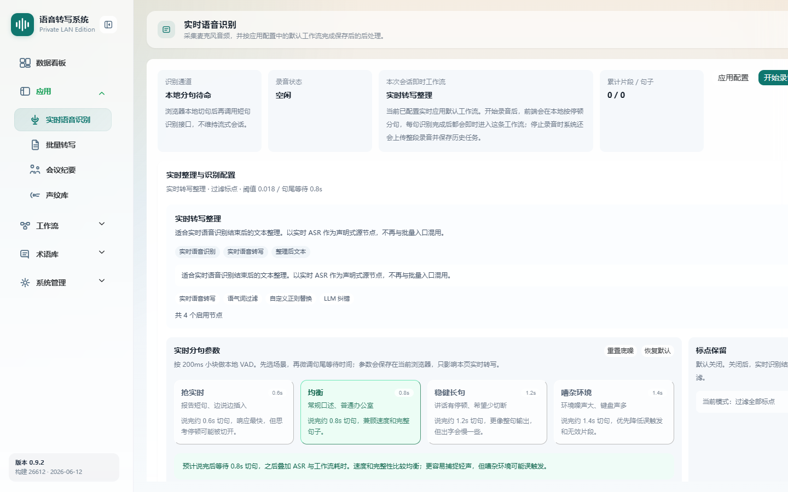

# 实时语音识别

> 菜单位置：左侧导航 **应用 → 实时语音识别**（路径 `/realtime`）
> 适用版本：标准版 / 高级版　|　可见角色：管理员 / 普通用户

实时语音识别采集麦克风音频，在浏览器本地完成分句后调用短句识别接口，并按应用配置绑定的实时工作流即时完成后处理。

---

## 功能特性

1. **录音控制**：支持开始 / 暂停 / 继续 / 停止录音，录音状态实时显示（空闲 / 录音中）。
2. **本地分句识别**：本地采集约 16k 音频，按约 200ms 音频块进行 VAD 切句，不维持后端流式会话。
3. **即时工作流后处理**：每识别完成一句即套用应用配置中绑定的实时工作流。
4. **双栏输出展示**：左侧“即时输出（套用工作流后）”，右侧“原始识别结果”，支持一键复制。
5. **整段复核**：停止录音后自动上传整段音频并保存为历史任务，展示整段复核执行状态、最终文本与节点明细。
6. **分句参数配置**：提供场景预设与精细微调，参数保存在浏览器本地。

---

## 如何使用

- **场景一**：报告口述。医生 / 办公人员边说边出文字，停止后获得整段复核结果。
- **场景二**：参数调优。在不同环境（安静 / 嘈杂）下切换分句场景，优化切句灵敏度。

### 实时分句参数

点击**展开配置**，可在“实时分句参数”中按场景预设快速切换，并精细微调：

四种场景预设：

| 预设 | 句尾等待 | 适用场景 |
| --- | --- | --- |
| 抢实时 | 约 0.6s | 报告短句、边说边插入，响应最快 |
| 均衡（默认） | 约 0.8s | 常规口述、普通办公室，兼顾速度与完整 |
| 稳健长句 | 约 1.2s | 讲话有停顿、希望少切断 |
| 嘈杂环境 | 约 1.4s | 环境噪声大、键盘声多，优先降低误触发 |

可微调项及范围：

| 参数 | 说明 | 取值范围 |
| --- | --- | --- |
| 最小触发阈值 | 触发识别的最小能量阈值 | 0.005 – 0.08（默认 0.018） |
| 底噪倍数 | 相对底噪的触发倍率 | 1.2 – 6（默认 2.8） |
| 句尾等待时间 | 句末静音判定时长，1 块约 200ms | 0.2 – 4s |
| 有效语音块数 | 触发识别的最少有效语音块 | 1 – 6 |
| 单块峰值倍数 | 单块峰值相对底噪倍率 | 1 – 3（默认 1.45） |
| 标点保留 | 是否保留识别标点 | 开 / 关（默认关闭） |

---

## 操作步骤

1. 通过 **HTTPS** 或 localhost 安全上下文打开实时语音识别页。
2. 首次使用时按浏览器提示**允许麦克风权限**。
3. （可选）点击**展开配置**，选择分句场景预设并按需微调参数；参数自动保存在当前浏览器。
4. 点击**开始录音**，对着麦克风说话，左栏会逐句显示套用工作流后的即时输出。
5. 录音过程中可**暂停 / 继续**；需要时点击**复制**导出当前输出文本。
6. 点击**停止录音**，系统自动上传整段音频并保存历史任务，下方展示整段复核结果、执行状态与节点明细。
7. 如需查看后处理详情，可在页面顶部**跳转批量转写**，并携带 taskId 查看该整段任务。

---

## 注意事项

- 实时录音需 **HTTPS 或 localhost 安全上下文**，否则浏览器禁止访问麦克风。
- 实时为“本地分句 + 短句识别”，不维持后端流式会话；网络抖动只影响单句，不会中断整段录音。
- 分句参数仅保存在**当前浏览器**，更换浏览器或清除站点数据后需重新配置。
- 即时输出是否经过纠错 / 过滤，取决于**应用配置**中绑定的实时工作流（详见 [应用配置](08-应用配置.md)）。
- 仅当存在有效识别文本时才创建实时历史任务；整段音频上传失败时会退化为仅保存文本结果。

---

## 异常恢复

| 异常现象 | 处理办法 |
| --- | --- |
| 麦克风权限被拒绝 | 在浏览器站点设置中开启麦克风权限后刷新页面 |
| 提示非 HTTPS 环境 | 改用 HTTPS 地址或 localhost 访问 |
| 单句识别失败 | 保留页面状态并提示原因，该句不生成输出，可继续录音 |
| 即时工作流执行失败 | 展示原始识别结果并提示失败信息，不影响录音 |
| 整段录音上传失败 | 自动回退为仅保存文本结果，并提示已降级保存 |
| 停止后无内容 | 提示暂无内容，说明本次未产生有效识别文本，不创建历史任务 |
