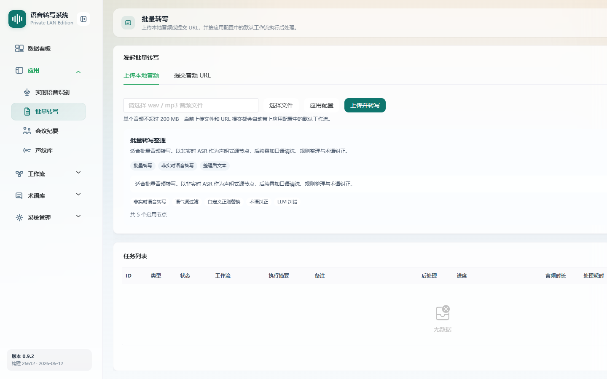

# 批量转写

> 菜单位置：左侧导航 **应用 → 批量转写**（路径 `/transcription`）
> 适用版本：标准版 / 高级版　|　可见角色：管理员 / 普通用户

批量转写用于上传音频文件或提交音频 URL，发起异步转写任务，并自动套用当前账号应用配置中的默认批量工作流完成后处理。

---

## 功能特性

1. **两种发起方式**：上传本地音频文件，或提交音频 URL。
2. **自动套用工作流**：自动带上当前账号应用配置中的默认批量工作流。
3. **任务列表管理**：展示任务 ID、类型、状态、工作流、执行摘要、备注、后处理、进度、音频时长、处理耗时、创建时间，支持搜索与筛选。
4. **任务详情**：查看完整转写文本、工作流执行记录与同步信息。
5. **任务操作**：单任务同步、删除（仅失败或已完成且非活动中的任务）、下载原音频。
6. **失败续跑**：后处理失败且满足条件时，支持从失败节点继续执行。

---

## 如何使用

- **场景一**：批量补录。将已有录音文件上传转写，自动整理为规范文本。
- **场景二**：URL 转写。对已有可访问的音频地址直接提交转写。
- **场景三**：结果复核。在任务详情查看完整文本与各节点处理记录。

---

## 操作步骤

### 发起转写任务

1. 进入批量转写页面。
2. 选择发起方式：
   - **上传本地音频**：选择一个 `.wav` 或 `.mp3` 文件（Web 页面一次仅上传一个文件）；
   - **提交音频 URL**：粘贴可访问的音频地址。
3. 系统自动带上当前账号应用配置中的**默认批量工作流**。
4. 提交后任务进入列表，状态从“处理中”流转至“已完成”或“失败”。

### 查看与管理任务

1. 在任务列表通过**搜索**（ID / 类型 / 状态）定位任务。
2. 点击**同步 / 刷新**手动更新任务状态；列表也会通过业务总线在状态变化后自动刷新。
3. 点击**任务详情**：
   - 查看任务基础信息卡片（状态 / 类型 / 音频时长 / 处理耗时 / 进度）；
   - 查看完整转写文本（支持内容查看弹窗）；
   - 查看工作流执行记录（执行编号 / 状态 / 触发类型 / 创建时间 / 文本长度 / 失败提示）；
   - 查看同步信息（失败次数 / 进度阶段 / 分片进度 / 上次与下次同步时间 / 最近错误）。
4. 对失败任务，满足条件时点击**从失败节点继续执行**。
5. 需要时**下载原音频**或**删除**任务（仅失败、或已完成且非活动中的任务可删除）。

---

## 注意事项

- Web 批量转写页面**一次仅提交一个本地文件**；多文件批量提交请使用[会议纪要](04-会议纪要.md)的新建会议页。
- 文件格式前端与后端均仅保留 `.wav` / `.mp3`，大小与编码兼容性以**后端校验**为准。
- 默认工作流来自[应用配置](08-应用配置.md)中“批量转写”绑定项，若需更换后处理流程请前往该页调整。
- 进度显示分片进度与百分比，长音频会分片处理。

---

## 异常恢复

| 异常现象 | 处理办法 |
| --- | --- |
| 文件格式不支持 | 按提示选择 `.wav` / `.mp3` 格式 |
| 文件或 URL 被后端拒绝 | 按后端返回的失败原因调整（如大小、编码、地址不可达） |
| 任务列表为空 | 友好提示暂无任务，提交新任务即可 |
| 任务执行失败 | 在详情查看失败提示；满足条件时从失败节点续跑 |
| 下载原音频失败 | 提示音频下载失败或无可用音频地址，确认音频是否仍保留 |
