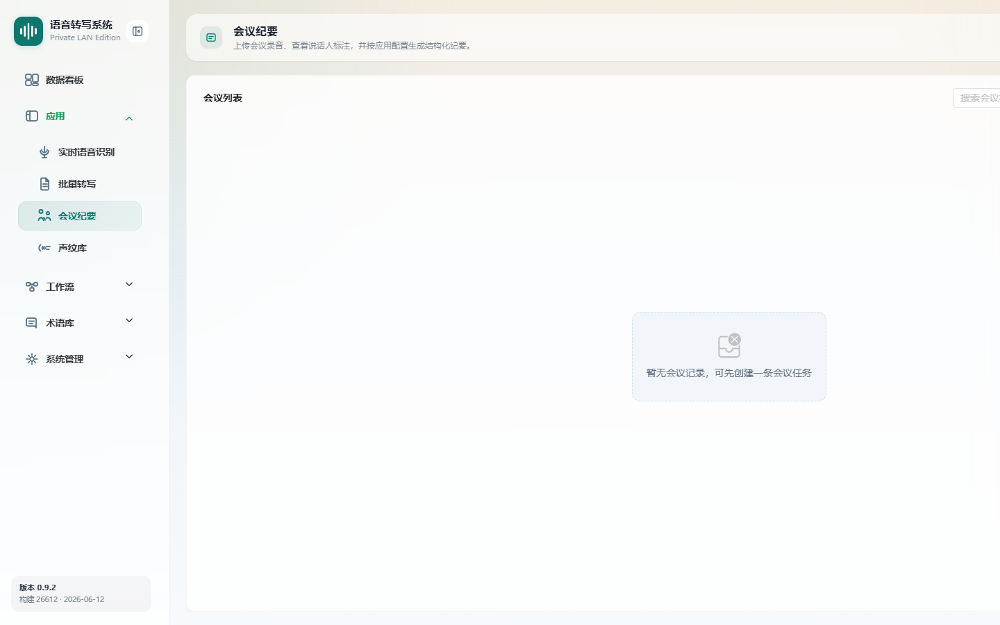
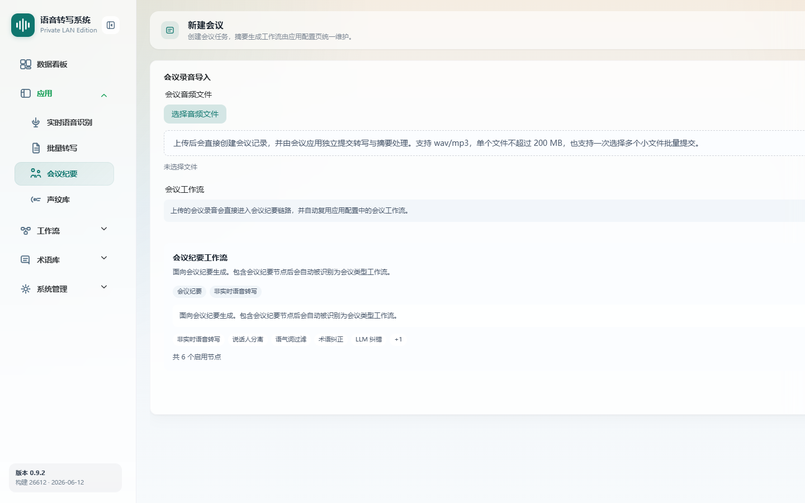

# 会议纪要

> 菜单位置：左侧导航 **应用 → 会议纪要**（路径 `/meetings`）
> 适用版本：**仅高级版**　|　可见角色：管理员 / 普通用户（需开通会议纪要能力）

会议纪要用于上传会议录音，自动完成转写、说话人分离，并由大模型生成结构化会议摘要。

---

## 功能特性

1. **会议列表**：展示会议 ID、标题、状态、音频时长、处理耗时、创建时间，支持搜索会议标题 / 状态。
2. **新建会议**：支持单个大文件或多个小文件批量提交，自动复用应用配置中的会议工作流。
3. **会议详情**：
   - 基础信息卡片（ID / 状态 / 音频时长 / 处理耗时 / 片段数）；
   - **逐字稿**：按说话人分段显示，标注时间范围；
   - **会议摘要**：按 Markdown 渲染，存在摘要时显示模型版本；
   - 展示当前生效的会议摘要工作流预览，支持跳转应用配置。
4. **摘要生成 / 重新生成**：在已有逐字稿的前提下生成或重新生成摘要。
5. **状态流转**：待转写 / 待处理 / 转写中 / 已完成 / 失败。

---

## 如何使用

- **场景一**：会后整理。上传完整会议录音，系统自动转写并生成结构化纪要。
- **场景二**：分段上传。将一场长会议拆为多个录音文件批量提交。
- **场景三**：摘要复核。在详情页查看逐字稿与摘要，必要时重新生成。

---

## 操作步骤

### 新建会议

1. 在会议列表点击**新建会议**。
2. 选择音频文件：可一次选择多个 `.wav` / `.mp3` 文件；已选列表支持单个移除或全部清空。
3. 系统自动复用应用配置中的**会议工作流**，并展示当前绑定工作流预览。
4. 点击提交：
   - **单文件**创建成功后自动进入会议详情；
   - **多文件**创建成功后返回会议列表。

### 查看会议详情与摘要

1. 在列表点击会议**详情**。
2. 在**逐字稿**标签页查看按说话人分段的转写文本与时间范围。
3. 切换到**会议摘要**标签页查看 Markdown 渲染的纪要，并可查看模型版本。
4. 如需更新摘要，点击**生成 / 重新生成摘要**（需已有逐字稿）。

### 删除会议

1. 仅**待转写 / 已完成 / 失败**状态的会议支持删除。
2. 点击删除并完成**二次确认**。

---

## 注意事项

- 会议纪要为**高级版**能力；标准版调用会议接口会返回权限错误，且 Web 端隐藏入口。
- 会议工作流来自[应用配置](08-应用配置.md)中“会议纪要”绑定项；未绑定时可提交基础识别流程，页面会提示前往应用配置绑定。
- **Web 会议详情仅支持查看与重新生成摘要**，不提供摘要内联编辑或导出；摘要编辑与 PDF 导出是[桌面客户端](16-桌面客户端.md)能力。
- 说话人实名匹配依赖[声纹库](05-声纹库.md)中已注册的声纹。
- 无逐字稿时不可触发摘要生成。

---

## 异常恢复

| 异常现象 | 处理办法 |
| --- | --- |
| 会议列表为空 | 友好提示暂无会议，新建会议即可 |
| 摘要生成失败 | 按提示重试，或检查应用配置中的会议工作流（尤其是 LLM 节点参数） |
| 会议不存在或加载失败 | 返回列表或按提示重新加载 |
| 会议处理失败 | 失败行显示失败原因摘要、失败次数、上次失败与下次重试时间，可等待自动重试或排查上游服务 |
| 标准版看不到会议入口 | 属正常表现，会议纪要需高级版授权 |
