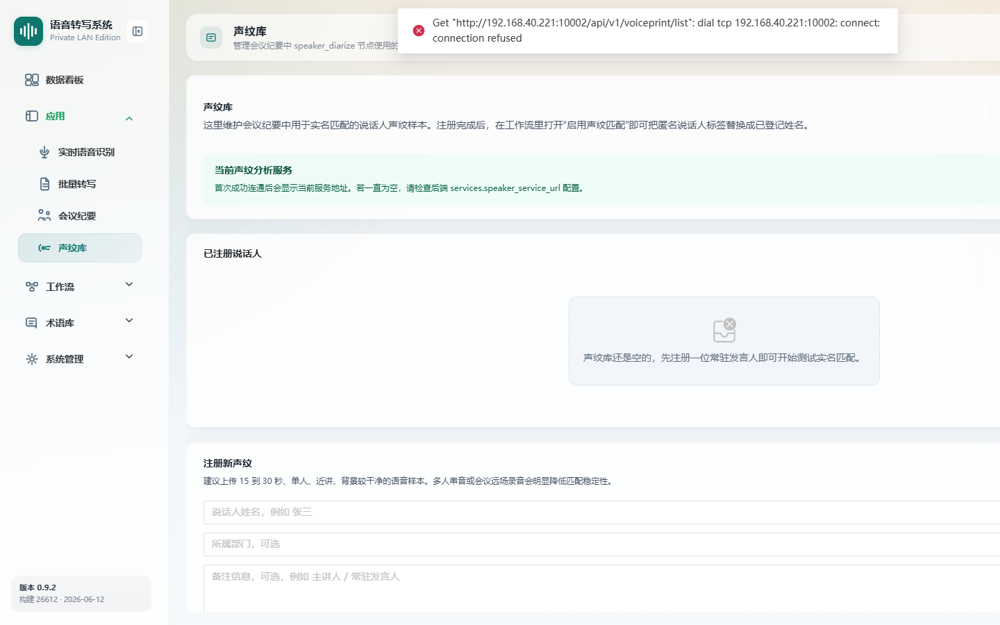

# 声纹库

> 菜单位置：左侧导航 **应用 → 声纹库**（路径 `/meetings/voiceprints`）
> 适用版本：**仅高级版**　|　可见角色：管理员 / 普通用户（需开通会议纪要 / 声纹能力）

声纹库用于注册说话人声纹，供[会议纪要](04-会议纪要.md)在逐字稿中进行说话人实名匹配。

---

## 功能特性

1. **声纹注册**：填写说话人姓名（必填）、所属部门、备注，选择“上传音频”或“直接录音”采集样本。
2. **示例文案**：直接录音时可选择示例朗读文案场景，规范采集内容。
3. **已注册说话人列表**：展示已注册声纹，显示声纹分析服务 URL，支持删除已注册声纹。

---

## 如何使用

- **场景一**：会前建档。为常参会人员录入声纹，使会议纪要逐字稿自动显示真实姓名。
- **场景二**：声纹维护。删除离职或错误录入的声纹样本。

---

## 操作步骤

### 注册新声纹

1. 进入声纹库页面，点击**注册新声纹**。
2. 填写**说话人姓名**（必填）、所属部门、备注。
3. 选择注册方式：
   - **上传音频**：选择已有 `.wav` / `.mp3` 样本；
   - **直接录音**：选择示例朗读文案，现场采集并回放确认。
4. 提交完成注册，新声纹出现在已注册列表中。

### 采集质量建议

- 建议音频时长 **15–30 秒**；
- **单人**录制，**近讲**，背景干净，避免多人混音与强噪声。

### 删除声纹

1. 在已注册说话人列表中找到目标声纹。
2. 点击删除并确认。

---

## 注意事项

- 声纹库为**高级版**能力，标准版不可见。
- **说话人姓名**与**音频样本**为必填项。
- 声纹质量直接影响会议纪要的说话人匹配准确度，请按采集建议录制。
- 页面显示的声纹分析服务 URL 需保证可达，否则注册 / 匹配会失败。

---

## 异常恢复

| 异常现象 | 处理办法 |
| --- | --- |
| 音频时长不足 | 按提示重新采集，满足 15–30 秒建议时长 |
| 注册失败 | 按提示原因排查（样本质量、服务连通性），重新注册 |
| 声纹库为空 | 提示注册新声纹 |
| 声纹分析服务不可达 | 检查页面显示的声纹分析服务 URL 与后端连通性 |
