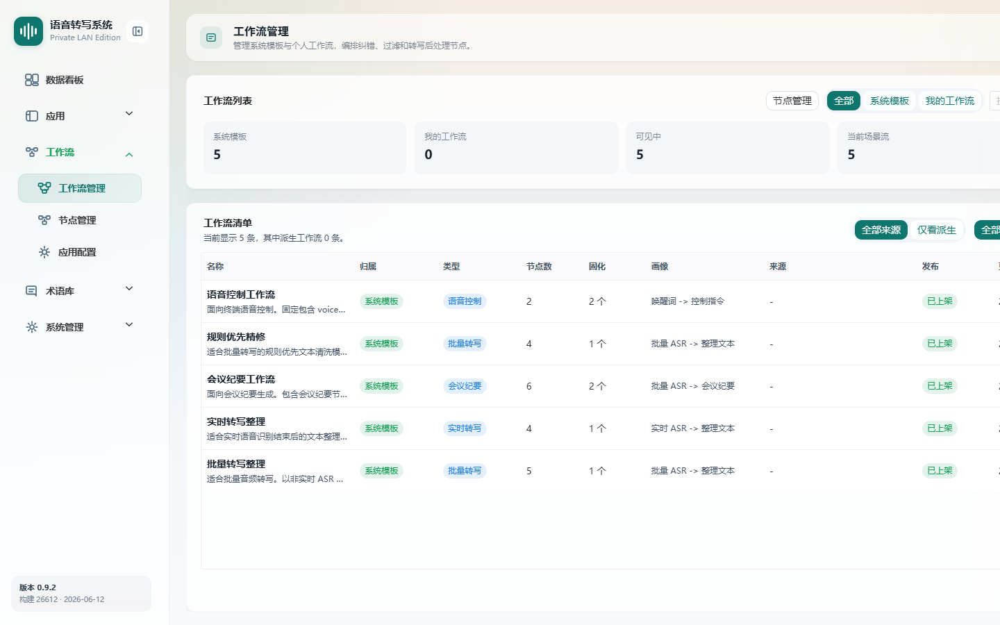
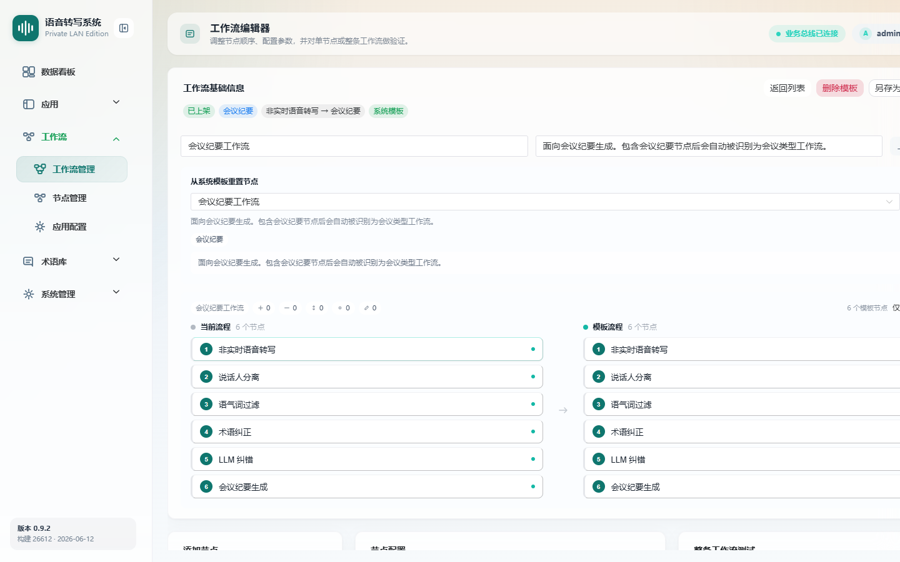
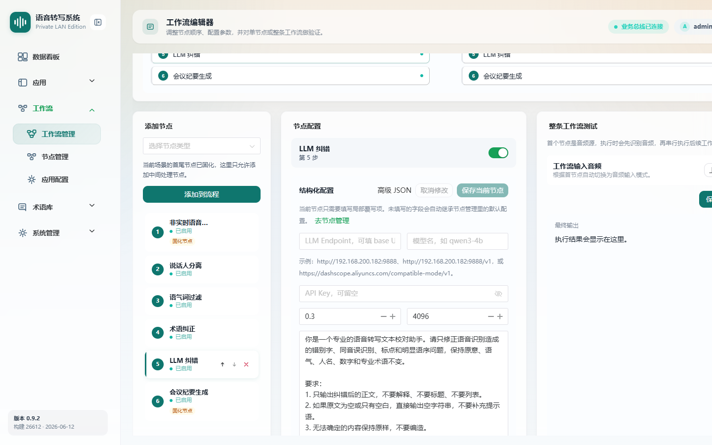
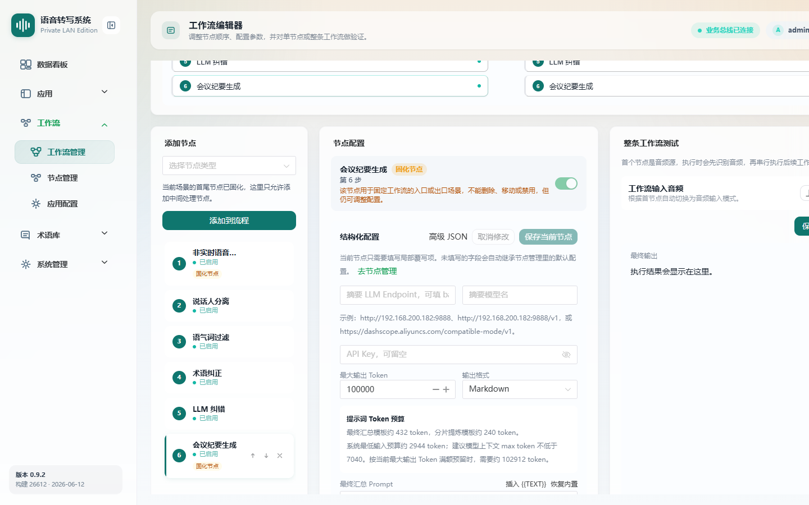

# 工作流管理

> 菜单位置：左侧导航 **工作流 → 工作流管理**（路径 `/workflows`）
> 适用版本：标准版 / 高级版　|　可见角色：**仅管理员**

工作流是对识别结果做后处理的有序节点序列。工作流管理用于维护系统模板与个人工作流，并通过可视化编辑器编排、配置、测试节点。

---

## 功能特性

1. **工作流列表**：展示名称、归属、类型、节点数、发布状态、更新时间；支持按来源（全部 / 仅看派生）与场景类型筛选。
2. **新建工作流**：填写名称与描述，选择场景类型，创建后自动添加场景必需的**固化节点**。
3. **工作流编辑器**：添加中间处理节点、排序、配置参数（结构化配置 / 高级 JSON）、单节点测试、整条工作流测试。
4. **模板与复用**：支持导入模板差异预览、克隆、另存为工作流。
5. **发布管理**：发布 / 下架、删除工作流；系统模板与已发布工作流以“已上架”状态展示。

### 工作流场景类型

| 场景 | 用途 |
| --- | --- |
| 批量转写整理 | 绑定到批量转写应用 |
| 实时转写整理 | 绑定到实时语音识别应用 |
| 会议纪要 | 绑定到会议纪要应用 |
| 语音控制 | 绑定到语音控制（高级版） |

---

## 如何使用

- **场景一**：定制后处理。新建工作流并加入术语纠正、语气词过滤、LLM 纠错等节点。
- **场景二**：调试验证。在编辑器中对单节点或整条流程做测试，确认效果后发布。
- **场景三**：模板派生。克隆系统模板为“我的工作流”，按需修改。

---

## 操作步骤

### 新建工作流

1. 在工作流管理点击**新建工作流**。
2. 填写**工作流名称**与**描述**。
3. 选择**工作流场景**（批量转写整理 / 实时转写整理 / 会议纪要 / 语音控制）。
4. 创建后系统按场景自动添加必需的**固化节点**（首尾源节点 / 输出节点不可删除、移动或禁用），归属为“我的工作流”。

### 编辑工作流

1. 在列表点击工作流**编辑**，进入工作流编辑器。
2. 在左侧**添加节点**区选择节点类型，点击**添加到流程**加入中间处理节点。
3. 通过节点项上的箭头**排序**，或禁用 / 删除可变节点（固化节点不可操作）。
4. 在中部**节点配置**区配置参数：
   - **结构化配置**：按字段填写；未填写的字段自动继承[节点管理](07-节点管理.md)的默认值；
   - **高级 JSON**：直接编辑 JSON 配置。
5. 配置完成后点击**保存当前节点**。
6. 在右侧**整条工作流测试**区输入文本或音频，验证最终输出与节点明细。
7. 需要时使用**导入模板**（含差异预览）、**另存为工作流**。

### LLM 纠错节点配置（重点）

“LLM 纠错”节点调用 OpenAI 兼容大模型对识别文本做智能校对，配置项如下：

| 配置项 | 说明 | 示例 |
| --- | --- | --- |
| LLM Endpoint | OpenAI 兼容服务地址 | `http://192.168.200.182:9888`、`.../v1` 或 `https://dashscope.aliyuncs.com/compatible-mode/v1` |
| 模型名 | 模型标识 | `qwen3-4b` |
| API Key | 可留空（内网服务通常无需鉴权） | — |
| temperature | 采样温度，越低越稳定 | `0.3` |
| max_tokens | 最大输出长度 | `4096` |
| 提示词模板 | 系统提示词，约束模型行为 | 见下方说明 |

> 提示词模板用于约束模型“只修正识别造成的错别字、同音误识、标点和明显语序问题，保持原意，人名 / 数字 / 专业术语不变”。调整提示词可改变纠错风格，详见[部署手册](../部署手册.md)中“提示词调整”章节。

### 会议纪要生成节点配置

“会议纪要生成”节点用于将逐字稿汇总为结构化纪要，同样基于 OpenAI 兼容大模型，可分别配置汇总提示词与分段提示词。

---

## 注意事项

- 本页**仅管理员可见**。
- **固化节点**（首部源节点、尾部输出节点）按场景不可删除、移动或禁用。
- 节点未显式填写的参数会**继承节点管理中的默认值**，修改默认值不会批量覆盖已有工作流节点的显式配置。
- 工作流需**发布（上架）**后才能在应用配置中绑定使用。
- LLM 节点的 Endpoint 必须是可达的 OpenAI 兼容服务，否则纠错 / 纪要生成会失败。

---

## 异常恢复

| 异常现象 | 处理办法 |
| --- | --- |
| 工作流列表为空 | 提示新建工作流 |
| 名称已存在 | 提示名称重复，更换名称 |
| 节点测试失败 | 显示错误信息，按提示检查节点配置与上游服务 |
| 导入模板失败 | 保留当前编辑内容并显示失败原因 |
| LLM 节点报错 | 检查 Endpoint 可达性、模型名、API Key 与 max_tokens 设置 |
