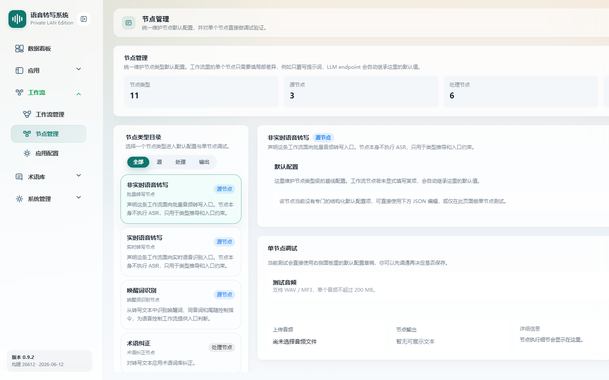

# 节点管理

> 菜单位置：左侧导航 **工作流 → 节点管理**（路径 `/workflows/nodes`）
> 适用版本：标准版 / 高级版　|　可见角色：**仅管理员**

节点管理维护各节点类型的**默认配置（基线配置）**。工作流中的节点在未显式填写参数时，会自动继承这里的默认值。

---

## 功能特性

1. **节点类型目录**：展示全部节点类型（共 11 种），分为源节点、处理节点、输出节点，支持搜索与分类筛选。
2. **节点默认配置**：维护节点类型级基线配置，支持结构化配置或高级 JSON 编辑。
3. **单节点调试**：输入测试文本（音频类节点可上传测试音频），执行单节点测试并查看输入、输出与详细信息。

### 节点类型一览

| 分类 | 节点 |
| --- | --- |
| 源节点 | 非实时语音转写、实时语音转写、唤醒词识别 |
| 处理节点 | 术语纠正、语气词过滤、敏感词过滤、LLM 纠错、自定义正则替换、说话人分离 |
| 输出节点 | 语音控制意图识别、会议纪要生成 |

---

## 如何使用

- **场景一**：统一基线。为“LLM 纠错”设置默认 Endpoint、模型、提示词，所有工作流新增该节点时自动继承。
- **场景二**：效果验证。在新增工作流节点前，先用单节点调试验证配置是否符合预期。

---

## 操作步骤

### 维护节点默认配置

1. 进入节点管理页面，按**分类**（全部 / 源 / 处理 / 输出）筛选或**搜索**节点类型。
2. 选择目标节点类型，查看节点说明与默认配置项。
3. 以**结构化配置**或**高级 JSON**编辑默认值。
4. 保存默认配置；后续工作流节点在未显式填写时将继承这些默认值。
5. 如需放弃修改，使用**撤销修改**。

### 单节点调试

1. 选择节点类型。
2. 输入**测试文本**；音频类节点可上传**测试音频**。
3. 点击**测试当前节点**。
4. 查看测试输入、节点输出与详细信息。

---

## 注意事项

- 本页**仅管理员可见**。
- 这里保存的是**节点类型级默认配置**，**不会批量覆盖**已有工作流节点中显式填写的配置。
- 工作流编辑器中的节点配置优先级高于此处默认值。

---

## 异常恢复

| 异常现象 | 处理办法 |
| --- | --- |
| 搜索 / 筛选无匹配结果 | 提示无匹配，调整关键词或分类 |
| 配置格式错误 | 提示格式错误位置（尤其高级 JSON），修正后重试 |
| 单节点测试失败 | 显示失败原因，按提示检查配置或上游服务 |
