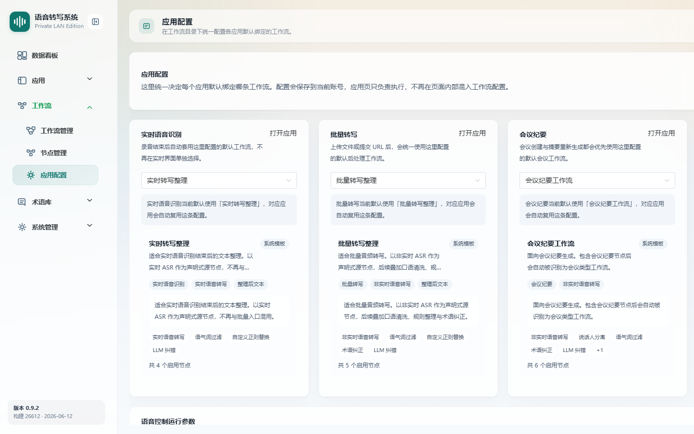

# 应用配置

> 菜单位置：左侧导航 **工作流 → 应用配置**（路径 `/workflows/application-settings`）
> 适用版本：标准版 / 高级版　|　可见角色：**仅管理员**

应用配置用于为各应用（实时识别 / 批量转写 / 会议纪要 / 语音控制）绑定**默认工作流**，并配置语音控制运行参数。配置按当前登录账号保存。

---

## 功能特性

1. **应用工作流绑定**：
   - 实时语音识别默认工作流；
   - 批量转写默认工作流；
   - 会议纪要默认工作流（高级版）；
   - 语音控制默认工作流（高级版）。
2. **快捷跳转**：支持从配置项直接打开对应应用页。
3. **语音控制运行参数**（高级版）：启用 / 停用语音控制、配置命令等待超时时间。

---

## 如何使用

- **场景一**：上线绑定。新建并发布工作流后，在此将其绑定到对应应用，使应用页自动套用。
- **场景二**：切换策略。为批量转写更换一条新的整理工作流。
- **场景三**：语音控制开关。开通语音控制能力后，在此启用并设置命令等待时间。

---

## 操作步骤

### 绑定应用默认工作流

1. 进入应用配置页面。
2. 在**实时语音识别 / 批量转写 / 会议纪要 / 语音控制**各项中选择对应场景类型的已发布工作流。
3. 保存后配置写入当前登录账号；应用页执行时自动复用绑定的工作流。
4. 如需核对效果，点击各项的**跳转打开**进入对应应用页。

### 配置语音控制运行参数（高级版）

1. 确认产品能力已开通语音控制（否则不显示该配置项）。
2. 设置**语音控制启用开关**。
3. 设置**命令等待超时时间**（桌面端低于 2 秒时按 2 秒兜底）。
4. 保存后 Web 端与桌面客户端按新配置执行语音控制。

---

## 注意事项

- 本页**仅管理员可见**。
- 配置**按当前登录账号保存**；桌面客户端匿名用户读取的是其对应账号的绑定。
- **会议纪要与语音控制**绑定项仅在对应产品能力开通时显示。
- 仅管理员可修改语音控制运行参数。
- 语音控制指令识别依赖此处绑定的**语音控制工作流**，未绑定则无法进入有效指令识别。
- 只有已**发布（上架）**的工作流才能被选择绑定。

---

## 异常恢复

| 异常现象 | 处理办法 |
| --- | --- |
| 工作流不存在 / 无法选择 | 提示选择有效工作流；确认目标工作流已发布且场景类型匹配 |
| 语音控制参数保存失败 | 恢复页面原值并提示失败原因，可重试 |
| 应用页未套用预期工作流 | 回到本页确认绑定项是否正确保存到当前账号 |
