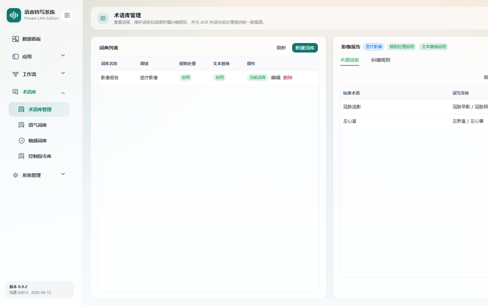
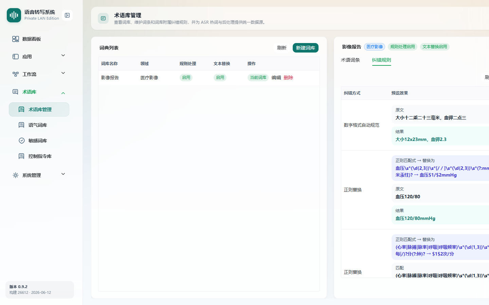
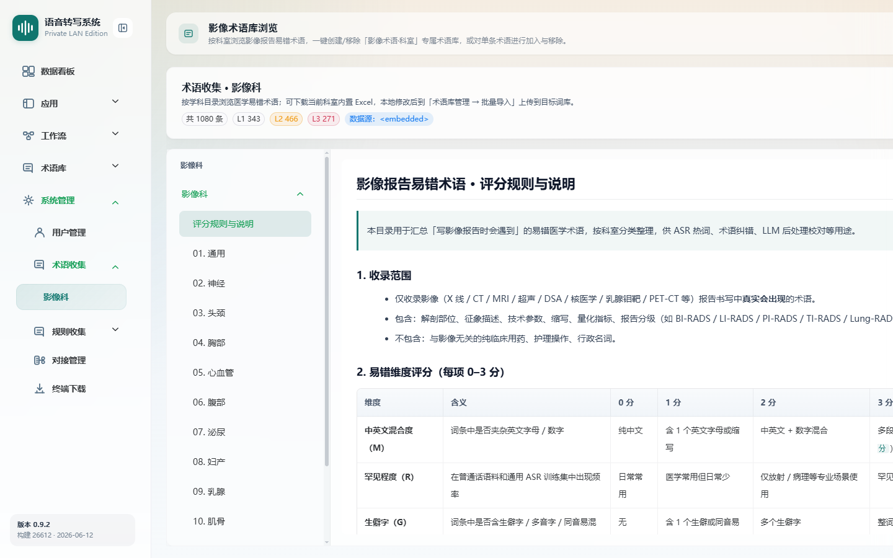
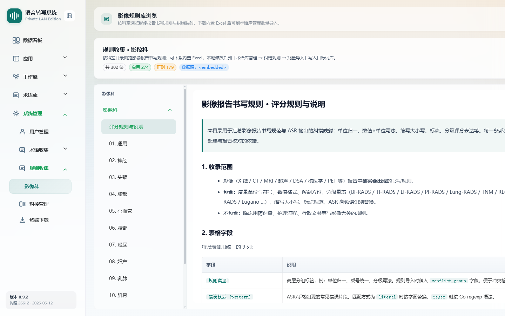

# 术语库与纠错规则

> 菜单位置：左侧导航 **术语库 → 术语库管理**（路径 `/terminology`）
> 相关页面：系统管理 → 术语收集（`/system/terms-catalog`）、规则收集（`/system/rules-catalog`）
> 适用版本：标准版 / 高级版　|　可见角色：**仅管理员**

术语库用于维护标准术语与误写变体映射，并配置词库附属的纠错规则。词条的标准术语与误写变体同时作为 ASR 热词候选，从源头提升识别准确率。

---

## 功能特性

### 词库与词条管理（3.9）

1. **词库管理**：展示词库列表（名称 / 领域），支持新建、编辑、删除词库。
2. **词条管理**：展示词条列表（标准术语 / 误写变体），支持新增、编辑、删除词条；误写变体可填多个（逗号或换行分隔）。
3. **批量导入**：支持 CSV / TSV / TXT / XLSX 文件导入，可下载 CSV 模板（表头 `correct_term` 与 `wrong_variants`）。

### 术语纠错规则（3.13）

“术语库管理”页提供**纠错规则**标签页，可为词库配置优先于近似词替换执行的规则。

| 规则类型 | 适用场景 |
| --- | --- |
| 近似词替换 | 高频稳定的固定错误（如“冠脉早影 → 冠脉造影”） |
| 正则替换 | 结构化特殊文本 |
| 数字归一化 | 口语数字落为纸面格式 |

规则按**优先级**顺序执行，规则列展示处理类型 / 匹配内容 / 替换为 / 优先级 / 状态，支持新增、启用 / 禁用。

### 内置影像目录浏览

系统内置医疗影像术语 / 规则目录，可在系统管理下浏览：

- **术语收集**（`/system/terms-catalog`）：浏览内置影像术语库。

  

- **规则收集**（`/system/rules-catalog`）：浏览内置影像规则库。

  

---

## 如何使用

- **场景一**：建词库。为某科室 / 领域新建词库，录入专业术语及常见误写。
- **场景二**：批量导入。用 CSV/XLSX 一次性导入大量术语词条。
- **场景三**：精细纠错。对固定错误配置近似词替换规则，对格式文本配置正则规则。

---

## 操作步骤

### 维护词库与词条

1. 进入术语库管理页面。
2. **新建词库**：填写词库名称与领域。
3. 选择词库后，右侧展示词条列表。
4. **新增词条**：填写标准术语与误写变体（多个变体用逗号或换行分隔）。
5. 需要时编辑或删除词条 / 词库。

### 批量导入词条

1. 选择目标词库，点击批量导入。
2. 可先**下载 CSV 模板**，按 `correct_term` / `wrong_variants` 表头填写。
3. 上传文件（不超过 5MB，单次最多 5000 行）。
4. 系统跳过已存在或本次重复的标准词，导入完成后查看结果。

### 配置纠错规则

1. 在术语库管理页选择词库，切换到**纠错规则**标签页。
2. **新增规则**：选择处理类型（近似词替换 / 正则替换 / 数字归一化），填写匹配内容、替换为与优先级。
3. 通过**启用 / 禁用**控制规则是否生效。

---

## 注意事项

- 本页**仅管理员可见**。
- 词库下存在词条时需**先删除词条**才能删除词库。
- 批量导入文件**不超过 5MB、单次最多 5000 行**；已存在或本次重复的标准词会被跳过。
- 纠错规则**优先于**近似词替换执行，配置时注意优先级顺序。
- 术语纠正效果需在工作流中加入“术语纠正”节点并绑定相应词库后才会生效。

---

## 异常恢复

| 异常现象 | 处理办法 |
| --- | --- |
| 词库下存在词条 | 提示先删除词条再删除词库 |
| 标准术语重复 | 提示术语已存在，调整后再保存 |
| 导入文件格式 / 大小不符 | 按后端返回的失败原因调整文件 |
| 规则格式错误 | 提示格式错误（尤其正则），修正后重试 |
| 规则列表为空 | 提示新增规则 |
