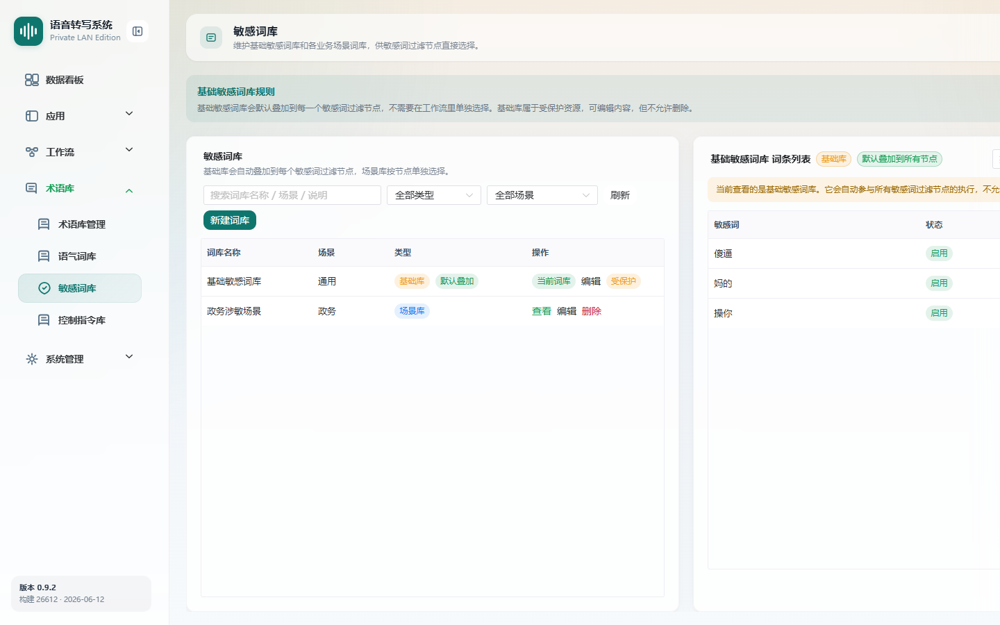

# 敏感词库

> 菜单位置：左侧导航 **术语库 → 敏感词库**（路径 `/terminology/sensitive`）
> 适用版本：标准版 / 高级版　|　可见角色：**仅管理员**

敏感词库维护需要在转写文本中识别并替换的敏感词，供工作流中的**敏感词过滤**节点使用。

---

## 功能特性

1. **基础敏感词库**：默认叠加到所有敏感词过滤节点；属于受保护资源，可编辑内容但**不可删除**。
2. **场景敏感词库**：可创建多个，供不同工作流节点按需选择。
3. **词条管理**：新增、编辑、删除敏感词，支持启用 / 禁用单个词条。

---

## 如何使用

- **场景一**：通用脱敏。在基础库维护通用敏感词，对所有过滤节点统一生效。
- **场景二**：场景脱敏。为特定业务创建场景库，仅在相应工作流节点中启用。

---

## 操作步骤

### 维护基础敏感词库

1. 进入敏感词库页面，默认展示基础库。
2. **新增 / 编辑**敏感词条。
3. 通过**启用 / 禁用**控制单个词条是否生效。

### 创建并维护场景敏感词库

1. 点击**创建场景敏感词库**，填写库名。
2. 在场景库下新增 / 编辑 / 删除词条，并按需启用 / 禁用。
3. 在[工作流编辑器](06-工作流管理.md)的“敏感词过滤”节点中选择启用该场景库。

---

## 注意事项

- 本页**仅管理员可见**。
- **基础库受保护，不可删除**；场景库可删除。
- **敏感词库页面不配置替换文本**；命中后的替换文本在工作流的“敏感词过滤”节点配置中设置。
- 工作流节点可同时叠加基础库与选中的场景库。

---

## 异常恢复

| 异常现象 | 处理办法 |
| --- | --- |
| 敏感词重复 | 提示已存在，调整后保存 |
| 场景库被引用无法删除 | 提示先在相关工作流节点解除引用 |
