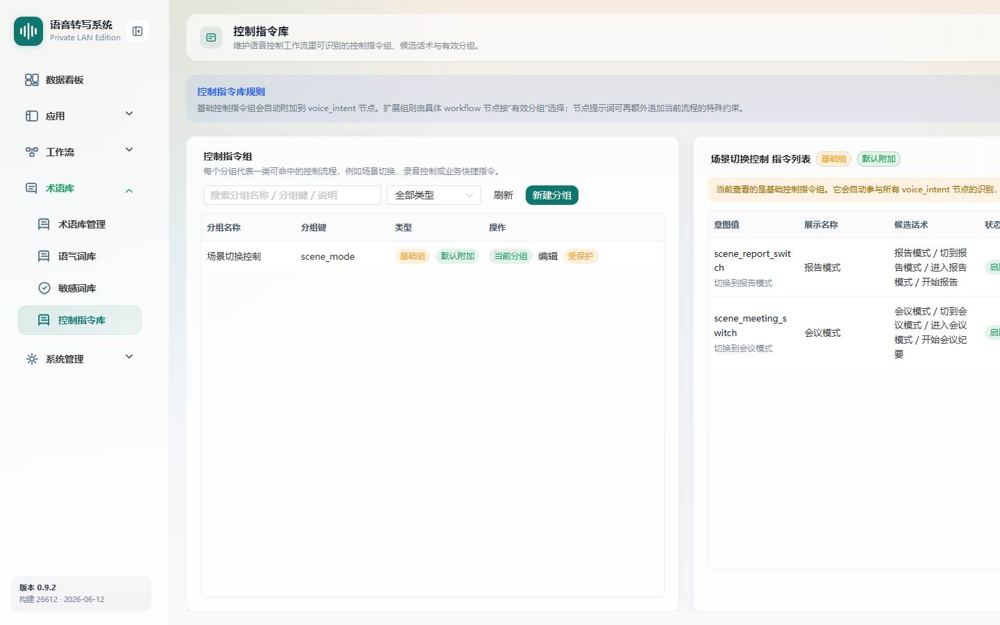

# 控制指令库

> 菜单位置：左侧导航 **术语库 → 控制指令库**（路径 `/terminology/voice-commands`）
> 适用版本：**仅高级版**　|　可见角色：**仅管理员**

控制指令库维护语音控制所需的指令组与指令，供语音控制工作流的 `voice_intent`（语音控制意图识别）节点使用。

---

## 功能特性

1. **指令组管理**：
   - **基础控制指令组**：自动附加到所有 `voice_intent` 节点，受保护不可删除；
   - **扩展组**：由工作流节点按“有效分组”选择，支持创建、编辑、删除。
2. **指令管理**：展示指令列表（意图值 / 展示名称 / 候选话术 / 状态 / 排序），支持新增、编辑、删除、启用 / 禁用。

---

## 如何使用

- **场景一**：内置切换。基础组已包含“切换报告模式 / 切换会议模式”等意图，开箱即用。
- **场景二**：扩展指令。为特定业务创建扩展组，配置自定义意图与候选话术。

---

## 操作步骤

### 维护指令组

1. 进入控制指令库页面。
2. **创建扩展组**：填写分组名称与分组键（受注册表约束的分组键需使用系统允许值）。
3. 需要时编辑或删除扩展组（基础组不可删除）。

### 维护指令

1. 选择指令组。
2. **新增指令**：填写意图值、展示名称、候选话术（可填多个，每行一个或列表形式），设置排序。
3. 通过**启用 / 禁用**控制指令是否参与匹配。

---

## 注意事项

- 控制指令库为**高级版**能力，标准版不可见。
- 本页**仅管理员可见**。
- **基础指令组受保护，不可删除**。
- 受注册表约束的**分组键 / 意图值**需使用系统允许值。
- 候选话术为空值不计入匹配。
- 语音控制需配合[应用配置](08-应用配置.md)绑定语音控制工作流，并在该工作流中加入 `voice_intent` 节点。

---

## 异常恢复

| 异常现象 | 处理办法 |
| --- | --- |
| 指令组被引用无法删除 | 提示先在相关工作流节点解除引用 |
| 意图值重复 | 提示已存在，调整后保存 |
| 标准版看不到入口 | 属正常表现，控制指令库需高级版授权 |
