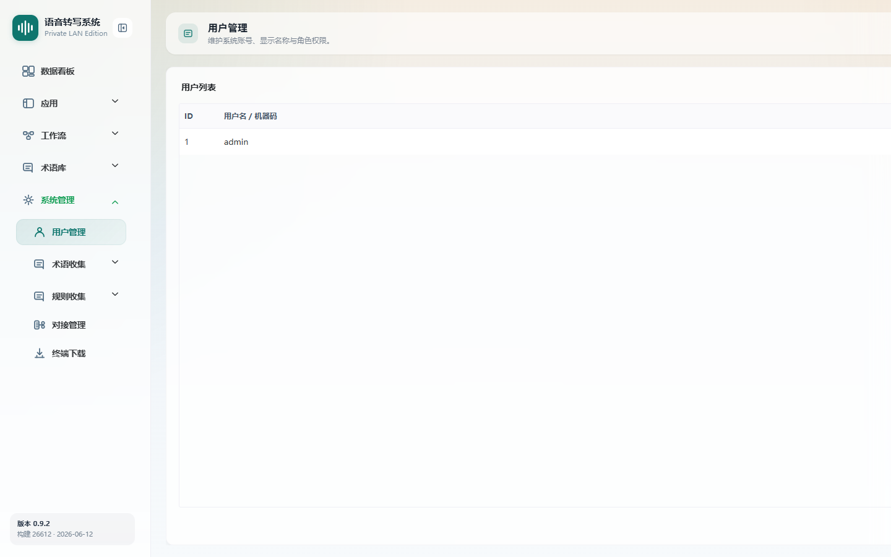

# 用户管理

> 菜单位置：左侧导航 **系统管理 → 用户管理**（路径 `/system/users`）
> 适用版本：标准版 / 高级版　|　可见角色：**仅管理员**

用户管理用于查看系统账号、维护显示名称与角色权限，并新增用户。

---

## 功能特性

1. **用户列表**：展示 ID、用户名 / 机器码、显示名、角色。
2. **新增用户**：填写用户名、密码，可填显示名并选择管理员 / 普通用户角色。
3. **搜索**：按用户名 / 显示名 / 角色搜索。
4. **角色区分**：列表中区分显示“管理员”与“普通用户”。

---

## 如何使用

- **场景一**：开账号。为新成员创建普通用户或管理员账号。
- **场景二**：查设备。查看桌面客户端匿名登录产生的设备用户（`device_` 前缀机器码）。

---

## 操作步骤

### 新增用户

1. 进入用户管理页面（仅管理员显示**新增用户**入口）。
2. 点击**新增用户**。
3. 填写**用户名**、**密码**（必填），可填写显示名。
4. 选择角色：**管理员**或**普通用户**。
5. 提交后新用户出现在列表中。

### 搜索用户

1. 在搜索框输入用户名 / 显示名 / 角色关键词。
2. 列表实时过滤显示匹配用户。

---

## 注意事项

- 本页**仅管理员可见**，且仅管理员显示“新增用户”入口。
- **当前页面不提供编辑用户、删除用户、重置密码功能**。
- 系统同时存在两类账号：管理员 / 普通用户账号、设备用户（`device_` 前缀机器码，由桌面客户端匿名登录产生）。
- 角色决定可见模块范围，详见 [用户手册首页](README.md) 的角色权限说明。

---

## 异常恢复

| 异常现象 | 处理办法 |
| --- | --- |
| 用户列表为空 | 提示新增用户 |
| 用户名重复 | 按提示更换用户名 |
| 普通用户看不到本页 | 属正常表现，用户管理仅管理员可见 |
