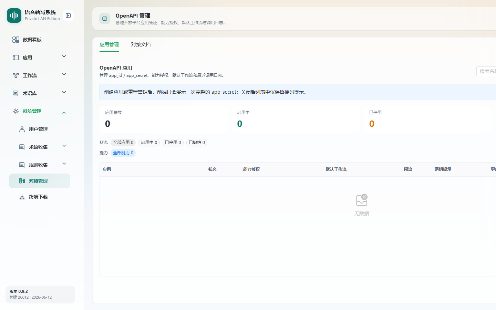
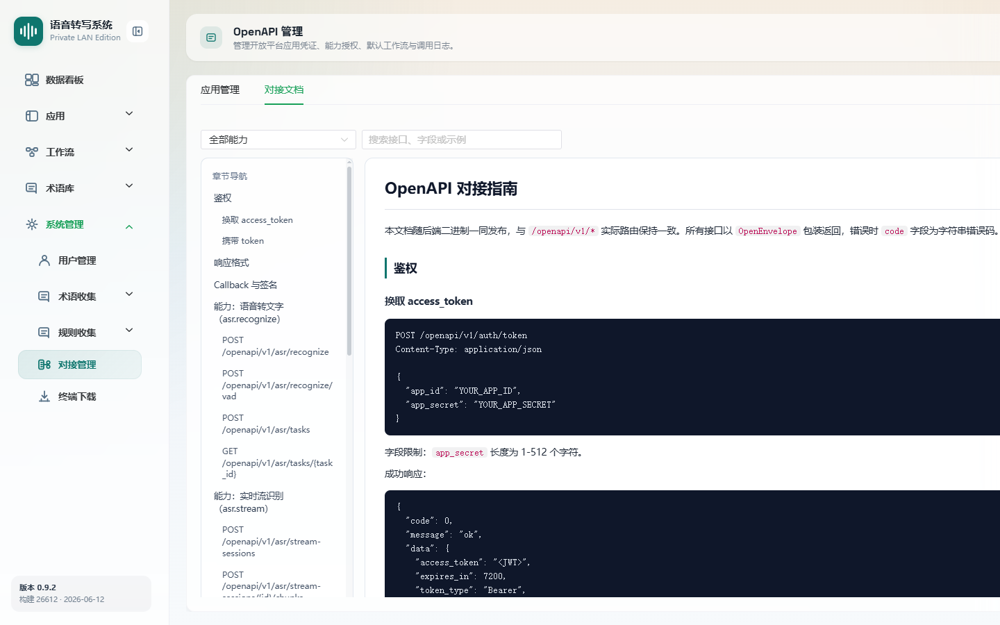

# OpenAPI 管理

> 菜单位置：左侧导航 **系统管理 → 对接管理**（路径 `/system/openapi`）
> 适用版本：标准版 / 高级版　|　可见角色：**仅管理员**（普通用户访问显示无权提示）

OpenAPI 管理用于对外开放语音转写、文本纠错、会议纪要等能力，管理第三方应用的凭证、能力授权、限流与调用日志，并提供对接文档。

---

## 功能特性

### 应用管理

1. **应用统计**：总数 / 启用中 / 已停用 / 已撤销。
2. **应用列表**：应用名称、App ID、状态、能力授权、默认工作流、限流、密钥提示、更新时间。
3. **应用操作**：编辑配置、查看调用日志、重置密钥、启用 / 停用、撤销。
4. **新增应用**：配置名称、限流、描述、能力授权、默认工作流与回调白名单，创建成功展示一次完整凭证。

### 能力授权

| 能力 | 说明 |
| --- | --- |
| 语音转文字 | 同步、VAD 与异步语音转文字 |
| 实时流识别 | 实时音频流识别 |
| 会议纪要 | 音频或文本生成会议纪要 |
| 文本纠错 | 独立文本纠错 |
| Skill 管理 | 注册、修改、删除 Skill |
| Skill 回调 | 接收语音指令回调 |

### 对接文档

页面提供**应用管理**与**对接文档**两个 Tab。对接文档以 Markdown 渲染，支持按能力分类筛选、关键词搜索、复制文档内容与鉴权 curl 示例。

---

## 如何使用

- **场景一**：第三方接入。为外部系统创建应用，授予所需能力并下发 App ID / Secret。
- **场景二**：用量管控。配置每秒限流，查看调用日志排查异常。
- **场景三**：查文档。在对接文档 Tab 查阅接口说明与鉴权示例。

---

## 操作步骤

### 新增应用

1. 进入 OpenAPI 管理页面，点击**新增应用**。
2. 填写**应用名称**（必填）、每秒限流（1–5000，默认 30）、描述。
3. 勾选**能力授权**（至少一项）。
4. 为支持工作流的能力（语音转文字 / 文本纠错 / 实时流识别 / 会议纪要 / Skill 回调）配置默认工作流。
5. 如启用 **Skill 回调**，必须填写**回调白名单**（每行一个 URL 前缀）。
6. （可选）填写 Meta JSON（须为合法 JSON）。
7. 创建成功后**立即保存** App ID 与 App Secret（Secret 仅展示一次）。

### 管理已有应用

1. 在列表对应用进行**编辑 / 启用 / 停用 / 撤销**（已撤销不可恢复）。
2. **重置密钥**：重置后新密钥仅完整展示一次，需立即保存。
3. **查看调用日志**：查看请求路径、HTTP 状态、耗时、时间与错误信息。

### 查看对接文档

1. 切换到**对接文档** Tab。
2. 按**能力分类**筛选或输入**关键词**搜索接口、字段、示例。
3. 需要时**复制当前文档内容**或**复制鉴权 curl 示例**。

---

## 注意事项

- 本页**仅管理员可访问**，普通用户进入显示“无权访问”提示。
- **App Secret 只在创建成功或重置密钥成功后展示一次**，务必立即妥善保存。
- 启用 Skill 回调时**回调白名单必填**。
- 每秒限流范围 1–5000，默认 30。
- Skill 管理能力本身不单独配置默认工作流。

---

## 异常恢复

| 异常现象 | 处理办法 |
| --- | --- |
| 应用列表为空 | 提示新增应用 |
| 应用名称重复 | 提示名称已存在，更换名称 |
| 未选择能力授权 | 提示至少选择一项能力 |
| 对接文档加载失败 | 提示“OpenAPI 对接文档加载失败”，确认后端文档接口可访问 |
| 复制失败 | 提示检查浏览器剪贴板权限 |
