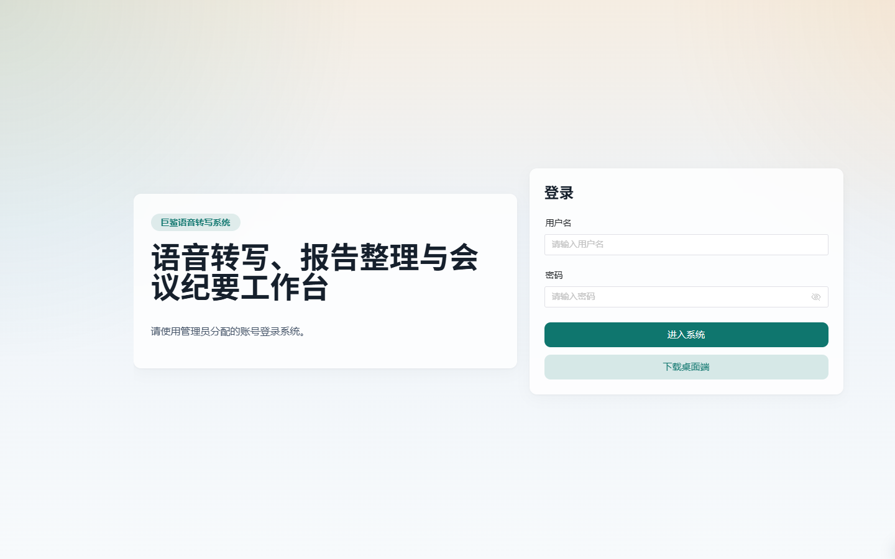
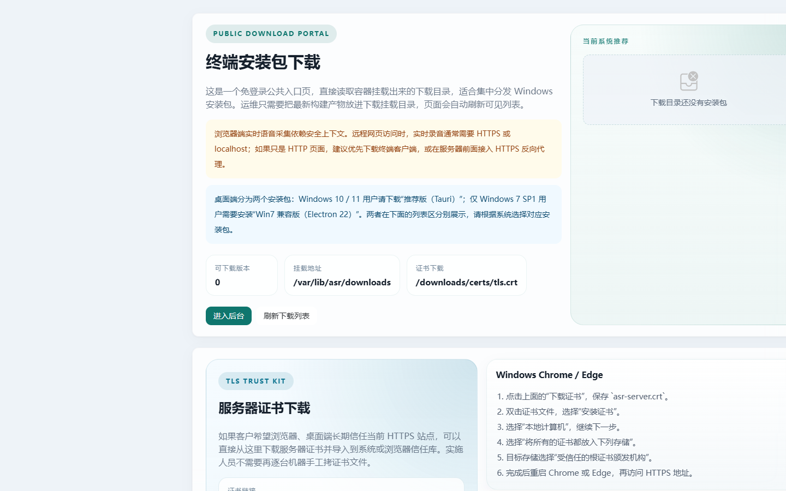

# 登录与终端下载

> 页面位置：Web 登录页（`/login`）、终端下载页（`/downloads`）
> 适用版本：标准版 / 高级版　|　可见角色：登录页与下载页均为公开入口

本章涵盖 Web 后台登录与免登录的终端下载页。终端下载页供实施人员或终端用户下载桌面客户端安装包与服务器证书。

---

## 一、Web 登录页

### 功能特性

1. 展示用户名、密码输入框与登录按钮。
2. 支持从登录页进入**终端下载页**。
3. 登录成功后保存 JWT（本地存储键名 `asr_token`），并初始化当前用户、产品能力与账号工作流绑定。
4. 已登录用户访问登录页时自动跳转数据看板。
5. 退出登录后清除 JWT 与工作流绑定缓存，返回登录页。

### 操作步骤

1. 通过部署服务器的 **HTTPS** 地址打开 Web 后台。
2. 输入管理员分配的**用户名**与**密码**。
3. 点击**进入系统**，登录成功后进入后台默认页面（数据看板）。
4. 如需下载客户端，点击登录页的**下载桌面端**进入终端下载页。
5. 使用完毕后点击右上角**退出**登出。

### 注意事项

- 登录页默认预填 `admin / 123456` 作为联调示例；**正式部署账号以交付配置为准**，请及时修改默认密码。
- JWT 有效期有限（≤24 小时），过期后需重新登录。

### 异常恢复

| 异常现象 | 处理办法 |
| --- | --- |
| 账号或密码错误 | 保持登录页并提示失败原因，核对账号密码 |
| 获取当前用户失败 | 清除登录态并要求重新登录 |
| 产品能力加载失败 | 使用默认标准版能力兜底，可刷新重试 |

---

## 二、终端下载页

### 功能特性

1. **免登录访问** `/downloads`。
2. 展示最新推荐安装包、安装包列表、文件大小与更新时间。
3. 支持下载安装包、复制安装包链接、刷新列表。
4. 支持下载服务器证书 `/downloads/certs/tls.crt` 并复制证书链接。
5. 展示 Windows Chrome/Edge、Firefox 的证书导入步骤。
6. 根据登录态显示“进入后台”或“管理员登录”。

### 桌面客户端版本选择

| 操作系统 | 安装包 |
| --- | --- |
| Windows 10 / 11 | Tauri 包（复用系统 WebView2） |
| Windows 7 SP1 | 独立的 Electron 22 兼容包（无需预装 WebView2） |

### 操作步骤

1. 浏览器访问 `/downloads`（无需登录）。
2. 按操作系统选择对应安装包**下载**，或**复制链接**分发。
3. 如使用 HTTPS 自签证书，**下载服务器证书**并按页面提示在浏览器中导入（Chrome/Edge、Firefox 步骤不同）。
4. 安装客户端后参考[桌面客户端](16-桌面客户端.md)章节完成连接配置。

### 注意事项

- 远程 Web 实时录音需 **HTTPS 或 localhost 安全上下文**，页面已给出提示。
- 列表按接口返回顺序展示，**首个文件作为最新推荐**。
- 本页**不提供安装包上传、删除或版本发布**；安装包需由运维放入服务端挂载目录。
- 证书需在**完成安装并生成证书**后才可下载。

### 异常恢复

| 异常现象 | 处理办法 |
| --- | --- |
| 下载包列表读取失败 | 提示读取失败并保留空列表，稍后刷新 |
| 证书下载返回 404 | 页面说明需先完成安装并生成证书后再刷新 |
| 下载目录为空 | 显示“暂无安装包”，需运维放入安装包 |
| 复制失败 | 提示当前浏览器不支持复制，可直接点击下载 |
