# 巨鲨语音助手项目详细设计书

## 文件状态

- [x] 草稿
- [ ] 正式发布
- [ ] 正在修改

| 项目 | 内容 |
| ---- | ---- |
| 文件编号 | ASR-DDD-001 |
| 当前版本 | V1.0.0 |
| 作者 | 产品研发团队 |
| 完成日期 | 2026 年 05 月 |

## 审批信息

| 角色 | 姓名 | 日期 |
| ---- | ---- | ---- |
| 编制 | | |
| 审核 | | |
| 批准 | | |

## 版本历史

| 版本/状态 | 作者 | 参与者 | 完成日期 | 备注 |
| --------- | ---- | ------ | -------- | ---- |
| V1.0.0 | 产品研发团队 | | 2026 年 05 月 28 日 | 按需求规格说明书 V1.3 和概要设计 V1.1.0 编写详细设计初稿 |

## 目录

- [1 引言](#1-引言)
  - [1.1 编写目的](#11-编写目的)
  - [1.2 设计范围](#12-设计范围)
  - [1.3 设计原则](#13-设计原则)
  - [1.4 参考资料](#14-参考资料)
- [2 总体详细设计](#2-总体详细设计)
  - [2.1 系统分层与运行边界](#21-系统分层与运行边界)
  - [2.2 请求入口与服务路由](#22-请求入口与服务路由)
  - [2.3 认证、角色与产品能力](#23-认证角色与产品能力)
  - [2.4 业务事件与最终一致性](#24-业务事件与最终一致性)
- [3 Web 前端详细设计](#3-web-前端详细设计)
  - [3.1 模块划分](#31-模块划分)
  - [3.2 路由守卫与初始化](#32-路由守卫与初始化)
  - [3.3 数据看板](#33-数据看板)
  - [3.4 实时语音识别](#34-实时语音识别)
  - [3.5 批量转写](#35-批量转写)
  - [3.6 会议纪要与声纹库](#36-会议纪要与声纹库)
  - [3.7 工作流、节点和应用配置](#37-工作流节点和应用配置)
  - [3.8 词典与纠错规则](#38-词典与纠错规则)
  - [3.9 用户、OpenAPI 与公开下载](#39-用户openapi-与公开下载)
- [4 桌面客户端详细设计](#4-桌面客户端详细设计)
  - [4.1 运行结构](#41-运行结构)
  - [4.2 连接身份与配置同步](#42-连接身份与配置同步)
  - [4.3 悬浮球录音与本地 VAD](#43-悬浮球录音与本地-vad)
  - [4.4 报告模式与会议模式](#44-报告模式与会议模式)
  - [4.5 语音控制](#45-语音控制)
  - [4.6 全局热键、历史、会议编辑与 PDF 导出](#46-全局热键历史会议编辑与-pdf-导出)
- [5 后端详细设计](#5-后端详细设计)
  - [5.1 Gateway](#51-gateway)
  - [5.2 admin-api](#52-admin-api)
  - [5.3 asr-api](#53-asr-api)
  - [5.4 nlp-api](#54-nlp-api)
- [6 工作流与节点详细设计](#6-工作流与节点详细设计)
  - [6.1 工作流类型与结构约束](#61-工作流类型与结构约束)
  - [6.2 工作流执行模型](#62-工作流执行模型)
  - [6.3 节点处理设计](#63-节点处理设计)
  - [6.4 节点测试与失败恢复](#64-节点测试与失败恢复)
- [7 OpenAPI 与 Legacy 详细设计](#7-openapi-与-legacy-详细设计)
  - [7.1 OpenAPI 应用生命周期](#71-openapi-应用生命周期)
  - [7.2 Token 鉴权、能力校验与审计](#72-token-鉴权能力校验与审计)
  - [7.3 回调与 Skill](#73-回调与-skill)
  - [7.4 Legacy 兼容路径](#74-legacy-兼容路径)
- [8 数据对象与状态机设计](#8-数据对象与状态机设计)
  - [8.1 数据对象归属](#81-数据对象归属)
  - [8.2 任务状态机](#82-任务状态机)
  - [8.3 会议状态机](#83-会议状态机)
  - [8.4 开放平台状态机](#84-开放平台状态机)
- [9 关键算法伪代码](#9-关键算法伪代码)
  - [9.1 本地 VAD 切句](#91-本地-vad-切句)
  - [9.2 实时识别片段处理](#92-实时识别片段处理)
  - [9.3 批量任务同步](#93-批量任务同步)
  - [9.4 会议处理](#94-会议处理)
  - [9.5 工作流执行](#95-工作流执行)
  - [9.6 术语纠错](#96-术语纠错)
  - [9.7 过滤节点](#97-过滤节点)
  - [9.8 语音控制状态机](#98-语音控制状态机)
  - [9.9 OpenAPI 鉴权与回调](#99-openapi-鉴权与回调)
- [10 异常、安全与性能设计](#10-异常安全与性能设计)
  - [10.1 异常处理策略](#101-异常处理策略)
  - [10.2 安全设计](#102-安全设计)
  - [10.3 性能设计](#103-性能设计)
  - [10.4 可维护性设计](#104-可维护性设计)
- [11 需求覆盖关系](#11-需求覆盖关系)

## 1 引言

### 1.1 编写目的

本文档在《巨鲨语音助手需求规格说明书》和《巨鲨语音助手项目概要设计书》的基础上，进一步说明系统各模块的详细逻辑、状态流转、调用时序和关键算法。本文不描述具体程序代码、具体函数实现和数据库建表语句，而以模块职责、流程图、时序图、状态机和伪代码作为开发、测试、联调和维护依据。

### 1.2 设计范围

本文覆盖以下系统范围：

1. Web 管理端：登录、公开下载、数据看板、实时识别、批量转写、会议纪要、声纹库、工作流、节点管理、应用配置、词典、用户管理和 OpenAPI 管理。
2. 桌面客户端：悬浮球录音、匿名登录、报告模式、会议模式、语音控制、全局热键、转写历史、会议摘要编辑和 PDF 导出。
3. 后端服务：Gateway、admin-api、asr-api、nlp-api。
4. 共享能力：工作流执行、词典规则处理、产品能力开关、OpenAPI、Legacy 兼容、任务同步、异常恢复。
5. 数据对象：用户与设备、转写任务、会议、工作流、词典、开放平台应用和调用日志。

不在本文范围内的内容：

1. 外部 ASR 引擎、外部说话人服务和 LLM 服务的模型内部实现。
2. Docker 镜像构建脚本、安装脚本和运维命令细节。
3. UI 视觉稿、组件样式和具体前端代码实现。
4. 具体接口请求体字段枚举以外的程序实现细节。

### 1.3 设计原则

| 原则 | 说明 |
| ---- | ---- |
| 主链路清晰 | 围绕“音频输入 -> 识别 -> 工作流后处理 -> 结果落库 -> 输出展示”组织模块。 |
| 能力可控 | 会议纪要、声纹库、语音控制等高级能力必须受产品能力开关控制。 |
| 配置集中 | 工作流、词典、应用配置和 OpenAPI 应用由管理服务维护，运行服务消费。 |
| 失败可恢复 | 批量任务、会议任务和工作流后处理支持状态记录、失败提示和重试恢复。 |
| 入口兼容 | 新接口和 Legacy 接口共用底层业务能力，兼容生命周期由 Gateway 收口控制。 |
| 客户端轻量 | Web 和桌面端只负责采集、展示、配置和本地能力，不实现底层识别模型。 |

### 1.4 参考资料

- 巨鲨语音助手需求规格说明书 V1.3
- 巨鲨语音助手项目概要设计书 V1.1.0
- OpenAPI 对接指南
- 后端配置示例
- jusha-asr-business 部署说明

## 2 总体详细设计

### 2.1 系统分层与运行边界

系统采用客户端、接入层、业务服务层、持久化与外部能力层四级分层。详细设计时，各层边界如下：

| 层级 | 组成 | 主要职责 | 不承担职责 |
| ---- | ---- | -------- | ---------- |
| 客户端层 | Web 管理端、桌面客户端、第三方调用方 | 用户交互、音频采集、本地配置、接口调用、结果展示 | 模型识别、持久化主数据 |
| 接入层 | Nginx、Gateway | 静态资源、HTTPS、API 路由、WebSocket 代理、Legacy 开关 | 业务规则判断、工作流执行 |
| 业务服务层 | admin-api、asr-api、nlp-api | 配置管理、识别任务、会议、文本处理、开放平台能力 | 底层 ASR 模型训练与推理内部逻辑 |
| 持久化与外部能力层 | MySQL、uploads、downloads、外部 ASR、3D-Speaker | 数据持久化、文件存储、识别、说话人能力 | 前端状态展示 |

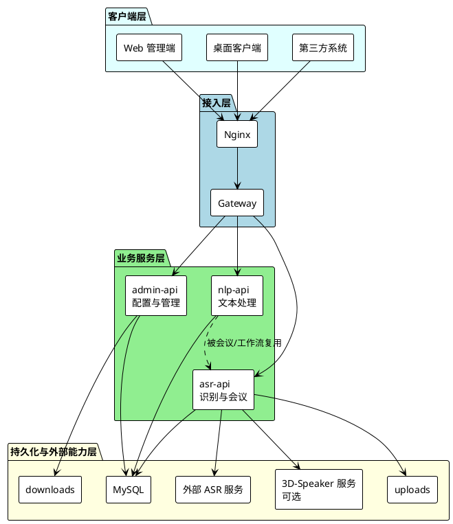

### 2.2 请求入口与服务路由

Gateway 按路径将请求分发到对应服务。路由判断只处理入口选择、WebSocket 升级和 Legacy 开关，不直接解释业务请求内容。

| 请求类别 | 入口路径 | 目标服务 | 处理要点 |
| -------- | -------- | -------- | -------- |
| 管理接口 | `/api/admin/*` | admin-api | JWT 鉴权、角色校验、配置管理 |
| 转写接口 | `/api/asr/*` | asr-api | 批量、实时、任务、文件 |
| 会议接口 | `/api/meetings/*` | asr-api | 会议上传、列表、详情、摘要 |
| NLP 接口 | `/api/nlp/*` | nlp-api | 文本纠错和摘要 |
| OpenAPI 认证 | `/openapi/v1/auth/*` | admin-api | 应用凭证换取 token |
| OpenAPI ASR/会议/Skill | `/openapi/v1/asr/*`、`/openapi/v1/meetings/*`、`/openapi/v1/skills/*` | asr-api | OpenAuth、能力校验、审计 |
| OpenAPI NLP | `/openapi/v1/nlp/*` | nlp-api | OpenAuth、能力校验、审计 |
| 上传文件访问 | `/uploads/*` | asr-api 或静态代理 | 音频文件下载与访问控制 |
| WebSocket 事件 | `/ws/events` 及 OpenAPI 流式事件 | asr-api | Gateway 透传升级和消息帧 |
| 公开下载 | `/downloads/files/*`、证书路径 | Nginx | 静态目录分发 |

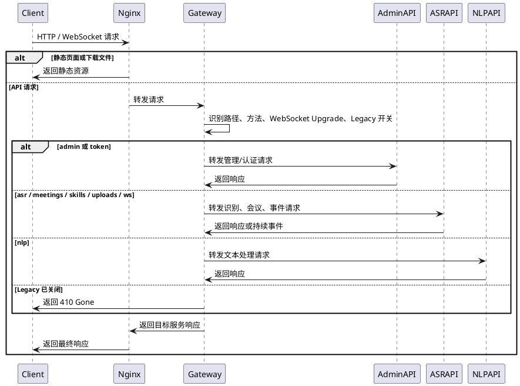

### 2.3 认证、角色与产品能力

系统存在三类访问身份：Web 登录用户、桌面匿名设备用户、OpenAPI 应用。三者共享部分业务数据，但认证方式和权限判断不同。

| 身份 | 认证方式 | 使用场景 | 权限来源 |
| ---- | -------- | -------- | -------- |
| Web 用户 | 用户名密码换取 JWT | Web 管理端 | 用户角色、产品能力、接口权限 |
| 桌面设备用户 | 机器码匿名登录换取 JWT | 桌面客户端 | 设备用户、产品能力、用户工作流绑定 |
| OpenAPI 应用 | app_id/app_secret 换取 access_token | 第三方调用 | 应用状态、能力授权、限流、默认工作流 |

产品能力控制规则：

1. Web 前端初始化时读取产品能力，控制会议、声纹、语音控制等入口可见性。
2. 桌面端匿名登录后读取产品能力，控制会议 Tab、会议场景和语音控制热键是否可用。
3. 后端接口必须再次校验产品能力；前端隐藏入口不作为安全边界。
4. OpenAPI 能力授权独立于产品能力，但最终能力不能突破系统当前产品版本开放范围。

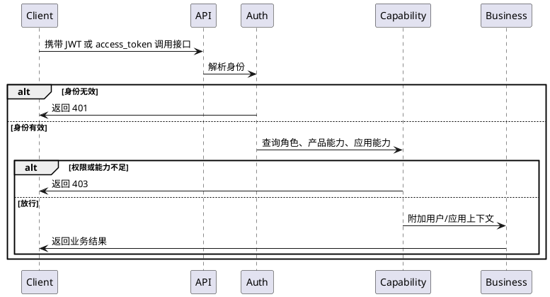

### 2.4 业务事件与最终一致性

批量转写、会议处理和开放平台异步任务都不是一次请求内完成。系统通过状态表、后台同步循环、WebSocket 事件和前端轮询共同保证最终一致性。

| 业务 | 一致性策略 | 前端刷新策略 | 失败恢复 |
| ---- | ---------- | ------------ | -------- |
| 批量转写 | asr-api 后台同步上游状态，更新任务和工作流执行记录 | 任务列表刷新、业务事件刷新行数据 | 单任务同步、后处理恢复、失败任务删除 |
| 会议纪要 | 会议同步循环补齐转写、说话人和摘要状态 | 列表轮询、详情轮询、手动刷新 | 摘要重生成、失败原因展示、可删除状态控制 |
| 实时识别 | 客户端本地分句逐段提交，停止后保存完整任务 | 页面即时展示，停止后读取任务详情 | 单句失败不阻断后续，整段上传失败可降级保存文本 |
| OpenAPI 异步 | 调用日志和业务任务分别记录，完成后签名回调 | 第三方轮询或接收回调 | 回调失败记录，Skill 连续失败可停用 |

## 3 Web 前端详细设计

### 3.1 模块划分

Web 前端按页面域和共享支撑域划分。页面模块只处理交互与展示，业务规则以 API 返回为准。

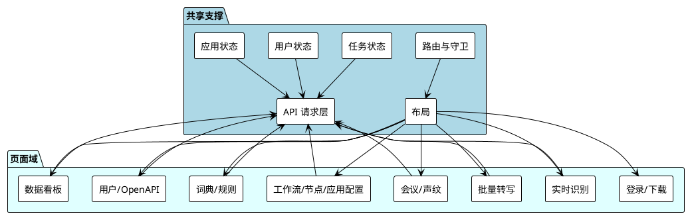

共享状态设计：

| 状态域 | 主要内容 | 更新来源 | 使用页面 |
| ------ | -------- | -------- | -------- |
| 用户状态 | token、当前用户、角色、登录态 | 登录、当前用户接口、退出 | 所有受保护页面 |
| 应用状态 | 产品能力、工作流绑定、侧栏折叠状态 | 初始化、应用配置保存、桌面/用户绑定同步 | 路由守卫、导航、实时、批量、会议、桌面同步 |
| 任务状态 | 批量任务列表筛选、分页、当前任务详情 | 批量列表、事件刷新、手动同步 | 批量转写、数据看板 |

### 3.2 路由守卫与初始化

路由守卫负责登录态、公开路由和产品能力判断。初始化顺序必须保证页面加载前已具备用户和能力上下文。

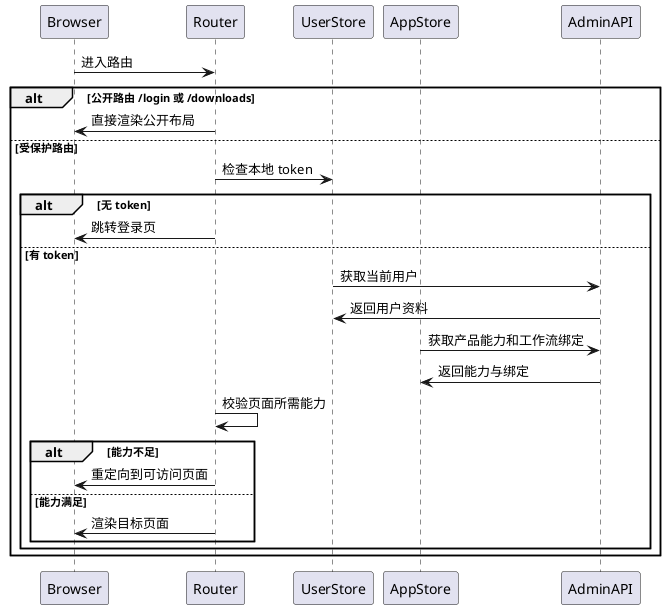

异常处理：

1. 当前用户接口返回未认证时，清除本地 token 并跳转登录页。
2. 产品能力加载失败时，前端以标准版能力兜底，并允许用户刷新重试。
3. 普通用户进入管理页时，前端不完全依赖角色隐藏，后端接口权限仍是最终判断。

### 3.3 数据看板

数据看板面向管理员展示任务统计、同步态势和风险告警。页面只读取聚合结果，不在前端重新计算数据库状态。

| 子模块 | 输入 | 输出 | 刷新时机 |
| ------ | ---- | ---- | -------- |
| 核心统计区 | 概览接口快照 | 待处理、处理中、已完成、回流完成、后处理失败等数量 | 页面进入、手动刷新、批量操作后 |
| 系统态势区 | 同步状态、最近同步时间、回流完成率 | 稳定/阻塞状态和完成率展示 | 页面进入、定时刷新或手动刷新 |
| 风险告警区 | 告警列表、筛选条件 | 分页告警、可重试标识、重试批次结果 | 筛选变化、批量重试、清空历史 |

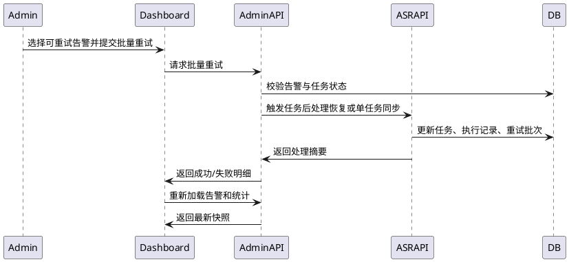

### 3.4 实时语音识别

Web 实时识别使用浏览器麦克风采集和本地 VAD 切句。当前设计不维持后端长流式会话，而是将本地短句提交识别，停止后再保存整段任务。

模块职责：

| 模块 | 职责 |
| ---- | ---- |
| 音频采集 | 请求麦克风权限，采集单声道目标 16k 音频，按约 200ms 形成音频块。 |
| VAD 切句 | 根据最小阈值、底噪倍数、静音等待、有效语音块等参数形成短句。 |
| 短句识别 | 将短句音频提交给后端识别，获得原始文本。 |
| 即时后处理 | 使用当前账号实时工作流绑定，对短句文本执行后处理。 |
| 输出展示 | 同时展示原始识别结果和后处理输出，支持复制。 |
| 停止保存 | 录音结束后上传整段音频或文本，保存实时历史任务。 |

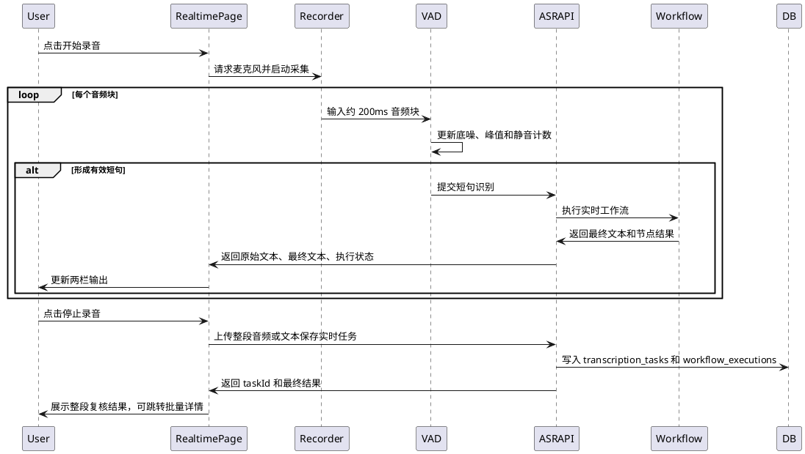

关键状态：

| 状态 | 进入条件 | 可执行操作 | 退出条件 |
| ---- | -------- | ---------- | -------- |
| 空闲 | 页面初始或停止完成 | 开始录音、调整参数、复制历史输出 | 开始录音 |
| 录音中 | 麦克风启动成功 | 暂停、停止、查看即时输出 | 暂停或停止 |
| 暂停 | 用户暂停录音 | 继续、停止 | 继续或停止 |
| 保存中 | 停止后存在有效文本 | 等待保存结果 | 保存成功或失败降级 |
| 错误 | 权限、HTTPS、识别或保存失败 | 查看错误、重试或停止 | 用户重新操作 |

### 3.5 批量转写

批量转写支持本地 `.wav` / `.mp3` 文件上传和音频 URL 提交。页面一次只选择并上传一个本地文件，后端负责文件校验、任务创建、上游提交和后台同步。

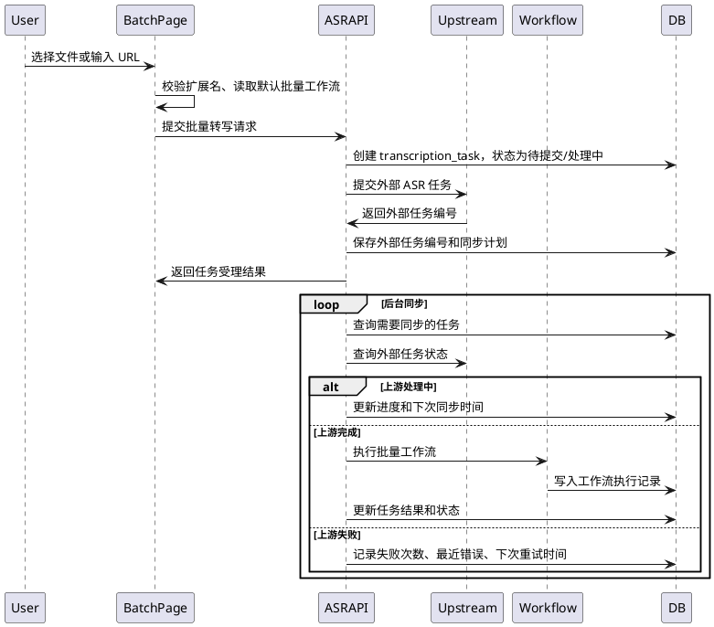

任务详情展示逻辑：

1. 读取任务基础信息、原始文本、最终文本和工作流执行摘要。
2. 若工作流后处理失败，展示失败节点和恢复入口。
3. 若存在同步错误，展示失败次数、上次失败、下次同步和最近错误。
4. 删除操作只允许失败任务或已完成且不在活动状态的任务。

### 3.6 会议纪要与声纹库

会议纪要是高级版能力。会议可以由 Web 会议上传、桌面会议录音或 OpenAPI 创建。会议链路在批量识别基础上增加说话人片段、会议摘要和摘要重生成。

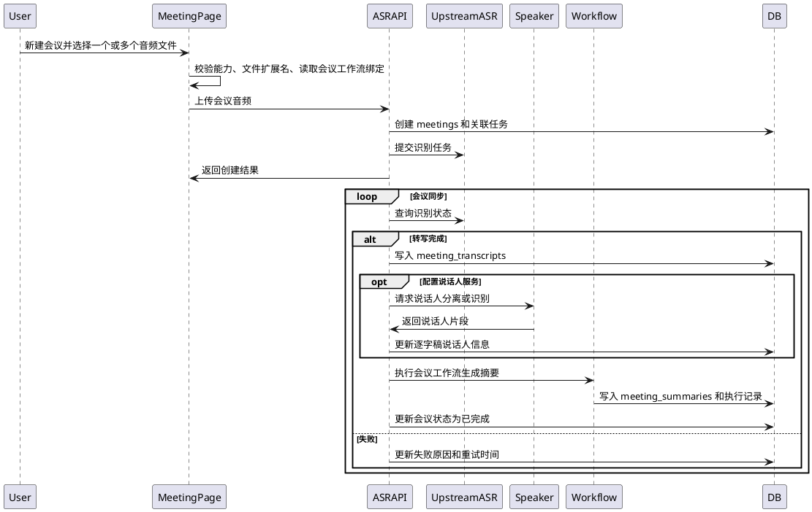

声纹库设计：

| 子模块 | 设计说明 |
| ------ | -------- |
| 声纹注册 | 必填说话人姓名和音频样本；支持上传和现场录音；建议 15-30 秒单人近讲音频。 |
| 声纹列表 | 展示已注册说话人、服务 URL、注册时间和删除入口。 |
| 外部服务降级 | 未配置或不可用时，会议主流程保留，声纹相关能力提示不可用或降级。 |
| 数据关系 | 声纹记录与会议说话人匹配结果逻辑关联，会议详情展示匹配后的说话人标签。 |

### 3.7 工作流、节点和应用配置

Web 管理端提供工作流创建、编辑、发布、克隆、节点默认配置和应用绑定。工作流的结构约束必须在前后端均有体现，后端是最终校验者。

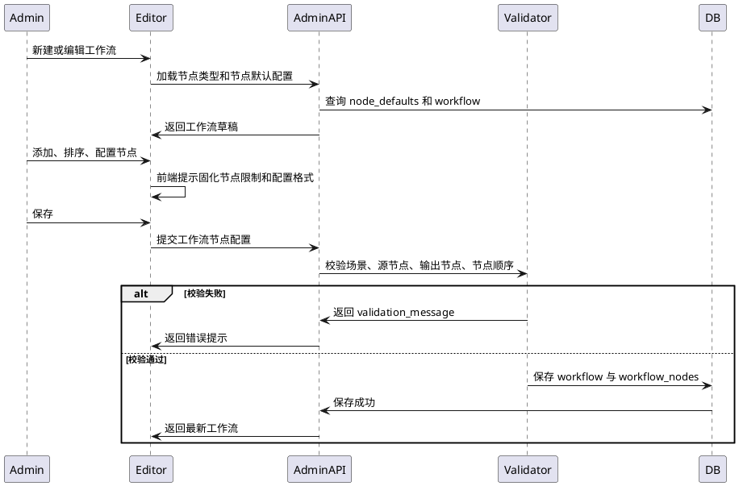

应用配置设计：

| 配置项 | 适用能力 | 绑定目标 | 说明 |
| ------ | -------- | -------- | ---- |
| 实时语音识别默认工作流 | 标准版/高级版 | realtime 工作流 | Web 实时和桌面报告模式读取。 |
| 批量转写默认工作流 | 标准版/高级版 | batch 工作流 | 批量转写创建任务时自动携带。 |
| 会议纪要默认工作流 | 高级版 | meeting 工作流 | Web 会议、桌面会议和 OpenAPI 会议复用。 |
| 语音控制默认工作流 | 高级版 | voice_control 工作流 | 桌面语音控制唤醒和意图识别使用。 |

### 3.8 词典与纠错规则

词典模块为工作流节点提供运行数据。Web 页面负责维护数据，实际执行由后端节点处理。

| 模块 | 数据结构逻辑 | 执行时使用方式 |
| ---- | ------------ | -------------- |
| 术语库 | 词库 -> 词条；词条包含标准术语和多个误写变体 | 术语纠错节点读取选定词库，先执行附属规则，再执行变体替换。 |
| 纠错规则 | 与术语词库关联；包含规则类型、匹配内容、替换内容、优先级和状态 | 按 priority、sort_order、id 稳定排序执行。 |
| 语气词库 | 基础库受保护，场景库可增删 | 语气词过滤节点自动叠加基础库，再叠加选中场景库。 |
| 敏感词库 | 基础库受保护，场景库可增删 | 敏感词过滤节点自动叠加基础库，再叠加选中场景库，替换文本来自节点配置。 |
| 控制指令库 | 基础指令组受保护，扩展组按节点选择 | voice_intent 节点将候选话术映射为意图值。 |

术语导入流程：

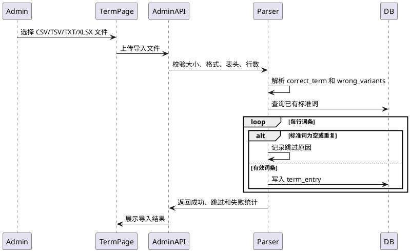

### 3.9 用户、OpenAPI 与公开下载

用户管理只提供列表、新增和搜索，不提供编辑、删除、重置密码。OpenAPI 管理只允许管理员访问，包含应用生命周期、能力授权、默认工作流、密钥轮换、调用日志和对接文档展示。

公开下载页免登录访问，数据由公开下载接口提供，文件实体由 Nginx 静态目录分发。

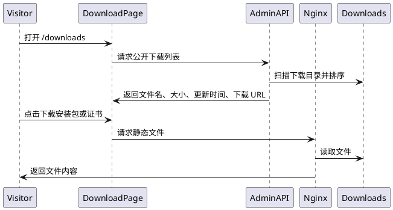

## 4 桌面客户端详细设计

### 4.1 运行结构

桌面端以窗口标签区分悬浮录音窗和设置窗。Win10/11 使用 Tauri 包，Win7 使用 Electron 22 兼容包，两者共用主要 Vue 业务逻辑。

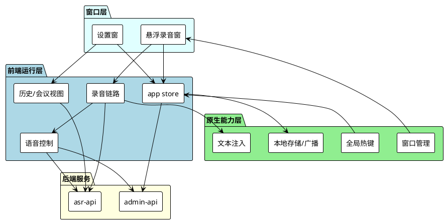

### 4.2 连接身份与配置同步

桌面端默认服务地址为 `http://127.0.0.1:10010`。服务地址保存前应补齐协议并去除末尾斜杠。连接成功后，以机器码匿名登录并保存 JWT。

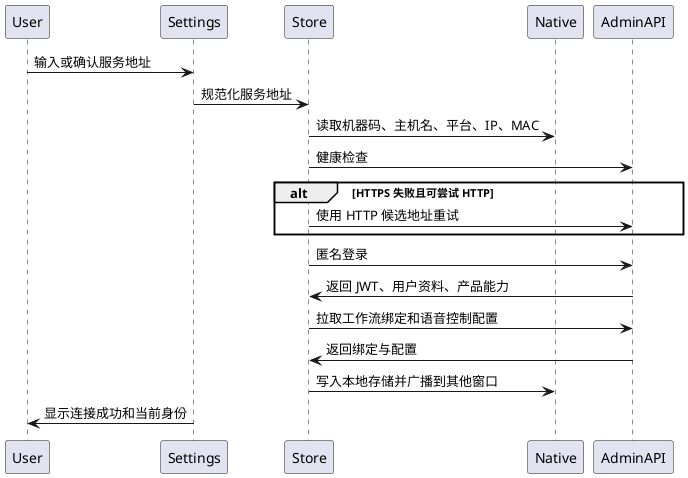

401 处理策略：

1. 普通业务请求收到 401 时，清除旧 token。
2. 尝试使用当前机器码重新匿名登录一次。
3. 重试原请求；若仍失败，设置窗显示登录失败原因。
4. 不清空用户已配置的服务地址和设备别名。

### 4.3 悬浮球录音与本地 VAD

悬浮球是桌面端主操作入口。中心区域拖动、短点击录音、右键打开设置窗。录音块默认约 200ms，目标采样率 16k，单声道。

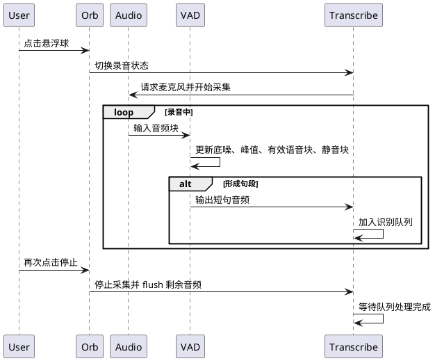

录音错误处理：

| 错误 | 页面/悬浮球反馈 | 后续动作 |
| ---- | -------------- | -------- |
| 麦克风权限拒绝 | 显示权限错误 | 引导用户在系统中授权 |
| 无可用麦克风 | 显示设备错误 | 保持空闲状态 |
| 麦克风被占用 | 显示占用提示 | 允许用户重试 |
| 单句识别失败 | 记录错误并提示 | 继续处理后续短句 |
| 保存失败 | 设置窗和悬浮球显示失败 | 保留本轮识别文本供复制 |

### 4.4 报告模式与会议模式

桌面端通过场景模式决定停止录音后的保存目标。

| 场景 | 可用条件 | 停止后行为 | 最小保存条件 |
| ---- | -------- | ---------- | ------------ |
| 报告模式 | 所有版本 | 保存为 realtime 类型转写任务，可自动注入文本 | 录音时长不小于 1 秒且有有效文本 |
| 会议模式 | 高级版会议能力开启 | 保存为会议任务，不保存普通实时历史 | 录音时长不小于 5 秒且有有效文本 |
| 命令模式 | 高级版语音控制开启 | 文本只用于指令识别，不注入、不入历史 | 命令成功、超时或连续失败后退出 |

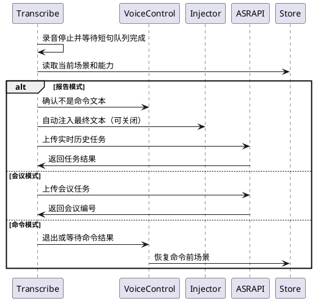

### 4.5 语音控制

语音控制由“普通模式唤醒”和“命令模式意图识别”两段组成。唤醒和意图均通过当前账号绑定的语音控制工作流执行。命令模式下文本不写入历史、不自动注入。

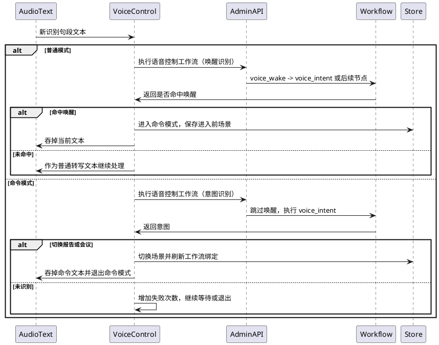

命令模式退出条件：

1. 成功识别并执行指令。
2. 等待时间超过配置值，且桌面端最低按 2 秒兜底。
3. 连续 3 次分类失败。
4. 用户通过热键或设置手动退出。
5. 录音被停止，且本次命令模式由热键自动启动录音时同步停录。

### 4.6 全局热键、历史、会议编辑与 PDF 导出

全局热键配置保存在本机，同一组合不能绑定多个动作。热键变更后需同步到原生层注册；注册失败时保留页面配置并显示结果。

| 动作 | 默认热键 | 能力约束 |
| ---- | -------- | -------- |
| 显示/隐藏设置页 | Alt+Shift+S | 无 |
| 显示/隐藏悬浮球 | Alt+Shift+F | 无 |
| 开启/关闭指令识别 | Alt+Shift+V | 语音控制能力开启 |
| 开启/关闭录音 | Ctrl+Shift+Space | 麦克风可用 |
| 报告/会议模式切换并激活 | Alt+Shift+M | 会议能力开启时才可进入会议 |

转写历史设计：

1. 以后台 realtime 类型任务为数据来源。
2. 列表优先展示最新工作流执行记录的 final_text，缺失时回退原始文本。
3. 支持复制、注入、删除、清空历史。
4. 快速收录只提供从选中文本写入术语或敏感词的便捷入口，不替代 Web 词典管理。

桌面会议详情设计：

1. 会议列表处理中时约 6 秒刷新，会议详情处理中时约 4 秒刷新。
2. 摘要页提供预览、编辑、导出三种模式。
3. 摘要正文以 Markdown 保存；PDF 导出只负责版式渲染和本地保存。
4. 导出选项包括标题、会议信息、逐字稿、字号和强调色。

## 5 后端详细设计

### 5.1 Gateway

Gateway 的详细职责是路径分派、请求头透传、CORS 头裁剪、WebSocket 升级代理和 Legacy 生命周期控制。

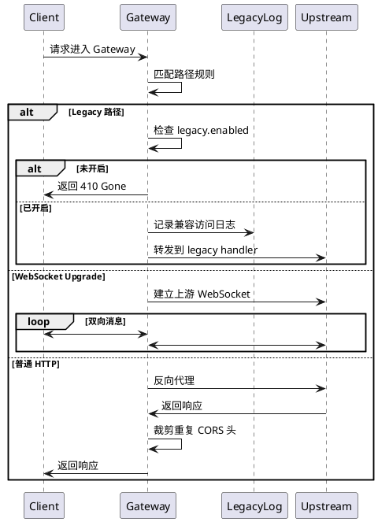

Gateway 异常策略：

| 异常 | 返回策略 |
| ---- | -------- |
| 目标服务不可达 | 返回上游不可用，记录目标地址和路径。 |
| WebSocket 上游建连失败 | 返回连接失败，客户端按事件连接失败处理。 |
| Legacy 关闭 | 统一返回 410 Gone。 |
| 未匹配路径 | 返回 404。 |

### 5.2 admin-api

admin-api 是配置管理面和部分公共能力入口。其详细模块如下：

| 模块 | 输入 | 输出 | 核心校验 |
| ---- | ---- | ---- | -------- |
| 认证与用户 | 登录信息、机器码、用户资料 | JWT、当前用户、用户列表 | 密码、角色、设备身份唯一性 |
| 工作流管理 | 工作流元数据、节点列表、测试文本 | 工作流详情、执行结果 | 名称、场景、节点结构约束 |
| 节点默认配置 | node_type、结构化配置或 JSON | 节点默认配置 | 配置格式、节点类型合法性 |
| 词典运营 | 词库、词条、导入文件、规则 | 列表、导入统计、规则结果 | 名称重复、引用关系、文件大小和行数 |
| 应用设置 | 语音控制开关和超时 | 设置详情 | 管理员权限、能力开关、数值范围 |
| 数据看板 | 筛选、分页、重试请求 | 统计、告警、重试结果 | 任务可重试状态 |
| 下载列表 | 下载目录扫描 | 文件列表和证书信息 | 文件存在性、安全路径 |
| OpenAPI 管理 | 应用配置、能力、密钥操作 | 应用、密钥、日志、文档 | 管理员权限、能力选择、回调白名单 |

启动初始化设计：

1. 读取配置并连接 MySQL。
2. 执行必要数据结构迁移。
3. 确保管理员账号存在，不覆盖已有同名账号密码。
4. 确保系统词库、敏感词、语气词、控制指令和工作流模板存在。
5. 启动 HTTP 服务并暴露管理接口。

### 5.3 asr-api

asr-api 是识别和会议执行面。所有音频任务的核心状态由 asr-api 维护。

| 模块 | 详细职责 |
| ---- | -------- |
| 批量任务 | 文件/URL 创建、任务列表、详情、删除、单任务同步、后台同步、后处理恢复。 |
| 实时识别 | 短句识别、实时任务保存、流式 session、commit、事件输出。 |
| 会议处理 | 会议上传、列表、详情、删除、转写同步、说话人处理、摘要生成和重生成。 |
| 声纹与说话人 | 声纹注册、删除、查询、会议说话人匹配和外部服务适配。 |
| 事件输出 | WebSocket 事件、OpenAPI events_url、业务总线刷新。 |
| OpenAPI 执行 | ASR、会议和 Skill 能力包装、鉴权上下文、审计和回调。 |

asr-api 后台循环设计：

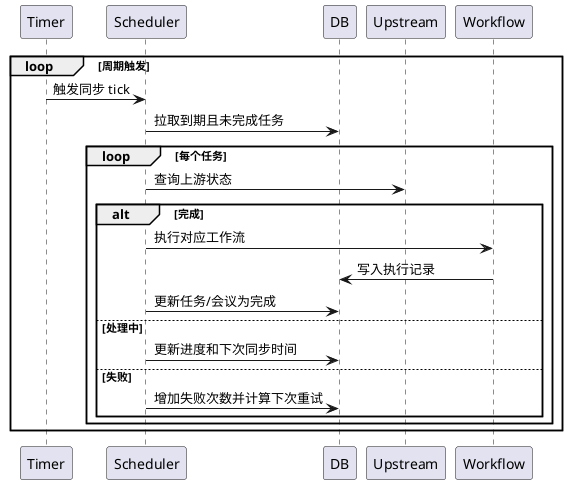

### 5.4 nlp-api

nlp-api 提供文本处理能力，可被 Web、OpenAPI 和 asr-api 间接复用。

| 模块 | 详细职责 |
| ---- | -------- |
| 管理端接口 | 为受保护 Web 页面提供文本纠错、摘要等能力。 |
| OpenAPI 接口 | 为第三方调用方提供文本纠错能力，执行 OpenAuth 和审计。 |
| Legacy 兼容 | 在兼容开关打开时承接旧路径请求，返回旧格式响应。 |
| 纠错处理 | 读取术语、纠错规则和节点配置，对文本执行规范化。 |
| 摘要处理 | 根据会议或文本上下文生成摘要，供会议链路复用。 |

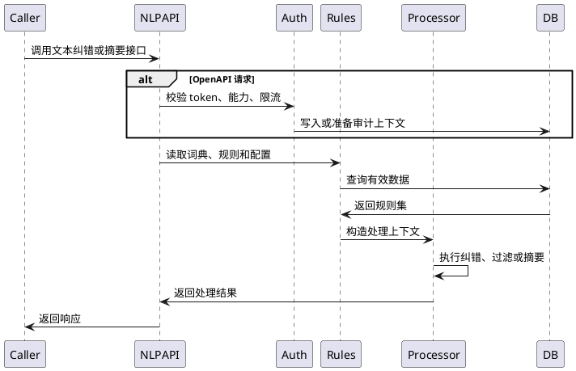

## 6 工作流与节点详细设计

### 6.1 工作流类型与结构约束

工作流通过类型和节点约束限定适用场景。结构校验必须保证执行链路可预测。

| 工作流类型 | 固化源节点 | 允许处理节点 | 固化输出或末尾节点 | 使用场景 |
| ---------- | ---------- | ------------ | ------------------ | -------- |
| 批量转写整理 | 非实时语音转写 | 术语纠错、语气词过滤、敏感词过滤、LLM纠错、自定义正则 | 无强制输出节点 | 批量转写任务后处理 |
| 实时转写整理 | 实时语音转写 | 术语纠错、语气词过滤、敏感词过滤、LLM纠错、自定义正则 | 无强制输出节点 | Web 实时和桌面报告模式 |
| 会议纪要 | 非实时或会议源 | 术语纠错、说话人分离、LLM纠错、过滤节点 | 会议纪要生成必须位于末尾 | 会议摘要生成和重生成 |
| 语音控制 | 唤醒词识别 | 控制指令候选、规则处理 | 语音控制意图识别 | 桌面命令模式 |

结构约束：

1. 一个启用工作流最多只能有一个启用源节点。
2. 源节点必须是第一个启用节点。
3. 会议纪要生成节点最多一个，且必须是最后一个启用节点。
4. 固化节点不能删除、移动或禁用。
5. 无启用源节点的旧工作流视为 Legacy 文本后处理工作流，列表默认隐藏但保留兼容说明。
6. 任务创建或摘要重生成时，必须校验工作流类型与业务类型匹配。

### 6.2 工作流执行模型

工作流执行以文本和上下文为输入，以 final_text、结构化输出和节点执行记录为输出。

```plantuml
@startuml 工作流执行模型
participant Trigger as T
participant Engine as E
participant Repo as R
participant Node as N
participant DB as DB

T -> E: 触发执行，传入 workflow_id、输入文本和上下文
E -> R: 读取工作流、节点和默认配置
R -> E: 返回启用节点列表
E -> DB: 创建 workflow_execution
loop 按节点顺序
  E -> N: 传入当前文本、节点配置、上下文
  N -> E: 返回输出文本、结构化结果、耗时、错误
  E -> DB: 写入 workflow_node_result
  alt 节点失败且不可跳过
    E -> DB: 标记执行失败
    E -> T: 返回失败和可恢复节点
  end
end
E -> DB: 标记执行成功并保存 final_text
E -> T: 返回最终结果
@enduml
```

执行上下文包含：

| 上下文字段 | 说明 |
| ---------- | ---- |
| 触发来源 | realtime、batch、meeting、voice_control、openapi、manual_test 等。 |
| 用户或应用 | JWT 用户、匿名设备用户或 OpenAPI 应用。 |
| 任务引用 | transcription_task、meeting、open_call_log 等业务对象引用。 |
| 能力上下文 | 产品能力、OpenAPI 能力、工作流类型。 |
| 文件上下文 | 音频 URL、本地文件路径、音频时长、逐字稿片段。 |
| 恢复上下文 | 从失败节点继续执行时的上一节点输出和原执行记录。 |

### 6.3 节点处理设计

| 节点类型 | 输入 | 输出 | 关键设计 |
| -------- | ---- | ---- | -------- |
| 非实时语音转写 | 音频文件或 URL | 原始转写文本 | 作为源节点时声明输入来源，实际识别由 ASR 任务链路完成。 |
| 实时语音转写 | 短句文本或实时结果 | 原始转写文本 | 作为源节点时用于标记实时工作流类型。 |
| 唤醒词识别 | 短句文本 | 是否唤醒、置信信息 | 命中后进入命令模式；未命中时文本继续普通转写。 |
| 术语纠错 | 文本、词库和规则 | 纠错文本 | 规则优先，变体替换其次。 |
| 语气词过滤 | 文本、基础库、场景库 | 去除语气词后的文本 | 基础库自动叠加。 |
| 敏感词过滤 | 文本、敏感词库、替换文本 | 脱敏文本 | 替换文本来自节点配置，不在词库页面配置。 |
| LLM 纠错 | 文本、模型配置 | 纠错文本 | 失败时按节点策略决定是否中断。 |
| 自定义正则替换 | 文本、正则规则 | 替换后文本 | 适合结构化文本修正。 |
| 说话人分离 | 音频或会议片段 | 说话人片段 | 依赖外部说话人服务，可降级。 |
| 语音控制意图识别 | 命令文本、指令库 | 意图值和动作 | 基础指令组自动附加。 |
| 会议纪要生成 | 逐字稿、会议上下文 | Markdown 摘要 | 会议工作流末尾节点。 |

### 6.4 节点测试与失败恢复

节点测试用于验证单节点配置，不应改变正式任务状态。源节点测试应给出明确提示，避免误以为可单独完成识别链路。

工作流失败恢复原则：

1. 仅对已保存执行记录且存在失败节点的任务开放恢复。
2. 恢复时读取失败节点之前最近成功输出作为输入。
3. 使用当前工作流配置继续执行后续节点。
4. 恢复成功后更新任务最终文本和新的执行摘要。
5. 恢复失败时保留原失败记录并追加新的失败原因。

```plantuml
@startuml 后处理恢复流程
participant User as U
participant Page as P
participant ASRAPI as S
participant Workflow as W
participant DB as DB

U -> P: 点击从失败节点继续执行
P -> S: 提交恢复请求
S -> DB: 读取任务、原执行记录、失败节点
S -> W: 构造恢复上下文
W -> DB: 读取失败节点前输出
W -> W: 从失败节点开始执行剩余节点
alt 恢复成功
  W -> DB: 写入新执行记录和 final_text
  S -> DB: 更新任务后处理状态
  S -> P: 返回成功结果
else 恢复失败
  W -> DB: 写入失败节点结果
  S -> P: 返回失败原因
end
@enduml
```

## 7 OpenAPI 与 Legacy 详细设计

### 7.1 OpenAPI 应用生命周期

```plantuml
@startuml OpenAPI应用生命周期
[*] --> Enabled : 创建应用并展示 secret 一次
Enabled --> Disabled : 管理员停用
Disabled --> Enabled : 管理员启用
Enabled --> Revoked : 管理员撤销
Disabled --> Revoked : 管理员撤销
Enabled --> Enabled : 重置密钥，只展示新 secret 一次
Revoked --> [*]
@enduml
```

生命周期规则：

1. 创建应用时必须至少选择一个能力。
2. 启用 Skill 回调能力时必须配置回调白名单。
3. App Secret 仅在创建和重置后展示一次，服务端只保留密钥摘要。
4. 已撤销应用不可恢复。
5. 每秒限流范围为 1-5000，默认 30。

### 7.2 Token 鉴权、能力校验与审计

OpenAPI 请求进入业务服务后，先由 OpenAuth 运行子模块完成 token 校验、应用状态校验、能力校验、限流和审计上下文装载。

```plantuml
@startuml OpenAPI鉴权审计时序
participant ThirdParty as T
participant Gateway as G
participant Service as S
participant OpenAuth as A
participant DB as DB
participant Business as B

T -> G: 调用 OpenAPI，携带 access_token
G -> S: 转发到 asr-api 或 nlp-api
S -> A: 执行 OpenAuth
A -> DB: 校验 token、应用状态、能力、限流
alt 校验失败
  A -> DB: 记录失败调用日志
  A -> T: 返回 401/403/429
else 校验成功
  A -> B: 注入应用上下文和默认工作流
  B -> DB: 处理业务数据
  B -> A: 返回业务结果
  A -> DB: 记录调用路径、状态、耗时、错误信息
  A -> T: 返回业务响应
end
@enduml
```

### 7.3 回调与 Skill

回调用于异步任务完成通知和 Skill 触发。回调必须校验白名单，并携带签名和请求标识，便于第三方验签和幂等处理。

```plantuml
@startuml OpenAPI回调时序
participant Business as B
participant Callback as C
participant DB as DB
participant ThirdParty as T

B -> C: 异步任务完成或 Skill 触发
C -> DB: 读取应用回调白名单和密钥信息
C -> C: 校验 callback_url 前缀白名单
alt 不在白名单
  C -> DB: 记录回调拒绝
else 允许回调
  C -> C: 生成请求标识、时间戳和签名
  C -> T: 发送回调请求
  alt 回调成功
    T -> C: 返回成功状态
    C -> DB: 记录成功
  else 回调失败
    T -> C: 返回失败或超时
    C -> DB: 记录失败次数
    opt Skill 连续失败达到阈值
      C -> DB: 自动停用 Skill
    end
  end
end
@enduml
```

### 7.4 Legacy 兼容路径

Legacy 兼容层的目标是旧入口兼容，而不是形成业务分叉。旧路径进入后仍复用当前 asr-api 和 nlp-api 的业务能力。

```plantuml
@startuml Legacy兼容流程
participant OldClient as C
participant Gateway as G
participant Log as L
participant LegacyHandler as H
participant CurrentService as S

C -> G: 调用旧路径
G -> G: 检查 legacy.enabled
alt 关闭
  G -> C: 返回 410 Gone
else 开启
  G -> L: 写入 runtime/legacy-access.log
  G -> H: 转发旧路径请求
  H -> H: 转换旧请求格式到当前业务参数
  H -> S: 调用当前业务能力
  S -> H: 返回当前业务结果
  H -> C: 转换为旧格式响应
end
@enduml
```

## 8 数据对象与状态机设计

### 8.1 数据对象归属

| 数据对象 | 主要写入服务 | 主要读取方 | 说明 |
| -------- | ------------ | ---------- | ---- |
| users | admin-api | Web、桌面、admin-api、asr-api | 账号和匿名设备用户。 |
| device_identities | admin-api | 桌面、admin-api | 机器码匿名登录身份。 |
| user_workflow_bindings | admin-api | Web、桌面、asr-api、OpenAPI 默认工作流 | 当前账号各场景默认工作流。 |
| transcription_tasks | asr-api | Web、桌面、Dashboard、OpenAPI | 批量、实时任务统一表述。 |
| meetings | asr-api | Web、桌面、OpenAPI | 会议主对象。 |
| meeting_transcripts | asr-api | Web、桌面 | 逐字稿和说话人片段。 |
| meeting_summaries | asr-api | Web、桌面 | Markdown 摘要和模型版本。 |
| workflows / workflow_nodes | admin-api | asr-api、nlp-api、桌面、Web | 工作流定义和节点。 |
| workflow_executions / workflow_node_results | 工作流执行方 | Web、桌面、Dashboard | 运行记录和失败恢复依据。 |
| term/sensitive/filler/voice dicts | admin-api | 工作流节点、nlp-api、桌面快速收录 | 后处理基础数据。 |
| open_apps / open_call_logs / open_skills | admin-api、asr-api、nlp-api | OpenAPI 管理页和运行服务 | 开放平台配置和审计。 |

### 8.2 任务状态机

```plantuml
@startuml 转写任务状态机
[*] --> Created : 创建任务
Created --> Submitted : 已提交上游 ASR
Submitted --> Processing : 上游处理中
Processing --> Recognized : 识别完成
Recognized --> PostProcessing : 执行工作流
PostProcessing --> Completed : 后处理成功
PostProcessing --> PostprocessFailed : 后处理失败
Submitted --> Failed : 上游提交失败
Processing --> Failed : 上游识别失败或重试耗尽
PostprocessFailed --> PostProcessing : 手动恢复
Completed --> Deleted : 删除符合条件的任务
Failed --> Deleted : 删除失败任务
Deleted --> [*]
@enduml
```

状态说明：

| 状态 | 说明 | 可见操作 |
| ---- | ---- | -------- |
| Created | 本地任务已创建，可能尚未提交上游 | 查看、等待同步 |
| Submitted/Processing | 上游任务进行中 | 同步、查看进度 |
| Recognized | 已拿到原始文本 | 等待或触发后处理 |
| PostProcessing | 工作流执行中 | 查看执行状态 |
| Completed | 最终文本可用 | 查看、下载音频、删除 |
| PostprocessFailed | 工作流失败 | 查看失败节点、恢复 |
| Failed | 识别或提交失败 | 查看错误、同步、删除 |

### 8.3 会议状态机

```plantuml
@startuml 会议状态机
[*] --> Created : 创建会议
Created --> WaitingTranscription : 等待转写
WaitingTranscription --> Transcribing : 上游转写中
Transcribing --> WaitingSummary : 转写完成，等待摘要
WaitingSummary --> SpeakerProcessing : 可选说话人处理
SpeakerProcessing --> Summarizing : 生成摘要
WaitingSummary --> Summarizing : 无说话人处理
Summarizing --> Completed : 摘要完成
Transcribing --> Failed : 转写失败
SpeakerProcessing --> Failed : 说话人处理失败且不可降级
Summarizing --> Failed : 摘要失败
Completed --> Summarizing : 重新生成摘要
Completed --> Deleted : 删除
Failed --> Deleted : 删除
Deleted --> [*]
@enduml
```

### 8.4 开放平台状态机

```plantuml
@startuml 开放平台调用状态机
[*] --> Received : 请求进入
Received --> AuthFailed : token 无效
Received --> CapabilityDenied : 能力未授权
Received --> RateLimited : 超出限流
Received --> Accepted : 鉴权通过
Accepted --> Processing : 执行业务
Processing --> Succeeded : 同步成功或异步受理
Processing --> Failed : 业务失败
Succeeded --> CallbackPending : 需要回调
CallbackPending --> CallbackSucceeded : 回调成功
CallbackPending --> CallbackFailed : 回调失败
AuthFailed --> Logged
CapabilityDenied --> Logged
RateLimited --> Logged
Succeeded --> Logged
Failed --> Logged
CallbackSucceeded --> Logged
CallbackFailed --> Logged
Logged --> [*]
@enduml
```

## 9 关键算法伪代码

### 9.1 本地 VAD 切句

```text
输入：音频块流 blocks，参数 minThreshold、noiseFactor、silenceBlocks、minSpeechBlocks、peakFactor
输出：若干短句音频 segment

初始化：
  noiseFloor = 初始底噪估计
  activeBuffer = 空
  speechCount = 0
  silenceCount = 0
  inSpeech = false

对每个 block 执行：
  peak = 计算 block 峰值
  rms = 计算 block 均方根能量
  如果当前不在语音中：
    使用低能量 block 平滑更新 noiseFloor

  voiceHit = peak >= minThreshold 且 rms >= noiseFloor * noiseFactor
  strongHit = peak >= noiseFloor * peakFactor

  如果 voiceHit 或 strongHit：
    将 block 追加到 activeBuffer
    speechCount += 1
    silenceCount = 0
    如果 speechCount >= minSpeechBlocks：
      inSpeech = true
  否则如果 inSpeech：
    将 block 追加到 activeBuffer
    silenceCount += 1
    如果 silenceCount >= silenceBlocks：
      输出 activeBuffer 作为 segment
      清空 activeBuffer
      speechCount = 0
      silenceCount = 0
      inSpeech = false
  否则：
    丢弃当前 block 或仅保留极短前置缓冲

录音停止时：
  如果 activeBuffer 中存在有效语音：
    输出 activeBuffer 作为最后一个 segment
```

### 9.2 实时识别片段处理

```text
输入：短句音频 segment，当前场景 sceneMode，工作流绑定 bindings，语音控制状态 voiceState
输出：页面/桌面可展示文本、可选注入文本、任务保存材料

识别 segment：
  rawText = 调用短句识别接口
  如果 rawText 为空：
    记录空片段并返回

语音控制优先处理：
  如果语音控制能力开启：
    voiceResult = 使用语音控制工作流处理 rawText
    如果 voiceResult 要求吞掉文本：
      更新命令状态或切换场景
      返回，不写入普通输出

普通文本处理：
  workflowId = 根据 sceneMode 读取实时或会议前置处理绑定
  如果 workflowId 存在：
    finalText = 执行对应工作流
    如果工作流失败：
      finalText = rawText
      记录失败提示
  否则：
    finalText = rawText

输出处理：
  将 rawText 追加到原始文本列表
  将 finalText 追加到最终文本列表
  如果在桌面报告模式且自动注入开启：
    尝试注入 finalText
  更新页面或悬浮球状态
```

### 9.3 批量任务同步

```text
输入：同步周期 tick
输出：更新后的任务状态、工作流执行记录和告警

每次 tick：
  tasks = 查询到期同步且未完成的批量任务
  对每个 task：
    如果 task 缺少外部任务编号：
      尝试向上游提交音频
      如果提交失败：
        记录失败次数和下次同步时间
        继续下一个 task

    upstreamStatus = 查询上游任务状态
    如果 upstreamStatus 为处理中：
      更新进度、阶段、下次同步时间
      继续

    如果 upstreamStatus 为失败：
      增加失败次数
      如果达到失败阈值：
        标记 task 为失败
      否则：
        计算下次重试时间
      继续

    如果 upstreamStatus 为完成：
      保存原始识别文本和音频元信息
      如果存在兼容的批量工作流：
        执行工作流
        如果工作流成功：
          保存 final_text，标记完成
        否则：
          标记后处理失败并记录失败节点
      否则：
        将原始文本作为 final_text，标记完成
```

### 9.4 会议处理

```text
输入：会议音频、会议工作流绑定、产品能力、可选说话人服务
输出：会议逐字稿、说话人片段、Markdown 摘要和会议状态

创建会议：
  校验会议能力是否开启
  校验音频文件格式
  创建会议记录，状态为等待转写
  提交外部 ASR 任务

同步会议：
  查询等待转写或转写中的会议
  对每个会议查询上游 ASR 状态
  如果转写未完成：
    更新进度并等待下次同步
  如果转写失败：
    记录失败原因和下次重试时间
  如果转写完成：
    生成逐字稿片段
    如果说话人服务可用：
      请求说话人分离或声纹识别
      将说话人结果合并到逐字稿
    如果会议工作流存在：
      执行会议工作流，会议纪要生成节点输出摘要
    否则：
      使用基础摘要流程或保留待生成状态
    保存摘要和执行记录
    标记会议完成

重新生成摘要：
  校验会议存在且逐字稿可用
  校验当前选择的会议工作流兼容
  使用已有逐字稿重新执行会议工作流末尾摘要链路
  覆盖会议摘要并记录模型版本和执行记录
```

### 9.5 工作流执行

```text
输入：workflowId、inputText、context
输出：finalText、nodeResults、executionStatus

加载工作流：
  workflow = 查询工作流
  nodes = 查询启用节点并按顺序排序
  defaults = 查询节点类型默认配置
  校验 workflow 类型与 context 触发来源匹配
  校验节点结构约束

创建执行记录：
  execution.status = running
  currentText = inputText

遍历 nodes：
  如果 node 是声明性源节点：
    记录 pass-through 结果
    继续

  mergedConfig = 合并 defaults[node.type] 与 node.config
  result = 执行节点处理器(currentText, mergedConfig, context)
  写入 node_result，包括输入摘要、输出摘要、耗时、状态和错误

  如果 result 失败：
    execution.status = failed
    execution.failedNode = node
    execution.finalText = currentText
    保存 execution
    返回失败

  currentText = result.outputText
  将 result.structuredOutput 合并到 context

执行完成：
  execution.status = succeeded
  execution.finalText = currentText
  保存 execution
  返回 currentText 和全部节点结果
```

### 9.6 术语纠错

```text
输入：文本 text，术语词库 dicts，纠错规则 rules
输出：纠错后文本 correctedText

准备规则：
  enabledRules = 过滤启用规则
  按 priority、sort_order、id 稳定排序

执行附属规则：
  correctedText = text
  对每条 rule：
    如果 rule 类型为近似词替换：
      将匹配内容替换为目标术语
    如果 rule 类型为正则替换：
      按规则表达式执行替换
    如果 rule 类型为数字归一化：
      将口语数字转换为目标纸面格式

执行词条变体替换：
  entries = 读取词库中启用词条
  对每个 entry：
    对 entry.wrongVariants 中的每个 variant：
      如果 correctedText 包含 variant：
        替换为 entry.correctTerm

返回 correctedText
```

### 9.7 过滤节点

```text
输入：文本 text，基础库 baseDict，场景库 selectedDicts，节点配置 config
输出：过滤后文本 outputText

加载词条：
  words = baseDict 中启用词条
  对每个 selectedDict：
    将其中启用词条追加到 words
  对 words 去重，并按长度从长到短排序

如果是语气词过滤：
  outputText = text
  对每个 word：
    删除独立出现或符合边界规则的 word
  清理多余空白和标点间距

如果是敏感词过滤：
  replacement = config.replacementText 或默认脱敏符
  outputText = text
  对每个 word：
    将命中的 word 替换为 replacement

返回 outputText
```

### 9.8 语音控制状态机

```text
输入：识别文本 text，voiceState，sceneMode，voiceControlConfig
输出：是否吞掉文本、是否切换场景、新 voiceState

如果语音控制未开启或未绑定工作流：
  返回不吞掉文本

如果 voiceState 为普通模式：
  wakeResult = 执行语音控制工作流的唤醒识别
  如果 wakeResult 命中：
    保存 previousSceneMode = sceneMode
    设置 voiceState = 命令模式
    设置 deadline = 当前时间 + max(commandTimeout, 2秒)
    返回吞掉文本
  否则：
    返回不吞掉文本

如果 voiceState 为命令模式：
  如果 当前时间 > deadline：
    恢复 previousSceneMode
    设置 voiceState = 普通模式
    返回吞掉文本

  intent = 执行语音控制工作流的意图识别
  如果 intent 为切换报告模式：
    sceneMode = report
    刷新工作流绑定
    设置 voiceState = 普通模式
    返回吞掉文本

  如果 intent 为切换会议模式 且会议能力开启：
    sceneMode = meeting
    刷新工作流绑定
    设置 voiceState = 普通模式
    返回吞掉文本

  如果 intent 未识别：
    failureCount += 1
    如果 failureCount >= 3：
      恢复 previousSceneMode
      设置 voiceState = 普通模式
    返回吞掉文本
```

### 9.9 OpenAPI 鉴权与回调

```text
输入：OpenAPI 请求 request
输出：业务响应和调用日志

鉴权：
  token = 从 Authorization 或 query 中读取
  如果 token 缺失或无效：
    记录失败日志
    返回 401

  app = 根据 token 装载应用
  如果 app 已停用或撤销：
    记录失败日志
    返回 403

  capability = 根据请求路径识别所需能力
  如果 app 未授权 capability：
    记录失败日志
    返回 403

  如果超过应用限流：
    记录限流日志
    返回 429

业务处理：
  context = 应用上下文 + 默认工作流 + requestId
  result = 调用底层 ASR、会议、NLP 或 Skill 能力
  记录调用路径、状态码、耗时和错误摘要

回调：
  如果 result 需要异步回调：
    校验 callback_url 是否命中白名单
    构造回调体、时间戳、请求标识和签名
    发送回调请求
    记录回调成功或失败
    如果 Skill 连续失败达到阈值：
      自动停用 Skill

返回：
  返回同步响应或异步受理结果
```

## 10 异常、安全与性能设计

### 10.1 异常处理策略

| 异常类别 | 处理策略 | 用户可见反馈 |
| -------- | -------- | ------------ |
| 参数错误 | 接口立即拒绝，返回字段级或业务级错误 | 表单提示或消息提示 |
| 认证失败 | 清理无效凭证，要求重新登录或重新获取 token | 跳转登录、桌面重新匿名登录、OpenAPI 401 |
| 能力不足 | 后端拒绝，前端隐藏或重定向 | 显示无权限或能力未开通 |
| 上游 ASR 失败 | 记录失败次数和最近错误，计算重试时间 | 任务详情和告警展示失败原因 |
| 工作流失败 | 写入失败节点结果，允许恢复 | 任务详情展示从失败节点继续执行 |
| 会议摘要失败 | 保留逐字稿，允许重新生成摘要 | 会议详情提示检查会议工作流 |
| 回调失败 | 记录失败次数和响应摘要 | OpenAPI 日志展示失败信息 |
| 桌面本地能力失败 | 不破坏服务端数据，提示本地能力不可用 | 注入失败、热键失败、麦克风失败提示 |

### 10.2 安全设计

1. Web 和桌面后续请求均使用 JWT；JWT 过期或无效必须重新认证。
2. OpenAPI 使用 access_token，不允许已撤销应用继续访问。
3. App Secret 只展示一次，服务端保存摘要。
4. 文件上传必须进行扩展名和 MIME 双重校验，并拒绝目录穿越。
5. 日志不记录密码、JWT、App Secret 和声纹原始数据。
6. 公开下载仅分发指定下载目录和证书目录中的文件。
7. 回调 URL 必须命中白名单前缀，回调签名用于第三方验签。
8. 普通用户访问管理能力时以后端权限判断为准。

### 10.3 性能设计

| 指标 | 设计措施 |
| ---- | -------- |
| 实时识别首字延迟 ≤ 2 秒 | 客户端本地切句、短句立即提交、单句失败不阻塞后续队列。 |
| 后台接口 P95 ≤ 300ms | 列表分页、聚合接口返回快照、重任务异步处理。 |
| 1 小时音频批量转写 ≤ 20 分钟 | 上游 ASR 异步处理，后台同步不阻塞请求线程。 |
| 30 分钟会议端到端 ≤ 15 分钟 | 转写、说话人、摘要按状态推进，失败可重试。 |
| 并发实时会话 ≥ 20 路 | WebSocket 和短句请求解耦，客户端本地承担 VAD。 |

### 10.4 可维护性设计

1. Gateway 统一收口路径和 Legacy 开关，避免业务服务重复维护入口策略。
2. admin-api 集中维护工作流、词典和应用设置，运行服务按需读取。
3. 工作流执行记录保留节点级结果，便于定位失败节点和恢复。
4. OpenAPI 调用日志记录路径、状态、耗时和错误摘要，便于第三方对接排查。
5. 桌面端调试日志只用于本机诊断，不写入业务主数据。
6. 产品能力开关由后端统一返回，Web 和桌面仅做展示层控制。

## 11 需求覆盖关系

| 需求规格模块 | 详细设计覆盖章节 |
| ------------ | ---------------- |
| 数据看板 | 3.3、5.2、10.1 |
| 实时语音识别 | 3.4、4.3、4.4、9.1、9.2 |
| 批量转写 | 3.5、5.3、8.2、9.3 |
| 会议纪要 | 3.6、4.4、4.6、8.3、9.4 |
| 声纹库 | 3.6、5.3、9.4 |
| 工作流管理 | 3.7、6.1、6.2、9.5 |
| 节点管理 | 3.7、6.3、6.4 |
| 应用配置 | 3.7、4.2、4.5 |
| 术语库、语气词库、敏感词库、控制指令库、纠错规则 | 3.8、6.3、9.6、9.7、9.8 |
| 用户管理 | 3.9、5.2 |
| OpenAPI 管理 | 3.9、7.1、7.2、7.3、8.4、9.9 |
| 登录与公开下载 | 3.2、3.9、4.2 |
| 桌面客户端 | 4.1 至 4.6、9.1、9.2、9.8 |
| 可靠性、安全性、性能、可移植性 | 10.1 至 10.4 |